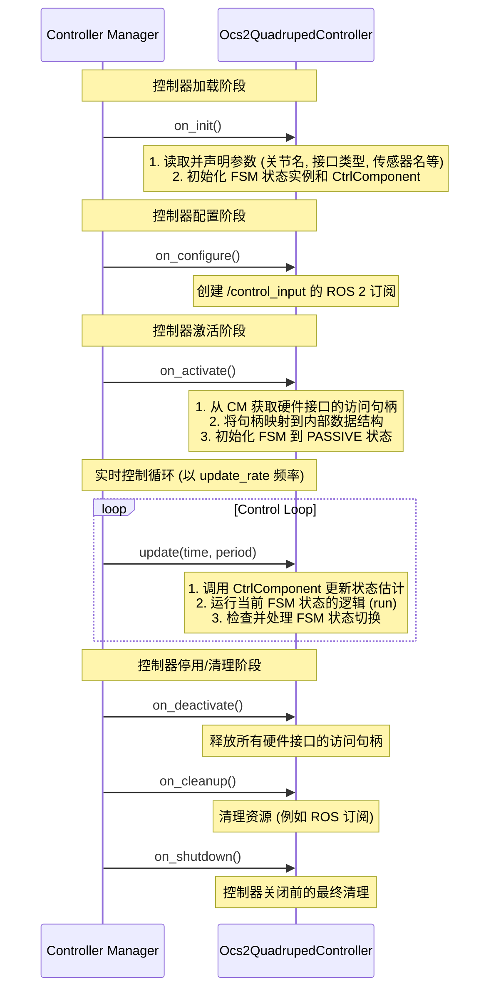

# Ocs2QuadrupedController 类分析

`Ocs2QuadrupedController` 是 `ocs2_quadruped_controller` 包的核心，它作为 `ros2_control` 框架下的一个控制器插件，是连接 OCS2 (Optimal Control for Switched Systems) MPC 算法、机器人硬件接口和 ROS 2 系统的桥梁。此类负责管理控制器的生命周期、有限状态机 (FSM)、以及与硬件（或仿真）的实时数据交互。

## 1. 方法功能与调用流程

`Ocs2QuadrupedController` 作为一个标准的 `ros2_control` 控制器，其主要方法的调用遵循 `ControllerInterface` 定义的生命周期。

### 调用流程

控制器从加载到运行再到停止的整个生命周期由 `Controller Manager` 管理。其核心方法的调用顺序和时间点如下所示：



### 各方法详细功能

-   **`on_init()`**
    -   **调用时机**: 控制器被 `Controller Manager` 加载后立即调用，是生命周期的第一个函数。
    -   **功能**:
        1.  **读取参数**: 从 ROS 2 参数服务器读取并声明控制器所需的配置，例如 `update_rate` (更新频率)、`joints` (关节列表)、`command_interfaces` (指令接口类型)、`imu_name` (IMU传感器名) 等。这些参数通常在启动控制器的 `yaml` 文件中定义。
        2.  **初始化核心组件**: 创建 `CtrlComponent` 的实例，该组件封装了与 OCS2 库交互的复杂逻辑。同时，初始化有限状态机 (FSM) 的各个状态实例，如 `StatePassive` (待机状态) 和 `StateOCS2` (OCS2 控制状态)。

-   **`command_interface_configuration()` / `state_interface_configuration()`**
    -   **调用时机**: 在 `on_init` 之后，`on_activate` 之前，由 `Controller Manager` 调用。
    -   **功能**:
        -   **声明资源**: 这两个函数用于向 `Controller Manager` 声明此控制器需要**独占**访问哪些硬件资源。
        -   它们基于 `on_init` 中读取的参数（如关节名、传感器名和接口类型）来动态构建一个接口列表（例如 `LF_HAA_joint/position`, `imu_sensor/orientation.x`）。`Controller Manager` 会根据这个列表去资源管理器中查找并锁定这些接口。

-   **`on_configure()`**
    -   **调用时机**: `on_init` 之后，`on_activate` 之前。
    -   **功能**: 配置 ROS 2 通信。在此类中，它创建了一个指向 `/control_input` 话题的订阅，用于接收来自游戏手柄或键盘的用户指令，从而控制机器人的步态和运动。

-   **`on_activate()`**
    -   **调用时机**: 当控制器从 `inactive` 状态切换到 `active` 状态时调用。这是控制器开始运行前的最后一步。
    -   **功能**:
        1.  **获取接口句柄**: `Controller Manager` 在此阶段会将之前声明的硬件接口的**访问句柄** (`LoanedCommandInterface`, `LoanedStateInterface`) 传递给控制器。这些句柄保存在基类的 `command_interfaces_` 和 `state_interfaces_` 成员变量中。
        2.  **映射接口**: 该函数会遍历这些句柄，并根据接口名称将它们分类存储到 `ctrl_interfaces_` 结构体的各个向量中（例如 `joint_position_command_interface_`, `imu_state_interface_`），以便在控制循环中方便地访问。
        3.  **启动 FSM**: 初始化有限状态机，将 `current_state_` 设置为 `StatePassive` (待机状态)，并调用其 `enter()` 方法。

-   **`update(const rclcpp::Time &time, const rclcpp::Duration &period)`**
    -   **调用时机**: 控制器处于 `active` 状态时，由 `Controller Manager` 以 `update_rate` 参数指定的频率周期性调用。这是**实时控制循环**的核心。
    -   **功能**:
        1.  **更新状态**: 调用 `ctrl_comp_->updateState()`，此方法会从 `state_interfaces_` 读取最新的机器人状态（关节位置/速度、IMU 数据等），并更新状态估计器。
        ```txt
        in ctrl_comp_->updateState:

        measured_rbd_state_ = estimator_->update(time, period);
        size: 36
        详情见 estimator.md

        observation_.state = rbd_conversions_->computeCentroidalStateFromRbdModel(measured_rbd_state_);
        size: 24

        ```
        2.  **执行 FSM**: 运行当前状态的 `run()` 方法 (`current_state_->run()`)。例如，在 `StateOCS2` 状态下，这会触发 MPC 的计算和 WBC (全身控制器) 的求解，最终计算出关节指令。
        3.  **状态切换**: 检查当前状态是否需要切换到下一个状态 (`current_state_->checkChange()`)。如果需要，则执行状态的退出 (`exit()`) 和新状态的进入 (`enter()`) 逻辑。

-   **`on_deactivate()` / `on_cleanup()` / `on_shutdown()`**
    -   **调用时机**: 分别在控制器被停止、清理和关闭时调用。
    -   **功能**: 依次释放资源。`on_deactivate` 会释放对硬件接口的控制权，`on_cleanup` 会销毁 ROS 2 的订阅等，`on_shutdown` 则进行最终的清理工作。

## 2. 接口数据的来源与更新

`command_interfaces_` 和 `state_interfaces_` 是连接控制器逻辑与硬件（或 Gazebo 等仿真器）的桥梁。

### 数据来源

这些接口的数据**并非直接从文件读入**，而是通过 `ros2_control` 的资源管理机制动态获取的：

1.  **定义 (YAML)**: 用户在 `config` 目录下的 `yaml` 文件中定义硬件（如 `gz_quadruped_hardware`）暴露了哪些 `state` 和 `command` 接口。
2.  **声明 (Controller)**: 如前所述，控制器通过 `command_interface_configuration` 和 `state_interface_configuration` 方法告诉 `Controller Manager` 它需要哪些接口。
3.  **获取 (Controller Manager)**: `Controller Manager` 在激活控制器时 (`on_activate`)，将这些接口的实时访问句柄（`Loaned...Interface`）传递给控制器实例的 `command_interfaces_` 和 `state_interfaces_` 成员。
4.  **映射 (Controller)**: `on_activate` 函数将这些句柄整理到自定义的 `ctrl_interfaces_` 结构中，方便后续使用。

### 更新机制

-   **State Interfaces (状态接口，如传感器数据、关节角度)**
    -   **谁更新**: 由 `ros2_control` 的底层硬件抽象层 (`HardwareInterface`) 负责更新。在 Gazebo 中，`gz_quadruped_hardware` 插件会在每个控制周期开始前，从仿真环境中读取机器人的状态（如关节角度、IMU读数），并更新这些接口的值。
    -   **何时更新**: 在 `Controller Manager` 调用控制器的 `update()` 方法**之前**。
    -   **如何读取**: 在 `update()` 方法内部，通过访问 `ctrl_interfaces_` 中存储的句柄，调用其 `get_value()` 方法即可获得当前周期的最新状态。

-   **Command Interfaces (指令接口，如关节力矩、目标角度)**
    -   **谁更新**: 由 `Ocs2QuadrupedController` 自身更新。
    -   **何时更新**: 在 `update()` 方法**内部**。
    -   **如何写入**: 在 `update()` 方法中，经过 MPC 和 WBC 计算得到期望的关节指令后，通过访问 `ctrl_interfaces_` 中存储的句柄，调用其 `set_value()` 方法将新指令写入。`Controller Manager` 在 `update()` 执行完毕后，会将这些指令值传递给底层硬件（或仿真器）去执行。

## 3. 其他说明

-   **有限状态机 (FSM) 的核心地位**: 该控制器通过一个简单的有限状态机来管理机器人的宏观行为。`update` 函数的核心职责之一就是驱动这个 FSM 的运行和切换。用户指令（来自 `/control_input`）是触发状态切换（例如从 `PASSIVE` 到 `FIXEDDOWN`）的主要来源。

-   **职责分离 (Separation of Concerns)**: `Ocs2QuadrupedController` 本身并不直接执行复杂的 MPC 计算。它扮演着一个**高级管理者**的角色，负责处理与 `ros2_control` 框架的交互、参数加载和 FSM 管理。而所有与 OCS2 相关的核心算法，包括状态估计、MPC 求解、WBC 计算等，都被委托给了 `CtrlComponent` 类。这种设计使得代码结构更清晰，易于维护。

-   **高度参数化的设计**: 控制器的大部分行为和配置（关节名、传感器名、接口类型等）都通过 `yaml` 文件进行参数化配置。这使得该控制器代码具有很强的复用性，可以轻松地适配到具有不同关节和传感器配置的机器人上，而无需修改 C++ 源代码。
