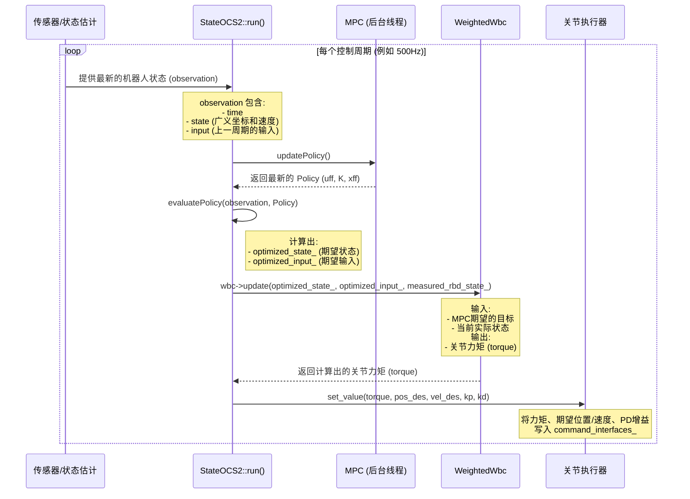

# `StateOCS2` 类与数据流分析

`StateOCS2` 是 `ocs2_quadruped_controller` 有限状态机 (FSM) 中的核心状态。当机器人进入该状态时，它会启动并运行模型预测控制 (MPC) 和全身控制 (WBC) 算法，实现对机器人的动态行走和平衡控制。

## 1. `StateOCS2` 类方法功能

-   **`StateOCS2(CtrlInterfaces& ctrl_interfaces, const std::shared_ptr<CtrlComponent>& ctrl_component)` (构造函数)**
    -   **功能**: 初始化 `StateOCS2` 状态。
    -   **执行细节**:
        1.  调用基类 `FSMState` 的构造函数，设置状态名称为 `OCS2`。
        2.  保存从 `Ocs2QuadrupedController` 传递过来的 `ctrl_component_` 共享指针，以便访问 MPC、WBC、状态估计等核心组件。
        3.  从 ROS 2 参数服务器读取并设置默认的关节 `kp` 和 `kd` 值。
        4.  实例化 `WeightedWbc` (加权全身控制器) 和 `SafetyChecker` (安全检查器)。`Wbc` 会加载 `task.info` 文件中定义的任务权重和参数。

-   **`enter()`**
    -   **功能**: 在 FSM 从其他状态切换到 `StateOCS2` 时被调用一次。
    -   **执行细节**: 调用 `ctrl_component_->init()`。这个函数会重置并初始化 MPC 求解器，确保控制器从一个干净的状态开始运行。

-   **`run(const rclcpp::Time& time, const rclcpp::Duration& period)`**
    -   **功能**: 这是 `StateOCS2` 的核心，在每个控制周期被 `Ocs2QuadrupedController::update()` 调用。它执行了从 MPC 策略评估到最终关节指令计算的完整流程。
    -   **执行细节**:
        1.  **检查 MPC 是否运行**: 如果 MPC 线程 (`mpc_running_`) 尚未准备好，则直接返回。
        2.  **更新策略 (`updatePolicy`)**: 从 MPC 线程获取最新计算出的最优控制策略 (`Policy`)。这是一个非阻塞调用，它会去检查 MPC 求解器是否有新的结果。
        3.  **评估策略 (`evaluatePolicy`)**: 使用当前的机器人状态 (`observation_`) 来评估刚刚获取的策略。此步骤会计算出当前时刻下，最优的期望状态 `optimized_state_` 和最优的期望输入 `optimized_input_`。
        4.  **运行全身控制 (WBC)**: 将 MPC 计算出的 `optimized_state_` 和 `optimized_input_` 作为**目标**，连同当前的**实际**机器人状态 (`measured_rbd_state_`)，一起传递给 WBC (`wbc_->update()`)。WBC 会求解一个优化问题，计算出实现该目标所需的**关节力矩**。
        5.  **发送指令**: 将 WBC 计算出的关节力矩，以及从 MPC 策略中提取出的期望关节位置和速度，通过 `command_interfaces_` 发送给底层硬件或仿真器。同时也会发送默认的 `kp` 和 `kd` 值。
        6.  **更新可视化**: 将最新的策略和指令信息发送给可视化工具 (如 Rviz)。

-   **`exit()`**
    -   **功能**: 在 FSM 准备从 `StateOCS2` 切换到其他状态时被调用一次。
    -   **执行细节**: 当前实现为空。可以在此添加停止 MPC 线程或清理资源等逻辑。

-   **`checkChange()`**
    -   **功能**: 在每个 `run` 之后被调用，用于判断是否需要切换 FSM 状态。
    -   **执行细节**:
        1.  **安全检查**: 调用 `safety_checker_->check()`，检查机器人的状态（如姿态、关节限制）是否在安全范围内。如果检查失败，会立即返回 `FSMStateName::PASSIVE`，使机器人进入待机状态以确保安全。
        2.  **指令检查**: 检查来自用户（如手柄）的命令。如果接收到特定命令（如 `command == 1`），则切换到 `PASSIVE` 状态。否则，保持在 `OCS2` 状态。

## 2. `Policy` 的概念解析

在 OCS2 框架中，`Policy` (策略) 是 MPC 求解器计算的核心输出。它不是一个简单的变量或函数，而是一个**时变线性反馈控制器**。

-   **本质**: `Policy` 本质上是一个数据结构，它存储了一系列在**未来时间段** (`timeHorizon`) 内的**前馈控制输入** (`uff`) 和**反馈增益矩阵** (`K`)。
-   **数学形式**: 在任意时刻 `t`，最优控制输入 `u(t)` 可以由这个策略计算得出：
    `u(t) = uff(t) + K(t) * (x(t) - xff(t))`
    其中：
    -   `x(t)` 是当前时刻的实际状态。
    -   `xff(t)` 是 MPC 计算出的当前时刻的最优期望状态（也称为名义轨迹）。
    -   `uff(t)` 是 MPC 计算出的当前时刻的最优前馈输入。
    -   `K(t)` 是反馈增益矩阵，用于根据实际状态与期望状态的偏差来调整控制输入。

-   **`updatePolicy()`**: 这个函数的作用是从 MPC 的后台计算线程中，获取最新计算完成的 `Policy`。MPC 求解器（如 `SqpMpc`）会持续在后台优化未来一段时间的控制策略。`updatePolicy` 相当于一个数据同步点，它将优化结果同步到主控制循环中。

-   **`evaluatePolicy()`**: 这个函数接收 `updatePolicy` 获取到的 `Policy` 和当前机器人的实际状态 `observation_.state`。它执行上述的反馈控制律，计算出当前时刻最应该执行的控制指令 `optimized_input_` 和对应的期望状态 `optimized_state_`。

简单来说，MPC 在后台深思熟虑地规划出一个“未来行动计划+应对意外的预案” (`Policy`)，`updatePolicy` 负责去拿这个最新的计划，而 `evaluatePolicy` 则负责根据当前情况，从计划中精准地执行一小步。

## 3. "传感器->MPC->WBC->机器狗" 数据流分析

下面是单个控制周期内，数据在系统中的完整流转过程：

### 输入输出详解

1.  **传感器/状态估计 -> `StateOCS2`**
    -   **输入**: 原始传感器数据（IMU、关节编码器）。
    -   **处理**: `CtrlComponent` 中的状态估计器 (`KalmanFilterEstimate` 或 `FromTopicEstimate`) 对数据进行融合处理。
    -   **输出 (`observation_`)**: 一个包含机器人完整状态的向量。对于质心动力学模型，它通常包括：
        -   质心动量（线性和角动量）
        -   基座姿态（位置和方向）
        -   12个关节的角度

2.  **`StateOCS2` -> MPC -> `StateOCS2`**
    -   **输入到 MPC**: 当前的 `observation_` 和用户指令（通过 `GaitManager` 转换成步态和目标速度）。
    -   **MPC 处理**: 在后台线程中，基于动力学模型、约束和代价函数，求解一个最优控制问题，生成一个覆盖未来时间窗口的 `Policy`。
    -   **输出 (`optimized_state_`, `optimized_input_`)**:
        -   `optimized_state_`: 当前时刻的**最优期望状态**向量，结构与 `observation_.state` 相同。
        -   `optimized_input_`: 当前时刻的**最优期望输入**向量，通常包括：
            -   4个足端的接触力（每个足3个分量，共12维）
            -   12个关节的速度

3.  **`StateOCS2` -> WBC -> `StateOCS2`**
    -   **输入到 WBC**:
        -   **目标**: `optimized_state_` 和 `optimized_input_` (来自 MPC)。
        -   **当前状态**: `measured_rbd_state_` (来自状态估计器的、包含浮动基座的完整状态)。
    -   **WBC 处理**: 求解一个考虑了接触约束、关节限制和任务权重（例如：保持躯干姿态、跟踪足端轨迹）的二次规划 (QP) 问题，将 MPC 的质心层面指令映射到各个关节。
    -   **输出 (`torque`)**: 一个12维的向量，包含每个关节需要施加的**力矩**。

4.  **`StateOCS2` -> 关节执行器**
    -   **输入**:
        -   `torque`: WBC 计算出的关节力矩。
        -   `pos_des`, `vel_des`: 从 `optimized_state_` 和 `optimized_input_` 中提取出的期望关节位置和速度。
        -   `kp`, `kd`: 预设的 PD 控制增益。
    -   **处理**: 通过 `ros2_control` 的 `command_interfaces_` 将这些值写入硬件抽象层。底层硬件（或仿真器）会利用这些值（通常是力矩前馈 + 位置/速度 PD 反馈）来驱动关节运动。

## 4. 其他说明

-   **MPC 与 WBC 的协同**: MPC 和 WBC 是一个经典的分层控制思想。MPC 在较高的抽象层面（质心模型）进行长远规划，负责“做什么”（例如，下一步腿应该落在哪里，身体应该如何移动）。而 WBC 在较低的层面（完整刚体模型）负责“怎么做”，它将 MPC 的抽象指令转化为具体的、物理上可行的关节力矩。这种分层结构有效降低了计算复杂度。
-   **实时性**: MPC 的计算非常耗时，因此它通常在后台线程中以较低的频率运行（例如 50-100Hz）。而 WBC 的计算相对较快，可以在主控制循环中以更高的频率运行（例如 500Hz）。`Policy` 机制是连接这两个不同频率循环的关键，它允许高频的 WBC 使用低频 MPC 更新的最新“计划”来生成平滑的控制指令。
