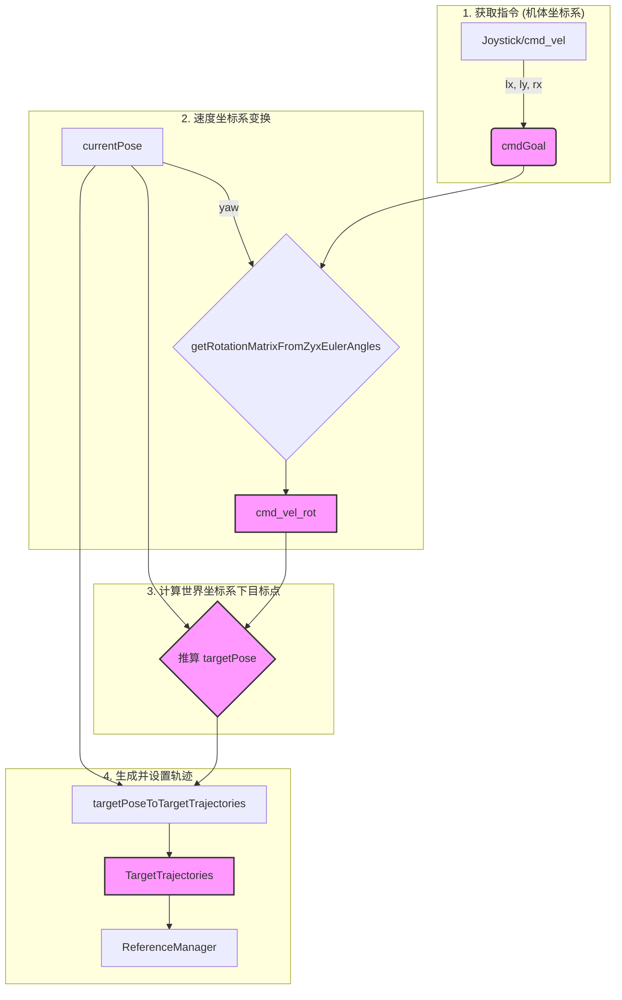

# `TargetManager` 类分析

`TargetManager` 类的核心职责是将来自用户的高层指令（例如游戏手柄的摇杆输入或 `/cmd_vel` 话题的消息）转换为 MPC (模型预测控制) 能够理解和跟踪的**目标轨迹** (`TargetTrajectories`)。它是用户意图与 MPC 优化目标之间的桥梁。

## 1. `TargetManager` 类方法功能

-   **`TargetManager(...)` (构造函数)**
    -   **功能**: 初始化目标管理器。
    -   **执行细节**:
        1.  保存对 `CtrlInterfaces`、`ReferenceManagerInterface` 和 `rclcpp_lifecycle::LifecycleNode` 的引用/指针。
        2.  从配置文件 (`reference.info`, `task.info`) 中加载多个关键参数：
            -   `comHeight`: 机器人的默认质心高度。
            -   `defaultJointState`: 机器人的默认站立关节角度。
            -   `mpc.timeHorizon`: MPC 的预测时域，在这里被用作计算未来目标点的时间 horizon (`time_to_target_`)。
            -   `targetRotationVelocity`: 摇杆输入对应的最大旋转速度。
            -   `targetDisplacementVelocity`: 摇杆输入对应的最大线速度。
        3.  创建一个 ROS 2 订阅，监听 `/cmd_vel` 话题。收到的 `geometry_msgs::msg::Twist` 消息会被写入一个实时缓冲区 (`RealtimeBuffer`)，并设置一个超时计数器 `twist_count`。

-   **`update(SystemObservation& observation)`**
    -   **功能**: 在每个控制周期由 `CtrlComponent::updateState()` 调用，计算并设置最新的目标轨迹。
    -   **执行细节**: 这是该类的核心逻辑，详细的数据转换将在下一节分析。总的来说，它执行以下步骤：
        1.  **获取指令**: 优先从 `/cmd_vel` 的缓冲区读取指令，如果超时或无新指令，则回退到使用游戏手柄的输入 (`ctrl_component_.control_inputs_`)。
        2.  **坐标变换**: 将用户输入的**机体坐标系**下的速度指令，转换成**世界坐标系**下的速度。
        3.  **计算目标点**: 基于当前位置和转换后的速度，推算出 `time_to_target_` 秒之后的目标位姿 `targetPose`。
        4.  **生成轨迹**: 调用 `targetPoseToTargetTrajectories` 方法，生成一个从当前位姿到目标位姿的线性插值轨迹。
        5.  **设置轨迹**: 通过 `referenceManagerPtr_->setTargetTrajectories()` 将生成的轨迹提交给 OCS2 的 `ReferenceManager`，供 MPC 求解器使用。

-   **`targetPoseToTargetTrajectories(...)`**
    -   **功能**: 一个辅助函数，用于创建一个简单的两点式 `TargetTrajectories` 对象。
    -   **执行细节**:
        1.  **时间轨迹**: 创建一个包含两个时间点的数组：`{当前时间, 目标到达时间}`。
        2.  **状态轨迹**: 创建一个包含两个状态向量的数组。
            -   第一个状态是机器人的当前位姿（位置和姿态），附加上默认的关节角度和零速度。
            -   第二个状态是期望的目标位姿 `targetPose`，同样附加上默认的关节角度和零速度。
        3.  **输入轨迹**: 创建一个包含两个零向量的输入数组（因为这里只定义了状态目标，输入轨迹由 MPC 自行优化）。
        4.  返回包含以上三个数组的 `TargetTrajectories` 对象。

## 2. `update` 方法中的数据转换

`update` 方法中包含了一系列关键的数据转换，将用户的直观操作映射为机器人在空间中的具体运动目标。



### 步骤详解

1.  **获取指令 (`cmdGoal`)**
    -   **来源**: 优先来自 `/cmd_vel`，超时则来自手柄 `control_inputs_`。
    -   **物理意义**: **机体坐标系**下的期望速度。这是一个6维向量。
    -   **数据结构 (`cmdGoal`)**:
        -   `[0]`: 前向速度 (x-axis)。
        -   `[1]`: 侧向速度 (y-axis)。
        -   `[2]`: 垂直速度 (z-axis, 通常为0)。
        -   `[3]`: 偏航角速度 (yaw-rate)。
        -   `[4]`: 俯仰角速度 (pitch-rate, 通常为0)。
        -   `[5]`: 滚转角速度 (roll-rate, 通常为0)。

2.  **速度坐标系变换 (`cmd_vel_rot`)**
    -   **问题**: `cmdGoal` 是基于机器人自身朝向的，而 MPC 需要在固定的世界坐标系下进行规划。因此，需要将机体坐标系下的线速度转换到世界坐标系下。
    -   **输入**:
        -   `cmdGoal.head(3)`: 机体坐标系下的线速度 `[vx, vy, vz]`。
        -   `currentPose.tail(3)`: 从 `observation.state` 中提取的当前基座姿态（Z-Y-X 欧拉角）。
    -   **处理**: `getRotationMatrixFromZyxEulerAngles(zyx)` 根据当前的偏航角 (yaw) 生成一个旋转矩阵，该矩阵只考虑绕Z轴的旋转。然后用这个矩阵左乘机体坐标系下的速度向量。
    -   **输出 (`cmd_vel_rot`)**: **世界坐标系**下的期望线速度。

3.  **计算目标点 (`targetPose`)**
    -   **问题**: MPC 需要一个未来的目标状态，而不仅仅是当前的速度指令。
    -   **处理**: 通过简单的线性外推来计算目标点。
        -   `target(0) = currentPose(0) + cmd_vel_rot(0) * time_to_target_`
        -   `target(1) = currentPose(1) + cmd_vel_rot(1) * time_to_target_`
        -   `target(3) = currentPose(3) + cmdGoal(3) * time_to_target_`
    -   **输出 (`targetPose`)**: **世界坐标系**下的目标位姿。这是一个6维向量。
        -   `[0-1]`: 目标 x, y 位置。
        -   `[2]`: 目标 z 位置，被强制设为 `command_height_`。
        -   `[3]`: 目标偏航角 (yaw)。
        -   `[4-5]`: 目标俯仰角 (pitch) 和滚转角 (roll)，被强制设为0。

4.  **生成并设置轨迹 (`TargetTrajectories`)**
    -   **处理**: 如前所述，`targetPoseToTargetTrajectories` 生成一个两点的轨迹。
    -   **额外修改**: 在生成轨迹后，代码还额外修改了轨迹的**起始点**和**结束点**的线速度部分，将其设置为刚刚计算出的世界坐标系下的期望速度 `cmd_vel_rot`。
        ```cpp
        trajectories.stateTrajectory[0].head(3) = cmd_vel_rot;
        trajectories.stateTrajectory[1].head(3) = cmd_vel_rot;
        ```
        这样做是为了给 MPC 提供更丰富的信息，即不仅要到达目标点，而且在整个轨迹期间都应保持期望的速度。

## 3. 其他说明

-   **指令优先级与超时机制**: `TargetManager` 实现了一个简单的指令优先级和超时机制。它优先使用来自 `/cmd_vel` 的指令。当收到一条 `/cmd_vel` 消息时，它会设置一个计数器 `twist_count`。在接下来的几个控制周期内，只要 `twist_count > 0`，系统就会持续使用该指令。当计数器减到0时，系统会清空缓冲区 (`buffer_.reset()`) 并切换回使用手柄指令。这可以防止机器人在 `/cmd_vel` 话题停止发布后继续执行旧指令，是一种安全保障。
-   **目标生成的简化**: 该类中的目标生成方式是比较基础的线性插值。它假设机器人可以立即达到期望速度并匀速运动到目标点。在更复杂的场景中，目标轨迹可以是更平滑的曲线（例如样条曲线），或者由更高层的路径规划器生成。
-   **与 `ReferenceManager` 的关系**: `TargetManager` 是 `ReferenceManager` 的一个“客户端”。它负责生成高层目标，而 `ReferenceManager` 则负责管理这些目标，并可能在内部进行进一步的处理（如与步态计划相结合），最终为 MPC 提供代价函数所需的参考轨迹。
