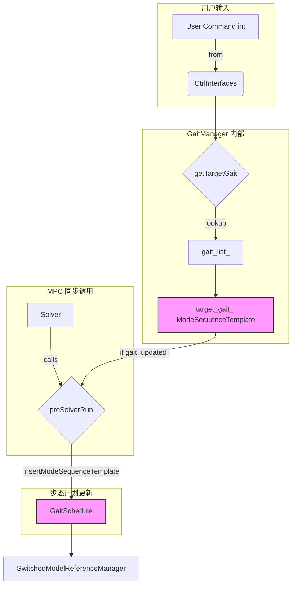

# `GaitManager` 类分析

`GaitManager` 类是一个 `SolverSynchronizedModule`，它在 OCS2 的 MPC (模型预测控制) 求解器和用户输入之间扮演着关键的协调角色。它的核心职责是**监听用户的步态切换指令**，并将这些离散的指令转换为 MPC 能够理解的、详细的**步态模式序列 (`ModeSequenceTemplate`)**，然后将其注入到 `GaitSchedule` 中。

作为一个 `SolverSynchronizedModule`，它的方法会被 MPC 求解器在优化循环的特定时间点自动调用，从而确保步态的切换与 MPC 的规划周期保持同步。

## 1. 类方法功能

-   **`GaitManager(CtrlInterfaces&, std::shared_ptr<GaitSchedule>)` (构造函数)**
    -   **功能**: 初始化 `GaitManager`。
    -   **执行细节**: 保存对 `CtrlInterfaces` (用于访问用户输入) 和 `GaitSchedule` (用于更新步态计划) 的引用。同时，将 `target_gait_` 初始化为一个默认的站立姿态 (`STANCE`)。

-   **`init(const std::string& gait_file)`**
    -   **功能**: 从配置文件中加载所有预定义的步态。这是一个一次性的设置过程。
    -   **执行细节**:
        1.  解析 `gait_file` (通常是 `gait.info`) 文件。
        2.  首先加载文件中 `list` 字段下的所有步态名称，存入 `gait_name_list_`。
        3.  然后，根据加载的名称列表，逐一解析文件中对应的步态定义，将它们作为 `ModeSequenceTemplate` 对象加载到 `gait_list_` 向量中。

-   **`preSolverRun(...)`**
    -   **功能**: 这是该类的**核心运行时方法**。它在 MPC 求解器**每次**优化计算**之前**被调用。
    -   **执行细节**:
        1.  调用 `getTargetGait()` 来检查并获取用户最新的步态指令。
        2.  如果 `gait_updated_` 标志位为 `true`（意味着 `getTargetGait` 检测到了一个新的指令），它就会调用 `gait_schedule_ptr_->insertModeSequenceTemplate()`。这个调用会将新的 `target_gait_` 插入到 `GaitSchedule` 的计划序列中，使其在未来的时间 (`finalTime`) 生效。
        3.  重置 `gait_updated_` 标志位，以避免在没有新指令的情况下重复插入。

-   **`getTargetGait()`**
    -   **功能**: 检查来自 `CtrlInterfaces` 的用户指令，并将其转换为一个具体的 `ModeSequenceTemplate`。
    -   **执行细节**:
        1.  它是有状态的：如果当前指令与上一周期的指令相同，或者指令为0，则直接返回，不做任何操作。
        2.  当检测到一个**新的、非零的**指令时，它会更新 `last_command_`。
        3.  它将接收到的整数指令 `command` 减去2，然后以此为索引从 `gait_list_` 中查找对应的 `ModeSequenceTemplate`。例如，指令 `2` 对应第一个步态，指令 `3` 对应第二个，以此类推。
        4.  将查找到的步态设置为 `target_gait_`，并设置 `gait_updated_` 标志位为 `true`，以通知 `preSolverRun` 需要执行一次步态更新。

## 2. 数据转换与处理流程

`GaitManager` 的核心数据转换是将一个简单的整数指令，转换为一个结构化的、描述机器人运动模式的 `ModeSequenceTemplate`。

### 数据转换详解

1.  **输入 (`ctrl_interfaces_.control_inputs_.command`)**:
    -   **数据类型**: `int`
    -   **物理意义**: 一个离散的、由用户（例如，通过手柄上的按键）发出的指令，代表想要切换到的目标步态。例如，`2` 可能代表 "trot"，`3` 可能代表 "pace"。

2.  **中间数据 (`target_gait_`)**:
    -   **数据类型**: `ModeSequenceTemplate`
    -   **物理意义**: 描述了一个完整步态周期的模板。它不包含绝对的时间信息，而是定义了步态的内部结构。
    -   **数据结构**:
        -   **`switchingTimes`**: 一个 `scalar_array_t` (即 `std::vector<double>`)，定义了一个周期内各个相位切换的**相对时间点**。例如，一个0.6秒的 trot 步态可能被定义为 `[0.0, 0.3, 0.6]`。
        -   **`modeSequence`**: 一个 `size_array_t` (即 `std::vector<size_t>`)，定义了每个相位对应的**接触模式**。每个模式是一个整数，其二进制位代表了哪些腿是触地的。例如，`[LF_RH, RF_LH]` 表示周期第一阶段是左前和右后腿支撑，第二阶段是右前和左后腿支撑。

3.  **输出 (对 `GaitSchedule` 的更新)**:
    -   **处理**: `gait_schedule_ptr_->insertModeSequenceTemplate()` 方法接收 `ModeSequenceTemplate`。
    -   **数据转换**: `GaitSchedule` 内部会将这个**相对时间**的模板，转换为一个带**绝对时间戳**的 `ModeSchedule`，并将其插入到未来的模式计划中。这意味着 MPC 将知道在未来的某个确切时间点，应该开始执行这个新的步态模式。

## 3. 步态 (Gait) 的实现与切换

步态是四足机器人运动的核心概念，它定义了在运动过程中足端的接触模式和时序。在 `ocs2_quadruped_controller` 中，步态的管理和切换是一个动态且与MPC紧密结合的过程。

### 步态的定义与表示

1.  **定义**: 一个步态在代码中被定义为一个 `ModeSequenceTemplate`。这个结构体包含两个关键部分：
    *   `switchingTimes`: 一个时间点序列，定义了每个运动阶段（Phase）的持续时间。
    *   `modeSequence`: 一个模式ID序列，每个ID对应 `switchingTimes` 的一个阶段，定义了在该阶段哪些足是处于支撑相（Stance）还是摆动相（Swing）。模式ID是一个整数，通过 `modeNumber2StanceLeg` 函数可以解码为每个腿的布尔接触标志。

2.  **配置文件**: 具体的步态参数（如trot, pace, standing_trot等）并不是硬编码在代码中的，而是在机器人描述包（例如 `go2_description`）的 `config/ocs2/gait.info` 文件中定义的。控制器在初始化时会从这个文件加载所有可用的步态模板。

### 步态的切换流程

步态的切换是由外部指令触发，并在MPC的规划周期中动态完成的，具体流程如下：

1.  **外部指令输入**: 用户通过键盘、手柄或其他节点发布一个 `control_input_msgs::msg::Inputs` 类型的消息到 `/control_input` 话题。消息中的 `command` 字段用于指定期望的步态（例如，3代表trot，4代表standing_trot）。

2.  **指令接收**: `Ocs2QuadrupedController` 类订阅了 `/control_input` 话题。当接收到新消息时，它会更新内部共享数据结构 `ctrl_interfaces_.control_inputs_` 中的 `command` 值。

3.  **GaitManager 的角色**: `GaitManager` 类是步态管理的核心。
    *   在初始化时 (`GaitManager::init`)，它会加载 `gait.info` 文件中定义的所有步态模板，并存储在一个列表 `gait_list_` 中。
    *   `GaitManager` 被注册为MPC求解器的一个 **同步模块 (Synchronized Module)**。这意味着它的 `preSolverRun` 方法会在 **每次MPC求解之前** 被自动调用。

4.  **检测与更新**:
    *   在 `preSolverRun` 方法中，会调用 `getTargetGait`。
    *   `getTargetGait` 方法会检查 `ctrl_interfaces_.control_inputs_.command` 的值是否与上一次记录的 `last_command_` 不同。
    *   如果指令发生了变化，它会根据新的 `command` 值从 `gait_list_` 中选择一个新的步态模板 (`target_gait_`)，并设置一个标志位 `gait_updated_ = true`。

5.  **注入新步态**:
    *   回到 `preSolverRun` 方法，如果 `gait_updated_` 标志位为 `true`，控制器会调用 `gait_schedule_ptr_->insertModeSequenceTemplate()`。
    *   这个函数的作用是将新的步态模板 (`target_gait_`) 插入到MPC的 `GaitSchedule` (步态时间表) 中。`GaitSchedule` 负责维护未来一段时间内的模式序列。这个插入操作是平滑的，它会规划从当前步态到新步态的过渡。

6.  **MPC重新规划**: 当MPC求解器开始本次迭代时，它会使用更新后的 `GaitSchedule` 来进行运动规划。因此，新生成的优化轨迹将自然地体现出新步态的接触模式和时序。

通过这种方式，步态的切换不是一个瞬时的、硬性的改变，而是被无缝地集成到了MPC的优化框架中，使得机器人能够平滑、动态地在不同步态之间进行过渡。

## 步态对MPC的影响

为了具象化说明，我们首先要理解MPC的目标是求解一个在未来一段时间内的最优控制问题（Optimal Control Problem, OCP），这个问题的通用形式可以写成：

### 最优控制问题的形式

- **最小化**: J(x, u) (一个代价函数，比如跟踪误差、能量消耗等)
- **受限于** (subject to):
  1. x_dot = f(x, u) (系统动力学)
  2. g(x, u) <= 0 (不等式约束)
  3. h(x, u) = 0 (等式约束)

### 步态 (Gait) 的作用

步态在这个框架中，扮演了“模式调度器 (Mode Scheduler)”的角色。它提供了一个随时间变化的模式 m(t)。这个模式 m(t) 是一个离散的变量（比如一个整数），它唯一地定义了当前的接触状态。

例如：
- m(t) = 0 可能代表所有腿都处于摆动相（飞行）。
- m(t) = 5 可能代表左前（LF）和右后（RH）腿处于支撑相，而另外两条腿处于摆动相（典型的Trot步态）。

这个模式 m(t) 不会改变动力学方程 f(x, u) 的形式，但它会动态地改变约束 g(x, u) 和 h(x, u) 的集合。我们可以把约束看作是模式的函数，即 g_m(x, u) 和 h_m(x, u)。

### 具体约束示例

#### 1. 零速约束 (Zero Velocity Constraint) - 用于支撑腿

- **目的**: 保证与地面接触的足端速度为零，防止打滑。
- **公式 (概念性)**: v_foot_i(x) = 0，其中 v_foot_i 是第 i 个足端的速度，它是机器人状态 x (包含关节角度和速度) 的函数。
- **步态如何影响**: 这个约束仅在第 i 条腿处于支撑相 (Stance Phase) 时才被激活。
  - **具体体现**: 在代码中，`ZeroVelocityConstraintCppAd::isActive(time)` 方法会查询 ReferenceManager 当前时间 time 的接触标志 `contact_flag_i(m(t))`。
    - IF `contact_flag_i(m(t)) == true` THEN MPC求解器必须满足 `v_foot_i(x) = 0` 这个等式约束。
    - ELSE (腿在摆动相), 这个约束被忽略。

#### 2. 零力约束 (Zero Force Constraint) - 用于摆动腿

- **目的**: 保证在空中摆动的腿与地面之间没有接触力。
- **公式 (概念性)**: F_foot_i(u) = 0，其中 F_foot_i 是施加在第 i 个足端的地面反作用力，它是控制输入 u 的一部分。
- **步态如何影响**: 这个约束与零速约束正好相反，它仅在第 i 条腿处于摆动相 (Swing Phase) 时才被激活。
  - **具体体现**: `ZeroForceConstraint::isActive(time)` 方法会进行查询。
    - IF `contact_flag_i(m(t)) == false` THEN MPC求解器必须满足 `F_foot_i(u) = 0` 这个等式约束。
    - ELSE (腿在支撑相), 这个约束被忽略，允许足端产生力。

#### 3. 摩擦锥约束 (Friction Cone Constraint) - 用于支撑腿

- **目的**: 保证地面反作用力在摩擦锥内，以防止足端打滑。
- **公式 (概念性)**: sqrt(F_x^2 + F_y^2) <= mu * F_z，其中 F_x, F_y 是水平切向力，F_z 是法向力，mu 是摩擦系数。
- **步态如何影响**: 这个约束同样仅在腿处于支撑相时才有意义。
  - **具体体现**: `FrictionConeConstraint::isActive(time)` 方法进行查询。
    - IF `contact_flag_i(m(t)) == true` THEN MPC求解器必须满足 `sqrt(F_x^2 + F_y^2) - mu * F_z <= 0` 这个不等式约束。
    - ELSE (腿在摆动相), 这个约束被忽略。

#### 4. 摆动腿轨迹约束 (Swing Trajectory Constraint)

- **目的**: 引导摆动腿按照预定的轨迹（例如，一个半椭圆或三次样条曲线）运动，以越过障碍并到达下一个落足点。
- **公式 (概念性)**: z_foot_i(x) >= z_swing_desired(t)，其中 z_foot_i 是足端的实际高度，z_swing_desired(t) 是由 SwingTrajectoryPlanner 生成的期望最低高度。
- **步态如何影响**: 这个约束仅在腿处于摆动相时才被激活。
  - **具体体现**: `NormalVelocityConstraintCppAd::isActive(time)` (以及其他相关约束) 会进行查询。
    - IF `contact_flag_i(m(t)) == false` THEN MPC求解器会激活一系列与摆动腿轨迹相关的约束，确保脚能抬起并向前摆动。
    - ELSE (腿在支撑相), 这些约束被忽略。

### 总结流程

所以，当用户切换步态时：

1. **GaitManager** 将新的步态模板（包含新的模式序列 `modeSequence` 和切换时间 `switchingTimes`）插入到MPC的 `GaitSchedule` 中。
2. **MPC求解器** 在进行优化时，对于其规划时域中的每一个时间点 t：
   - 它会从 `GaitSchedule` 中查询该时间点的模式 m(t)。
   - 根据 m(t) 解码出每条腿的接触状态 `contact_flag(m(t))`。
   - 动态地构建该时间点的约束集：为支撑腿激活零速和摩擦锥约束，为摆动腿激活零力和摆动轨迹约束。
3. **求解器** 在这个动态变化的约束集下，找到最优的状态和控制序列。

最终，机器人的运动就自然地体现出了新步态的特征。

## 4. 其他说明

-   **同步模块的重要性**: `GaitManager` 继承自 `SolverSynchronizedModule` 是其设计的关键。这确保了步态的改变是在 MPC 求解器两次迭代之间安全地进行的。如果在求解过程中随意改变步态计划，可能会导致优化问题无解或机器人行为不稳定。
-   **指令映射**: `command - 2` 的映射关系是一个需要注意的实现细节。它表明指令 `0` 和 `1` 被保留用于其他目的（通常是 FSM 的状态切换，如待机或站起），而实际的步态指令从 `2` 开始。
-   **配置文件驱动**: `GaitManager` 的行为完全由 `gait.info` 文件驱动。用户可以通过修改这个文件来添加、删除或调整步态，而无需修改任何 C++ 代码，这提供了很好的灵活性。
