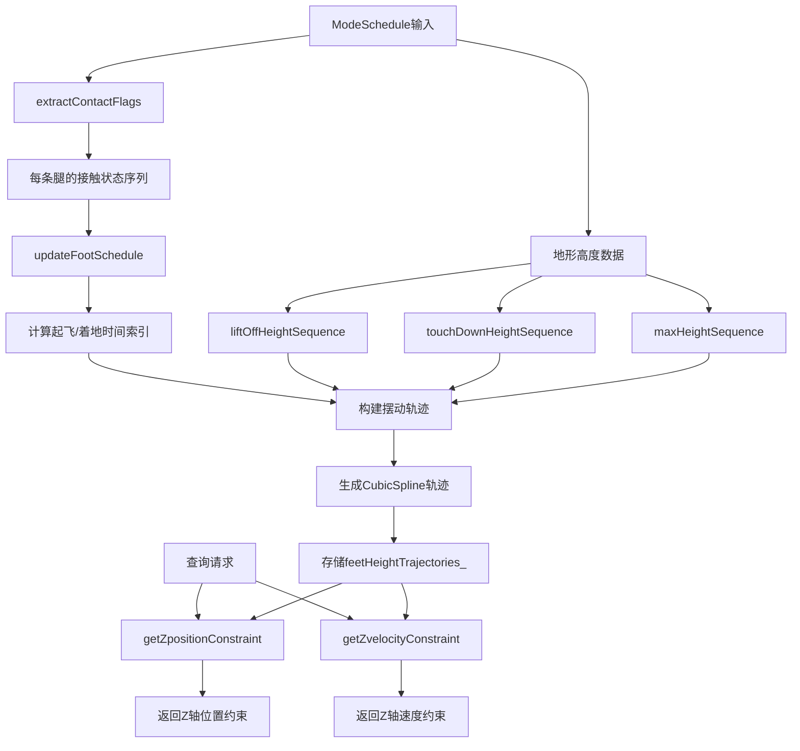

# SwingTrajectoryPlanner 类分析

## 1. 数据处理和更新流程

### 1.1 流程图



### 1.2 文字描述流程

SwingTrajectoryPlanner 的数据处理流程分为以下几个阶段：

1. **输入预处理阶段**：
   - 接收 `ModeSchedule`（运动模式调度）
   - 接收地形高度信息（起飞高度、着地高度、最大高度）
   - 提取每条腿在各个时间段的接触状态

2. **时间索引计算阶段**：
   - 根据接触状态序列，计算每条腿摆动阶段的起飞和着地时间索引
   - 处理边界条件，确保时间索引的有效性

3. **轨迹生成阶段**：
   - 为每条腿的每个摆动阶段生成三次样条轨迹
   - 考虑起飞速度、着地速度、中间高度等参数
   - 对短时间摆动进行缩放处理

4. **轨迹存储和查询阶段**：
   - 将生成的轨迹存储在内部数据结构中
   - 提供实时查询接口，返回指定时间的位置和速度约束

## 2. 数据输入输出与模块交互

### 2.1 输入数据来源
- **GaitManager**: 提供 `ModeSchedule`，包含步态切换时序和模式信息
- **TerrainEstimation**: 提供地形高度信息
- **StateEstimation**: 提供当前机器人状态信息

### 2.2 输出数据去向
- **LeggedRobotPreComputation**: 调用 `getZpositionConstraint` 和 `getZvelocityConstraint` 获取约束
- **SwingLegConstraint**: 用于 MPC 优化中的摆动腿约束
- **WBC模块**: 间接通过约束影响全身控制

### 2.3 具体数据格式
```cpp
// 输入数据
ModeSchedule {
    std::vector<size_t> modeSequence;    // 模式序列
    std::vector<scalar_t> eventTimes;    // 事件时间
}

feet_array_t<scalar_array_t> liftOffHeightSequence;    // 4条腿×N个阶段的起飞高度
feet_array_t<scalar_array_t> touchDownHeightSequence;  // 4条腿×N个阶段的着地高度
feet_array_t<scalar_array_t> maxHeightSequence;        // 4条腿×N个阶段的最大高度

// 输出数据
scalar_t position;  // Z轴位置约束值
scalar_t velocity;  // Z轴速度约束值
```

## 3. 类中各个方法的功能

### 3.1 构造函数
```cpp
SwingTrajectoryPlanner(Config config, size_t numFeet)
```
- **功能**: 初始化摆动轨迹规划器
- **参数**: 
  - `config`: 轨迹配置参数（起飞速度、着地速度、摆动高度等）
  - `numFeet`: 足端数量（通常为4）

### 3.2 主要更新方法

#### 3.2.1 update() 方法（三个重载版本）

**版本1**: `update(const ModeSchedule &modeSchedule, scalar_t terrainHeight)`
- **功能**: 基于统一地形高度更新轨迹
- **流程**: 
  1. 将单一地形高度扩展为所有腿的高度序列
  2. 调用完整版本的update方法

**版本2**: `update(const ModeSchedule &modeSchedule, const feet_array_t<scalar_array_t> &liftOffHeightSequence, const feet_array_t<scalar_array_t> &touchDownHeightSequence)`
- **功能**: 基于起飞和着地高度序列更新轨迹
- **流程**:
  1. 计算每个阶段的最大高度（起飞和着地高度的最大值）
  2. 调用完整版本的update方法

**版本3**: `update(const ModeSchedule &modeSchedule, const feet_array_t<scalar_array_t> &liftOffHeightSequence, const feet_array_t<scalar_array_t> &touchDownHeightSequence, const feet_array_t<scalar_array_t> &maxHeightSequence)`
- **功能**: 完整的轨迹更新实现
- **详细流程**:
  1. 提取接触标志序列
  2. 计算摆动时间索引
  3. 为每条腿生成轨迹
  4. 存储轨迹和事件时间

### 3.3 查询方法

#### 3.3.1 getZpositionConstraint()
```cpp
scalar_t getZpositionConstraint(size_t leg, scalar_t time) const
```
- **功能**: 获取指定腿在指定时间的Z轴位置约束
- **实现**: 查找对应的样条轨迹并计算位置值

#### 3.3.2 getZvelocityConstraint()
```cpp
scalar_t getZvelocityConstraint(size_t leg, scalar_t time) const
```
- **功能**: 获取指定腿在指定时间的Z轴速度约束
- **实现**: 查找对应的样条轨迹并计算速度值

### 3.4 私有辅助方法

#### 3.4.1 extractContactFlags()
```cpp
feet_array_t<std::vector<bool>> extractContactFlags(const std::vector<size_t> &phaseIDsStock) const
```
- **功能**: 从模式序列中提取每条腿的接触状态
- **输入**: 模式ID序列
- **输出**: 每条腿的接触标志序列

#### 3.4.2 updateFootSchedule()
```cpp
static std::pair<std::vector<int>, std::vector<int>> updateFootSchedule(const std::vector<bool> &contactFlagStock)
```
- **功能**: 计算摆动阶段的起飞和着地时间索引
- **输入**: 单条腿的接触标志序列
- **输出**: {起飞时间索引序列, 着地时间索引序列}

#### 3.4.3 findIndex()
```cpp
static std::pair<int, int> findIndex(size_t index, const std::vector<bool> &contactFlagStock)
```
- **功能**: 查找指定摆动阶段的起飞和着地时间索引
- **算法**: 
  - 向前搜索找到最近的接触阶段作为起飞时间
  - 向后搜索找到下一个接触阶段前的时间作为着地时间

#### 3.4.4 checkThatIndicesAreValid()
```cpp
static void checkThatIndicesAreValid(int leg, int index, int startIndex, int finalIndex, const std::vector<size_t> &phaseIDsStock)
```
- **功能**: 验证时间索引的有效性
- **检查项**: 
  - 起飞时间索引不能为负（确保有前序接触阶段）
  - 着地时间索引不能超出范围（确保有后续接触阶段）

#### 3.4.5 swingTrajectoryScaling()
```cpp
static scalar_t swingTrajectoryScaling(scalar_t startTime, scalar_t finalTime, scalar_t swingTimeScale)
```
- **功能**: 计算摆动轨迹的缩放因子
- **原理**: 对于持续时间短于 `swingTimeScale` 的摆动，按比例缩小高度和速度
- **公式**: `scaling = min(1.0, (finalTime - startTime) / swingTimeScale)`

### 3.5 配置加载函数
```cpp
SwingTrajectoryPlanner::Config loadSwingTrajectorySettings(const std::string &fileName, const std::string &fieldName, bool verbose)
```
- **功能**: 从配置文件加载摆动轨迹参数
- **参数**: 
  - `liftOffVelocity`: 起飞速度
  - `touchDownVelocity`: 着地速度
  - `swingHeight`: 摆动高度
  - `swingTimeScale`: 时间缩放参数

## 4. 模块作用和机理

### 4.1 模块作用
SwingTrajectoryPlanner 是四足机器人摆动腿运动规划的核心模块，主要作用包括：

1. **轨迹平滑性**: 确保摆动腿运动轨迹的平滑性和连续性
2. **地形适应**: 根据地形高度调整摆动轨迹，避免碰撞
3. **约束生成**: 为MPC优化器提供摆动腿的位置和速度约束
4. **步态协调**: 与步态管理器协同工作，确保摆动时序正确

### 4.2 代表的机理

#### 4.2.1 生物学启发
模拟四足动物的摆动腿运动模式：
- **抬腿阶段**: 快速抬起，避免障碍
- **前摆阶段**: 向前摆动，准备着地
- **着地阶段**: 平稳着地，准备承重

#### 4.2.2 数学原理
- **三次样条插值**: 确保位置、速度和加速度的连续性
- **分段轨迹**: 起飞到中点、中点到着地两段样条
- **边界条件**: 起飞和着地的位置、速度约束

#### 4.2.3 控制理论
- **预测性规划**: 基于步态时序预先规划轨迹
- **实时约束**: 为实时控制器提供参考轨迹
- **自适应调整**: 根据实际条件调整轨迹参数

### 4.3 关键技术特点

1. **时间缩放机制**: 
   - 对短时间摆动进行智能缩放
   - 保持轨迹的物理合理性

2. **地形自适应**:
   - 支持变高度地形
   - 动态调整摆动高度

3. **模块化设计**:
   - 独立的轨迹生成逻辑
   - 灵活的配置参数

4. **实时查询**:
   - 高效的时间索引机制
   - 支持任意时刻的轨迹查询

## 5. 其他重要说明

### 5.1 性能考虑
- **内存效率**: 使用样条轨迹减少存储需求
- **计算效率**: 预计算轨迹，实时查询开销小
- **数值稳定**: 三次样条确保数值稳定性

### 5.2 使用注意事项
- **边界条件**: 确保步态序列的完整性
- **参数调节**: 合理设置摆动高度和速度参数
- **时间同步**: 与步态管理器保持时间同步

### 5.3 扩展可能性
- **3D轨迹**: 当前主要处理Z轴，可扩展到3D轨迹
- **动态避障**: 集成实时障碍检测
- **学习优化**: 结合机器学习优化轨迹参数

### 5.4 与其他模块的关系
- **上游模块**: GaitManager (步态规划)
- **下游模块**: MPC约束生成、WBC轨迹跟踪
- **并行模块**: TerrainEstimation (地形感知)

这个模块体现了机器人足式运动控制中"规划-控制"分离的设计思想，通过预先规划平滑的摆动轨迹，为后续的实时控制提供高质量的参考信号。