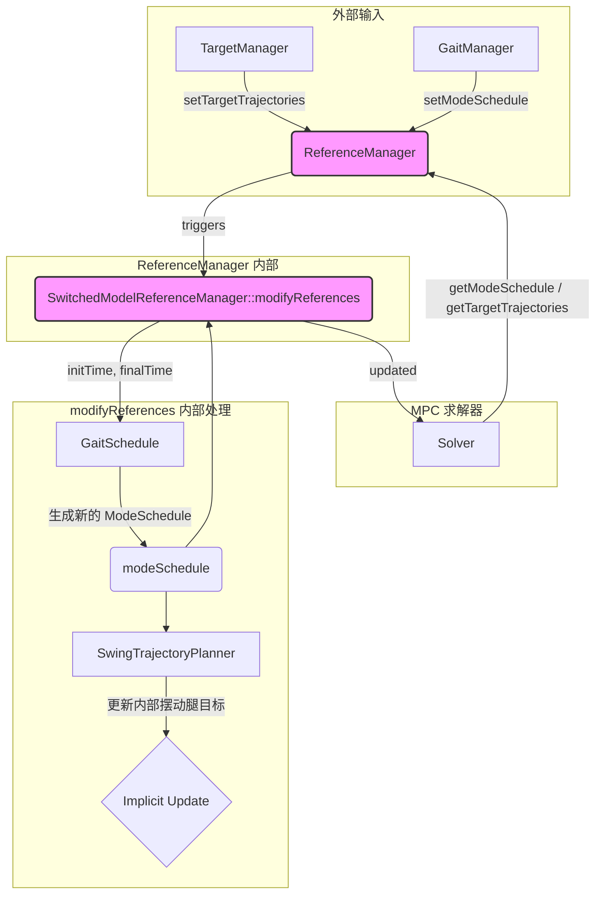

# `SwitchedModelReferenceManager` 类分析

`SwitchedModelReferenceManager` 继承自 `ocs2::ReferenceManager`，是 OCS2 框架中专门为**混合动力系统**（如足式机器人）设计的核心组件。它的主要职责是管理和同步两类至关重要的参考信息：**目标轨迹 (`TargetTrajectories`)** 和**模式计划 (`ModeSchedule`)**。

这个类本身并不**直接**从外部（如 ROS 话题）接收数据，而是作为一个协调者，接收由其他模块（如 `TargetManager` 和 `GaitManager`）处理好的数据，并将它们与机器人的当前状态相结合，生成最终供 MPC 使用的、内部一致的参考信号。

## 1. 类方法功能

### `ReferenceManager` (父类)

-   **`ReferenceManager(TargetTrajectories, ModeSchedule)` (构造函数)**
    -   **功能**: 初始化基类，存储一个初始的目标轨迹和模式计划。

-   **`setTargetTrajectories(TargetTrajectories)`**
    -   **功能 (接受外部数据)**: 这是**接收外部目标轨迹数据**的主要入口。`TargetManager` 在每个周期计算出新的目标后，会调用此方法将其设置进来。
    -   **执行细节**: 将传入的 `TargetTrajectories` 对象存储在一个线程安全的 `Synchronized` 变量中。MPC 求解器在开始新的优化迭代时，会从这里获取最新的目标。

-   **`getModeSchedule()`**
    -   **功能 (更新对外数据)**: 向 MPC 求解器提供最终的、经过处理的模式计划。
    -   **执行细节**: 在调用此方法时，它会首先触发一个**虚函数 `modifyReferences`**。这个虚函数允许子类（即 `SwitchedModelReferenceManager`）在提供数据前进行最后一步的修改和同步。执行完 `modifyReferences` 后，它返回内部存储的、可能已被更新的 `ModeSchedule`。

-   **`getTargetTrajectories()`**
    -   **功能 (更新对外数据)**: 向 MPC 求解器提供最终的、经过处理的目标轨迹。
    -   **执行细节**: 与 `getModeSchedule` 类似，它也会首先触发 `modifyReferences` 虚函数，然后再返回内部存储的、可能已被更新的 `TargetTrajectories`。

### `SwitchedModelReferenceManager` (子类)

-   **`SwitchedModelReferenceManager(gaitSchedulePtr, swingTrajectoryPtr)` (构造函数)**
    -   **功能**: 初始化子类，保存对 `GaitSchedule` 和 `SwingTrajectoryPlanner` 的指针。这两个模块是实现步态和摆动腿轨迹生成的关键。

-   **`setModeSchedule(const ModeSchedule&)`**
    -   **功能 (接受外部数据)**: 这是**接收外部模式计划数据**的主要入口。通常由 `GaitManager` 调用，用于设置新的步态序列。
    -   **执行细节**: 它首先调用父类的 `setModeSchedule` 来存储模式计划，然后还将这个模式计划传递给内部的 `gaitSchedulePtr_`，以确保步态计划器内部状态的同步。

-   **`modifyReferences(initTime, finalTime, initState, targetTrajectories, modeSchedule)` (核心虚函数)**
    -   **功能 (数据处理与更新)**: 这是该类最核心的方法。它在 MPC 求解器每次请求参考数据时被自动调用，负责**将用户定义的目标轨迹与当前的步态计划相结合**，生成一个协调一致的最终参考。
    -   **执行细节**:
        1.  **更新模式计划**: 它忽略传入的 `modeSchedule`，而是调用 `gaitSchedulePtr_->getModeSchedule()`，根据当前的步态和时间，生成一个覆盖整个 MPC 优化时域 (`initTime` 到 `finalTime`) 的新模式计划。这个新的 `modeSchedule` 会覆盖掉旧的。
        2.  **更新摆动腿轨迹**: 调用 `swingTrajectoryPtr_->update()`，将新生成的 `modeSchedule` 传递给摆动腿轨迹规划器。规划器会根据新的触地/离地时间点，重新计算所有摆动腿的参考轨迹（例如，生成平滑的足端抬起和落下的曲线）。这些计算出的摆动腿轨迹**隐式地**修改了代价函数的目标，因为代价函数会使用 `SwingTrajectoryPlanner` 来获取摆动腿的目标位置。

-   **`getContactFlags(scalar_t time)`**
    -   **功能**: 一个辅助函数，用于查询在特定时间点，哪些足应该是触地状态。

## 2. 数据转换与处理流程

`SwitchedModelReferenceManager` 的核心数据处理发生在 `modifyReferences` 方法被调用时。这个过程确保了无论用户如何改变目标速度或步态，MPC 得到的参考信号总是同步且合理的。

### 数据转换详解

1.  **输入 (来自 `TargetManager` 和 `GaitManager`)**:
    -   **`TargetTrajectories`**: 包含一个**稀疏**的目标。它只定义了未来某个时间点 (`targetReachingTime`) 的目标位姿 (`targetPose`) 和整个过程中的期望线速度。它**没有**定义中间过程的详细状态，也没有定义任何关于足端接触的信息。
        -   **物理意义**: "我希望在 `t` 时刻到达 `(x, y, yaw)` 位置，并保持 `v` 的速度前进。"
    -   **`ModeSchedule`**: 包含一个由 `GaitManager` 根据用户指令（如“开始小跑”）生成的模式序列。
        -   **物理意义**: "现在开始执行小跑步态。"

2.  **处理 (`modifyReferences`)**:
    -   **`modeSchedule` 的覆盖**: `gaitSchedulePtr_->getModeSchedule()` 会根据当前的步态定义（例如，小跑的周期、四条腿的相位关系）和当前时间，生成一个**密集**的、覆盖整个优化时域的模式序列。这个序列精确地定义了在未来的每一毫秒，哪些腿应该是支撑相，哪些是摆动相。
        -   **数据转换**: 从一个高层的步态指令（如 `trot`）转换为一个详细的、带时间戳的接触模式序列 `[t0, mode0], [t1, mode1], ...`。
    -   **`swingTrajectoryPtr_` 的更新**: `SwingTrajectoryPlanner` 接收到这个新的模式计划后，会识别出所有的摆动阶段（例如，左前腿从 `t_liftoff` 到 `t_touchdown`）。然后，它为每个摆动阶段生成一个三次样条曲线或其他平滑轨迹，定义了摆动腿足端在空间中的期望位置。
        -   **数据转换**: 从离散的接触模式序列转换为连续的、三维的足端空间位置轨迹。这个轨迹数据存储在 `SwingTrajectoryPlanner` 内部，供 OCS2 的约束和代价函数在优化时查询。

3.  **输出 (到 MPC 求解器)**:
    -   **更新后的 `ModeSchedule`**: 一个详细的、与当前步态完全同步的接触模式计划。
    -   **未被直接修改的 `TargetTrajectories`**: `modifyReferences` **没有**直接修改 `targetTrajectories` 的内容（例如质心位置目标）。但是，通过更新 `SwingTrajectoryPlanner`，它**间接**地为 MPC 提供了摆动腿的目标，这些目标会与 `targetTrajectories` 中的质心目标一起被优化。

## 3. 其他说明

-   **解耦的设计**: `ReferenceManager` 的设计体现了关注点分离的原则。`TargetManager` 关注“去哪里”，`GaitManager` 关注“怎么走”，而 `SwitchedModelReferenceManager` 则负责将这两者融合，生成一个统一、协调的参考信号。
-   **隐式与显式参考**: `TargetTrajectories` 是一个**显式**的参考，它直接定义了代价函数中关于质心状态的部分。而由 `SwingTrajectoryPlanner` 生成的摆动腿轨迹是一个**隐式**的参考，它通过影响约束（`SwingConstraint`）和代价函数中的摆动腿跟踪项来引导优化，但它本身并不存储在 `TargetTrajectories` 对象中。
-   **线程安全**: 父类 `ReferenceManager` 使用 `Synchronized` 包装器来保护其内部的 `TargetTrajectories` 和 `ModeSchedule` 成员变量，确保了来自外部（如 `TargetManager`）的写操作和来自 MPC 求解器的读操作之间不会发生数据竞争。
