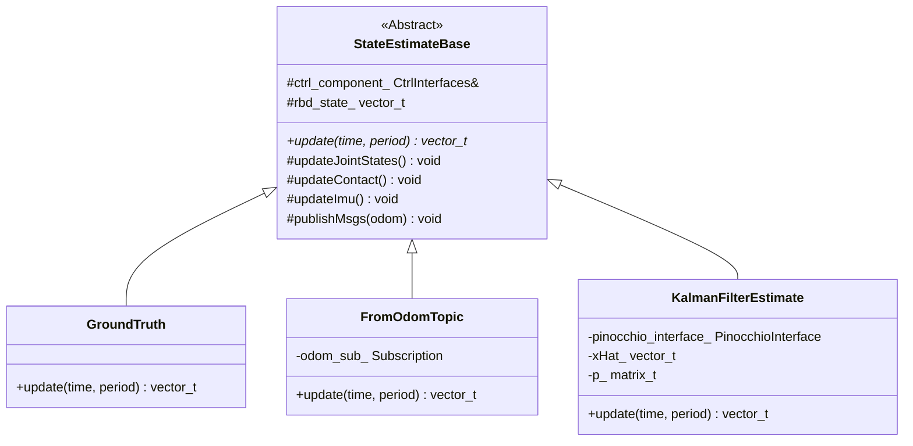

# 机器人状态估计器（Estimator）分析

## 1. 功能概述

`estimator` 模块在 `ocs2_quadruped_controller` 中扮演着至关重要的角色。它的核心功能是**估计机器人的状态**，主要是指机器人躯干（base）的位姿（位置和姿态）和速度（线速度和角速度）。准确的状态估计是后续所有控制算法（如 MPC、WBC）能够正确执行的基础。

该模块提供了多种状态估计方法，以适应不同的运行环境（例如，纯粹的仿真环境、接收外部定位信息的环境、或接近真实硬件的环境）。

## 2. 类关系与结构

`estimator` 中的主要类都继承自一个抽象基类 `StateEstimateBase`，形成了清晰的继承关系。

### 2.1. Mermaid 关系图



### 2.2. 类关系文字描述

- **`StateEstimateBase`**: 这是一个抽象基类，定义了所有具体状态估计器必须遵循的统一接口（即 `update` 纯虚函数）。它还提供了所有派生类共用的基础功能，例如从硬件/仿真接口读取关节、IMU 和足端接触力数据，以及发布最终的里程计（Odometry）消息。
- **`GroundTruth`**: 这是最简单的估计器。它直接从仿真环境（如 Gazebo）中读取**真实（Ground Truth）**的机器人状态。这在理想的仿真和算法验证阶段非常有用，但在真实硬件上无法使用。
- **`FromOdomTopic`**: 该估计器通过订阅一个 ROS 2 话题（默认为 `/odom`）来获取机器人的状态。它适用于当有外部定位系统（如 VICON、Lidar SLAM）已经完成了状态估计，并将结果以 `nav_msgs::msg::Odometry` 格式发布出来的场景。
- **`KalmanFilterEstimate`**: 这是最核心、最复杂的估计器。它实现了一个**线性卡尔曼滤波器**，通过融合多种传感器（IMU、关节编码器、足端接触传感器）的数据，来估计机器人的状态。这是最接近在真实硬件上运行的解决方案。

## 3. 各类及方法功能详解

### 3.1. `StateEstimateBase` (基类)

- **`StateEstimateBase(...)` (构造函数)**: 初始化成员变量，如 `CtrlInterfaces`（用于和硬件/仿真交互）、`CentroidalModelInfo`（机器人模型信息）等。
- **`updateJointStates()`**: 从 `CtrlInterfaces` 读取所有关节的位置和速度，并更新到状态向量 `rbd_state_` 中。
- **`updateContact()`**: 从 `CtrlInterfaces` 读取每个足端的接触力，并与设定的阈值 `feet_force_threshold_` 比较，以判断足端是否与地面接触，更新 `contact_flag_`。
- **`updateImu()`**: 从 `CtrlInterfaces` 读取 IMU 数据，包括姿态四元数、局部坐标系下的角速度和线加速度。
- **`update(...)`**: 纯虚函数，由派生类实现具体的状态估计算法。它是每个控制周期中被外部调用的主入口。
- **`publishMsgs(...)`**: 将估计出的状态封装成 `nav_msgs::msg::Odometry` 和 `geometry_msgs::msg::PoseWithCovarianceStamped` 消息，并通过 ROS 2 Publisher 发布出去。

### 3.2. `GroundTruth` (派生类)

- **`update(...)`**:
    1. 调用基类的 `updateJointStates()` 和 `updateImu()` 更新关节和姿态信息。
    2. 直接从 `ctrl_component_.odom_state_interface_` 读取仿真环境提供的精确的 base 位置和线速度。
    3. 组合所有信息，更新完整的状态向量 `rbd_state_`。
    4. 调用 `publishMsgs` 发布结果。

### 3.3. `FromOdomTopic` (派生类)

- **`FromOdomTopic(...)` (构造函数)**: 创建一个 `/odom` 话题的订阅者。
- **`update(...)`**:
    1. 从实时缓冲区 `buffer_` 中读取最新收到的 `nav_msgs::msg::Odometry` 消息。
    2. 调用 `updateJointStates()` 更新关节信息。
    3. 使用收到的 Odometry 消息中的位姿和速度信息来更新 base 的状态。
    4. 返回最终的状态向量 `rbd_state_`。

### 3.4. `KalmanFilterEstimate` (派生类)

该类是分析的重点。

- **`KalmanFilterEstimate(...)` (构造函数)**:
    - 初始化卡尔曼滤波器的状态向量 `xHat_`、协方差矩阵 `p_`、状态转移矩阵 `a_`、观测矩阵 `c_` 以及过程噪声 `q_` 和测量噪声 `r_` 等核心矩阵。
    - 初始化 Pinocchio 运动学模型，用于后续计算足端位置和速度。

- **`loadSettings(...)`**: 从 YAML 配置文件中加载卡尔曼滤波器的噪声参数，方便在线调整。

- **`getOdomMsg()`**: 将卡尔曼滤波器估计出的状态 `xHat_` 和协方差 `p_` 填充到 `nav_msgs::msg::Odometry` 消息中，为发布做准备。

- **`update(...)`**: 这是卡尔曼滤波器的核心迭代算法，每个控制周期执行一次，主要包含**预测**和**校正（更新）**两个步骤。

## 4. `KalmanFilterEstimate` 深度分析

### 4.1. 功能与目的

在没有外部高精度定位系统的情况下，机器人只能依赖自身的板载传感器（IMU、编码器等）来估计自己的位置和速度。`KalmanFilterEstimate` 的目的就是**融合这些多源、带有噪声的传感器数据，得出一个最优的、平滑的状态估计**。

### 4.2. 输入与输出来源

#### **输入 (Inputs):**

1.  **IMU 数据**:
    -   **来源**: 通过 `StateEstimateBase::updateImu()` 从 `ctrl_component_.imu_state_interface_` 获取。在仿真中，它来自 Gazebo 的 IMU 插件；在实物上，它来自真实的 IMU 传感器。
    -   **内容**: 姿态四元数 `quat_`，局部坐标系下的角速度 `angular_vel_local_` 和线加速度 `linear_accel_local_`。
    -   **作用**: 作为运动模型的输入，用于**预测**机器人的下一个状态。

2.  **关节数据 (Joint States)**:
    -   **来源**: 通过 `StateEstimateBase::updateJointStates()` 从 `joint_..._state_interface_` 获取。来自电机编码器。
    -   **内容**: 关节角度和角速度。
    -   **作用**: 用于正向运动学计算，得到足端相对于 base 的位置和速度。

3.  **足端接触状态 (Contact Flags)**:
    -   **来源**: 通过 `StateEstimateBase::updateContact()` 从 `foot_force_state_interface_` 获取。来自足底的力传感器。
    -   **内容**: 一个布尔数组 `contact_flag_`，表示哪条腿接触地面。
    -   **作用**: 这是卡尔曼滤波器更新步骤中的关键信息。它决定了是否信任由运动学计算出的足端速度（即**零速更新**）。当一条腿接触地面时，我们假设其速度为零，这构成了一个非常可靠的**测量**，用于校正预测阶段的误差累积。

#### **输出 (Outputs):**

1.  **状态向量 `rbd_state_`**:
    -   **去向**: 返回给 `Ocs2QuadrupedController`，作为 MPC 和 WBC 控制算法的当前状态输入。
    -   **内容**: 一个包含了机器人所有状态的向量，主要包括：
        -   估计的 base 姿态(欧拉角): 3  转换测量值zyx
        -   估计的 base 位置:  3  xHat_
        -   关节角度:  12  测量值joint_pos
        -   估计的 base 全局角速度:  3  转换测量值angularVel
        -   估计的 base 线速度:  3  xHat_
        -   关节角速度:  12  测量值joint_vel
    ```txt
    info_.actuatedDofNum size: 12
    info_.generalizedCoordinatesNum size: 18
    
    xHat_包括: 
        base 位置: 3
        base 速度: 3
        足端位置: 3*4=12
    rbd_state_ 使用 xHat_:
        base 位置: 3
        base 速度: 3
    ```

2.  **ROS 2 话题**:
    -   **去向**: 发布到 ROS 2 网络，供其他节点（如 Rviz 可视化、导航模块）使用。
    -   **内容**:
        -   `/odom` (`nav_msgs::msg::Odometry`): 包含估计的位姿、速度以及它们的协方差（不确定度）。
        -   `/pose` (`geometry_msgs::msg::PoseWithCovarianceStamped`): 只包含估计的位姿和其协方差。

### 4.3. 核心算法流程 (在 `update` 方法中)

1.  **数据采集**: 调用基类方法 `updateJointStates()`, `updateContact()`, `updateImu()` 获取当前时刻所有传感器的原始数据。

2.  **运动学计算**:
    -   使用 Pinocchio 模型和最新的关节数据，计算出每个足端相对于机器人 base 的位置 `eePos` 和速度 `eeVel`。

3.  **卡尔曼预测 (Prediction Step)**:
    -   **建立运动模型**: 假设机器人在世界坐标系中做匀加速运动。运动的加速度由 IMU 测量值（转换到世界坐标系）和重力加速度 `g` 共同决定。
    -   **状态预测**: 根据运动模型，由上一时刻的状态 `xHat_` 预测当前时刻的状态。
        `xHat_ = a_ * xHat_ + b_ * accel;`
    -   **协方差预测**: 预测状态的不确定性（协方差矩阵 `p_`）也会相应增长。
        `pm = a_ * p_ * at + q;` (其中 `q` 是过程噪声)

4.  **卡尔曼校正 (Update/Correction Step)**:
    -   **建立测量模型**: 测量值 `y` 由运动学计算出的足端位置 `ps_` 和速度 `vs_` 构成。
    -   **核心假设**: 当 `contact_flag_` 显示某足在地面上时，其真实速度应为零。这个假设就是所谓的**零速更新 (Zero Velocity Update, ZUPT)**。
    -   **调整噪声**: 根据 `contact_flag_` 动态调整测量噪声矩阵 `r`。如果足端接触地面，则其对应的速度测量噪声会变得很小，意味着我们非常信任“速度为零”这个测量值。反之，如果足端在空中，则其测量噪声会很大。
    -   **计算卡尔曼增益**: 根据预测的协方差 `pm` 和测量噪声 `r` 计算卡尔曼增益 `K` (代码中是隐式计算)。
    -   **状态校正**: 结合测量值 `y` 和预测值 `yModel` 的差，用卡尔曼增益 `K` 来校正预测的状态 `xHat_`。
        `xHat_ += pm * cT * sEy;` (此行等效于 `xHat_ = xHat_ + K * (y - yModel)`)
    -   **协方差校正**: 更新校正后状态的协方差 `p_`。

5.  **结果输出**:
    -   将最终校正后的状态 `xHat_`（主要是 base 的位置和速度）更新到 `rbd_state_` 中。
    -   调用 `publishMsgs` 将结果发布出去。

## 5. 补充说明

- **参数调优**: `KalmanFilterEstimate` 的性能在很大程度上取决于噪声参数的设置（在 `config` 文件中加载）。`imu_process_noise_*` 代表了对 IMU 测量值的信任程度，而 `footSensorNoise_*` 代表了对足端接触和运动学模型的信任程度。这些参数需要根据具体的机器人硬件和使用场景进行仔细调优。
- **线性化**: 该滤波器是一个线性卡尔曼滤波器。虽然机器人的运动是高度非线性的，但在每个非常短的时间步长 `dt` 内，可以将其近似为线性系统来处理，从而简化计算。
