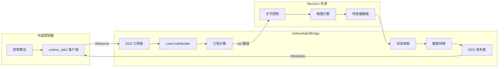

# unitree_mujoco 包分析

## 1. 功能概述

`unitree_mujoco` 包利用 MuJoCo 物理引擎，为宇树（Unitree）系列机器人（如 Go2）提供了一个高逼真度的仿真环境。其核心功能是**模拟真实机器人的硬件接口**，充当一个“数字孪生”。

这使得为真实机器人开发的、基于 `unitree_sdk2` 的控制程序，可以**无需任何修改**，直接在仿真环境中运行、测试和调试。

该包主要实现了以下功能：

*   加载指定的机器人模型（XML 文件）并运行物理仿真。
*   提供一个可视化的仿真窗口，可以实时观察机器人的状态。
*   建立一个桥梁，将 MuJoCo 仿真内部的状态数据（如传感器读数）转换为 `unitree_sdk2` 的 DDS 消息并发布出去。
*   接收外部通过 `unitree_sdk2` 发送的控制指令（DDS 消息），并将其转换为施加在仿真机器人关节上的力矩。
*   模拟手柄输入，允许通过游戏手柄控制仿真机器人。

## 2. 数据处理和更新的主要流程

`unitree_mujoco` 的运行主要由两个并行的线程驱动：**物理仿真线程**和**SDK 桥接线程**。

**A. 物理仿真线程 (`PhysicsThread` in `main.cc`)**

1.  **加载模型：** 程序启动时，加载指定的机器人 MJCF (XML) 模型文件。
2.  **仿真循环：** 该线程在一个循环中不断调用 `mj_step()` 函数。
3.  **状态更新：** `mj_step()` 根据当前状态和施加的控制力（`mjData->ctrl`），计算并更新下一个时间步的仿真状态（如关节角度 `qpos`、速度 `qvel` 等）。
4.  **传感器模拟：** 在每次状态更新后，MuJoCo 会根据模型中定义的传感器（如关节位置/速度传感器、IMU、接触力传感器），自动更新 `mjData->sensordata` 数组。

**B. SDK 桥接线程 (`UnitreeSdk2BridgeThread` in `main.cc`)**

这个线程运行 `UnitreeSdk2Bridge` 类的实例，负责仿真数据和 DDS 消息之间的双向转换。

*   **数据流：仿真 -> 外部控制器 (数据发布)**
    1.  `UnitreeSdk2Bridge` 在独立的线程中，以固定的频率（例如 500Hz）执行 `PublishLowStateGo` 等函数。
    2.  这些函数从 `mjData->sensordata` 中读取最新的仿真传感器数据。
    3.  将读取到的数据填充到 `unitree_sdk2` 定义的 DDS 消息结构体中（例如 `unitree_go::msg::dds_::LowState_`）。
    4.  通过 `ChannelPublisher` 将这些 DDS 消息发布到预定义的网络主题上（例如 `rt/lowstate`）。
    5.  外部的控制器通过订阅这些主题，就能接收到仿真机器人的状态，如同接收真实机器人的状态一样。

*   **数据流：外部控制器 -> 仿真 (指令接收)**
    1.  `UnitreeSdk2Bridge` 创建了一个 `ChannelSubscriber` 来订阅控制指令主题（例如 `rt/lowcmd`）。
    2.  当外部控制器发布一个 `LowCmd_` 消息时，绑定的回调函数 `LowCmdGoHandler` 会被触发。
    3.  该回调函数解析消息内容，获取期望的关节位置 `q`、速度 `dq`、前馈力矩 `tau` 以及 PD 增益 `kp`, `kd`。
    4.  它根据公式 `torque = tau + kp * (q_des - q_sim) + kd * (dq_des - dq_sim)` 计算出最终要施加到每个关节上的总力矩。其中 `q_sim` 和 `dq_sim` 从 `mjData->sensordata` 中实时获取。
    5.  计算出的总力矩被写入到 `mjData->ctrl` 数组中。
    6.  在下一次物理仿真线程调用 `mj_step()` 时，这些力矩就会被施加到机器人的关节上，从而驱动仿真机器人运动。

## 3. 与 unitree_sdk2 的交互

`unitree_mujoco` 与 `unitree_sdk2` 的交互是**间接**且**完全基于 DDS 通信协议**的。它本身并不直接链接或调用 `unitree_sdk2` 的客户端 API，而是**完美地模拟了机器人硬件的 DDS 接口**。

*   **角色扮演：** `unitree_mujoco` 扮演的是**机器人本身**（服务器端），而使用 `unitree_sdk2` 的控制程序扮演的是**客户端**。
*   **发布状态：** `unitree_mujoco` **发布** `rt/lowstate` 和 `rt/sportmodestate` 等主题，供 `unitree_sdk2` 客户端订阅和接收。
*   **订阅指令：** `unitree_mujoco` **订阅** `rt/lowcmd` 主题，以接收来自 `unitree_sdk2` 客户端的控制指令。

这种设计实现了仿真环境和真实硬件之间的高度解耦和接口统一。任何为真实 Go2 机器人编写的、遵循 `unitree_sdk2` 通信协议的程序，都可以无缝地将 `unitree_mujoco` 作为其控制对象。

## 4. 值得说明的内容

*   **配置文件 (`config.yaml`)：** 该文件提供了高度的灵活性，允许用户轻松切换不同的机器人模型、指定用于 DDS 通信的网络接口（例如，使用 `lo` 本地回环接口进行本机仿真，或使用 `eth0` 与另一台机器上的控制器通信），以及配置手柄等。
*   **传感器依赖：** `UnitreeSdk2Bridge` 的功能强依赖于 MuJoCo 模型（XML 文件）中正确定义的传感器。它通过传感器名称（如 `imu_quat`, `touch_FR`）来识别和读取特定的数据。如果模型中缺少必要的传感器，桥接功能将无法正常工作。
*   **多机器人支持：** 代码中通过 `idl_type_` 区分了 `unitree_go` 和 `unitree_hg` 两种不同的 DDS 消息定义，表明该仿真框架被设计为可以支持包括 Go2、H1 在内的多种宇树机器人。

---

## UnitreeSdk2Bridge 类详细分析

### 1. 类的功能概述

`UnitreeSdk2Bridge` 类是 `unitree_mujoco` 包的核心组件，负责在 MuJoCo 仿真环境和 `unitree_sdk2` DDS 通信协议之间建立双向数据桥梁。该类的主要作用是：

- **状态数据发布**：将 MuJoCo 仿真中的机器人状态（关节角度、IMU 数据、接触力等）转换为 DDS 消息并发布
- **控制指令接收**：接收外部控制器通过 DDS 发送的控制指令，并转换为 MuJoCo 仿真中的关节力矩
- **多机器人支持**：根据机器人类型自动选择合适的消息格式（Go2 或 H1/G1）
- **手柄模拟**：提供游戏手柄输入的模拟和转换功能

### 2. 主要方法功能分析

#### 2.1 构造函数 `UnitreeSdk2Bridge(mjModel *model, mjData *data)`
- **功能**：初始化桥接类，设置 DDS 发布者/订阅者和线程
- **关键步骤**：
  1. 调用 `CheckSensor()` 检测仿真模型中的传感器配置
  2. 根据电机数量确定消息类型（`idl_type_`）：≤20个电机使用 `unitree_go`，>20个使用 `unitree_hg`
  3. 创建对应的 DDS 订阅者和发布者
  4. 启动三个独立线程：低级状态发布、高级状态发布、无线手柄状态发布

#### 2.2 控制指令处理方法

**`LowCmdGoHandler(const void *msg)` 和 `LowCmdHgHandler(const void *msg)`**
- **功能**：处理来自外部控制器的低级控制指令
- **数据流程**：
  ```
  DDS LowCmd 消息 → 解析指令参数 → 计算关节力矩 → 更新 mj_data_->ctrl
  ```
- **力矩计算公式**：
  ```cpp
  mj_data_->ctrl[i] = cmd->motor_cmd()[i].tau() +
                      cmd->motor_cmd()[i].kp() * (cmd->motor_cmd()[i].q() - mj_data_->sensordata[i]) +
                      cmd->motor_cmd()[i].kd() * (cmd->motor_cmd()[i].dq() - mj_data_->sensordata[i + num_motor_]);
  ```
  其中：
  - `tau()`：前馈力矩
  - `kp() * (q() - q_actual)`：位置 PD 控制项
  - `kd() * (dq() - dq_actual)`：速度 PD 控制项

#### 2.3 状态数据发布方法

**`PublishLowStateGo()` 和 `PublishLowStateHg()`**
- **功能**：定期发布机器人的低级状态信息
- **发布频率**：500Hz（2000μs 周期）
- **数据映射**：

| 数据类型 | MuJoCo 传感器数据位置 | DDS 消息字段 | 物理意义 |
|----------|---------------------|-------------|----------|
| 关节位置 | `sensordata[0:num_motor_-1]` | `motor_state()[i].q()` | 关节角度 (rad) |
| 关节速度 | `sensordata[num_motor_:2*num_motor_-1]` | `motor_state()[i].dq()` | 关节角速度 (rad/s) |
| 关节力矩 | `sensordata[2*num_motor_:3*num_motor_-1]` | `motor_state()[i].tau_est()` | 关节估计力矩 (Nm) |
| IMU 四元数 | `sensordata[dim_motor_sensor_+0:3]` | `imu_state().quaternion()` | 姿态四元数 (w,x,y,z) |
| IMU 角速度 | `sensordata[dim_motor_sensor_+4:6]` | `imu_state().gyroscope()` | 角速度 (rad/s) |
| IMU 加速度 | `sensordata[dim_motor_sensor_+7:9]` | `imu_state().accelerometer()` | 线加速度 (m/s²) |
| 足端接触力 | `sensordata[dim_motor_sensor_+16:19]` | `foot_force()` | 接触力 (N) |

- **欧拉角计算**：从四元数实时计算 RPY 角度
  ```cpp
  low_state_go_.imu_state().rpy()[0] = atan2(2 * (w * x + y * z), 1 - 2 * (x * x + y * y)); // Roll
  low_state_go_.imu_state().rpy()[1] = asin(2 * (w * y - z * x));                           // Pitch  
  low_state_go_.imu_state().rpy()[2] = atan2(2 * (w * z + x * y), 1 - 2 * (y * y + z * z)); // Yaw
  ```

**`PublishHighState()`**
- **功能**：发布高级状态信息（主要是位置和速度）
- **数据映射**：
  - 位置：`sensordata[dim_motor_sensor_+10:12]` → `position()`
  - 速度：`sensordata[dim_motor_sensor_+13:15]` → `velocity()`

**`PublishWirelessController()`**
- **功能**：发布游戏手柄状态
- **数据处理**：将游戏手柄的模拟量和数字量转换为标准化的 DDS 消息格式

#### 2.4 传感器检测方法

**`CheckSensor()`**
- **功能**：扫描 MuJoCo 模型，检测可用的传感器类型
- **检测项目**：
  - IMU 传感器（`imu_quat`）
  - 位置传感器（`frame_pos`）
  - 接触力传感器（包含 `touch` 关键字的传感器）
- **重要性**：确定后续数据发布时哪些字段可用

#### 2.5 手柄配置方法

**`SetupJoystick(string device, string js_type, int bits)`**
- **功能**：配置游戏手柄的按键和轴映射
- **支持类型**：Xbox 手柄、Switch Pro 手柄等
- **映射配置**：为不同类型手柄的按键和摇杆建立统一的内部映射

### 3. 数据处理和更新流程

#### 3.1 整体数据流架构


#### 3.2 控制指令处理流程
1. **DDS 消息接收**：订阅者接收到 `LowCmd` 消息时触发回调
2. **参数解析**：提取期望位置、速度、力矩和 PD 增益
3. **实时反馈**：从 `mj_data_->sensordata` 获取当前关节状态
4. **PD 控制计算**：根据期望值和实际值计算控制力矩
5. **力矩施加**：将计算结果写入 `mj_data_->ctrl` 数组
6. **物理仿真**：MuJoCo 在下一个时间步应用这些力矩

#### 3.3 状态数据发布流程
1. **定时触发**：独立线程以 500Hz 频率执行发布函数
2. **传感器读取**：从 `mj_data_->sensordata` 读取最新仿真数据
3. **数据映射**：将传感器数据按照预定义的位置映射到 DDS 消息字段
4. **格式转换**：执行必要的单位转换和坐标系变换
5. **消息发布**：通过 DDS 发布者将消息发送到相应主题

### 4. 与外部系统的交互

#### 4.1 与 MuJoCo 的交互
- **数据读取**：通过 `mjData->sensordata` 数组访问所有传感器数据
- **控制输出**：通过 `mjData->ctrl` 数组设置关节控制力矩
- **模型信息**：通过 `mjModel` 获取机器人结构信息（关节数量、传感器配置等）

#### 4.2 与 unitree_sdk2 客户端的交互
- **接口标准化**：完全兼容 `unitree_sdk2` 的 DDS 消息格式
- **主题映射**：
  - 发布：`rt/lowstate`（低级状态）、`rt/sportmodestate`（高级状态）、`rt/wirelesscontroller`（手柄状态）
  - 订阅：`rt/lowcmd`（控制指令）
- **透明切换**：控制程序无需修改即可在仿真和真实硬件间切换

#### 4.3 多线程协调
- **低级状态线程**：500Hz 发布关节和 IMU 数据
- **高级状态线程**：500Hz 发布位置和速度信息  
- **手柄状态线程**：500Hz 发布游戏手柄输入
- **主线程**：处理控制指令接收和其他管理任务

### 5. 设计特点和优势

#### 5.1 高保真度仿真
- **实时 PD 控制**：在仿真中实现与真实机器人相同的控制逻辑
- **完整传感器模拟**：提供 IMU、关节编码器、力传感器等完整的传感器反馈
- **准确的物理模型**：基于 MuJoCo 的高精度物理仿真

#### 5.2 接口一致性
- **API 兼容**：与真实硬件的 `unitree_sdk2` 接口完全一致
- **消息格式统一**：使用相同的 DDS 消息定义
- **无缝切换**：控制代码可以无修改地在仿真和实体间运行

#### 5.3 扩展性设计
- **多机器人支持**：通过 `idl_type_` 自动适配不同机器人型号
- **模块化架构**：传感器检测、控制处理、状态发布等功能独立
- **配置灵活性**：支持多种手柄类型和网络配置
