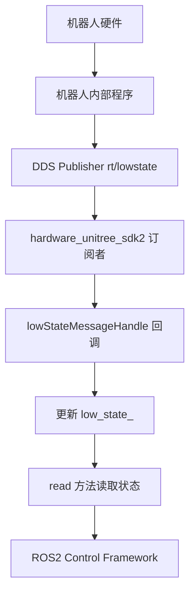
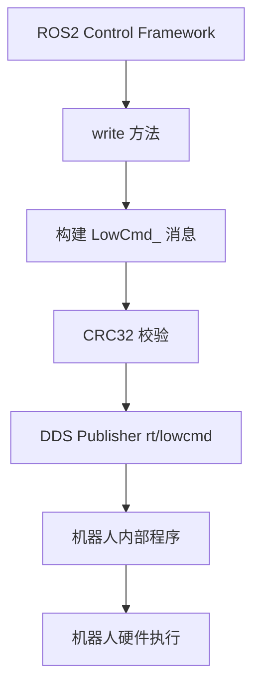
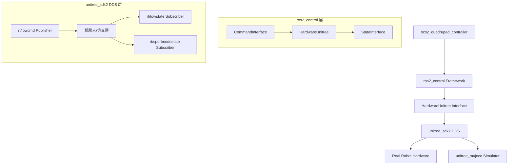
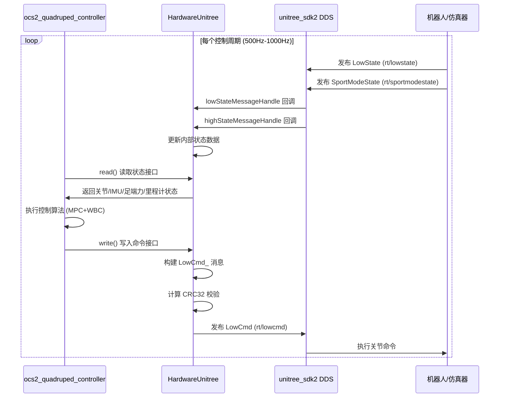
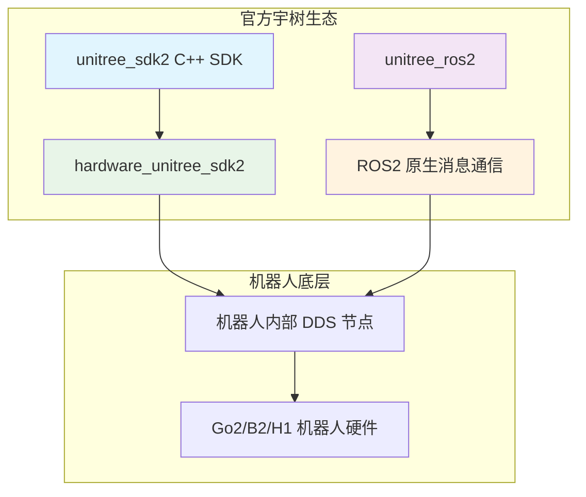
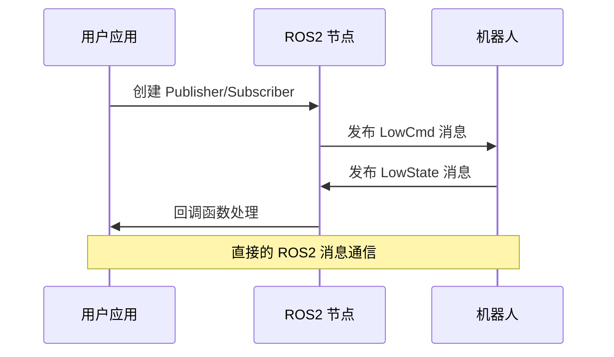
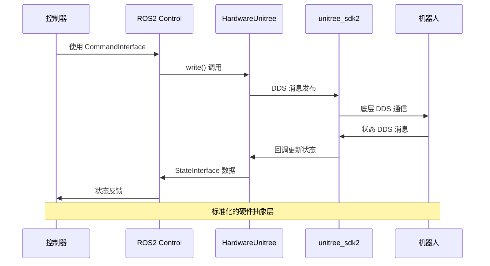

# HardwareUnitree SDK2 硬件接口分析

## 概述

`hardware_unitree_sdk2` 是基于 ROS2 Control 框架的硬件接口包，专门用于与宇树科技的四足机器人（如 Go2）进行通信。该包实现了 ROS2 Control 的 `SystemInterface`，通过 unitree_sdk2 与机器人的底层硬件进行数据交换。

## 核心组件

### 1. HardwareUnitree 类

`HardwareUnitree` 类继承自 `hardware_interface::SystemInterface`，是整个硬件接口的核心。

#### 主要成员变量

```cpp
// DDS 消息结构
unitree_go::msg::dds_::LowCmd_ low_cmd_{};     // 底层命令消息
unitree_go::msg::dds_::LowState_ low_state_{}; // 底层状态消息  
unitree_go::msg::dds_::SportModeState_ high_state_{}; // 高层状态消息

// DDS 通信接口
unitree::robot::ChannelPublisherPtr<unitree_go::msg::dds_::LowCmd_> low_cmd_publisher_;
unitree::robot::ChannelSubscriberPtr<unitree_go::msg::dds_::LowState_> lows_tate_subscriber_;
unitree::robot::ChannelSubscriberPtr<unitree_go::msg::dds_::SportModeState_> high_state_subscriber_;

// 关节命令接口（传递给机器人）
std::vector<double> joint_torque_command_;    // 关节力矩命令 (12)
std::vector<double> joint_position_command_;  // 关节位置命令 (12)
std::vector<double> joint_velocities_command_; // 关节速度命令 (12)
std::vector<double> joint_kp_command_;        // 关节 Kp 增益命令 (12)
std::vector<double> joint_kd_command_;        // 关节 Kd 增益命令 (12)

// 关节状态接口（从机器人读取）
std::vector<double> joint_position_;         // 关节位置状态 (12)
std::vector<double> joint_velocities_;       // 关节速度状态 (12)
std::vector<double> joint_effort_;           // 关节力矩状态 (12)

// 传感器状态接口
std::vector<double> imu_states_;             // IMU 状态 (10): [qw,qx,qy,qz,gx,gy,gz,ax,ay,az]
std::vector<double> foot_force_;             // 足端力状态 (4): [FL,FR,RL,RR]
std::vector<double> high_states_;            // 高层状态 (6): [px,py,pz,vx,vy,vz]

// 配置参数
std::string network_interface_ = "lo";       // 网络接口名称
int domain_ = 1;                             // DDS 域 ID
bool show_foot_force_ = false;               // 是否显示足端力信息

// 关节接口映射
std::unordered_map<std::string, std::vector<std::string>> joint_interfaces = {
    {"position", {}},
    {"velocity", {}}, 
    {"effort", {}}
};
```

#### 核心方法

##### on_init() 方法
- **功能**: 初始化硬件接口
- **主要操作**:
  ```cpp
  // 初始化数据容器
  joint_torque_command_.assign(12, 0);
  joint_position_command_.assign(12, 0);
  joint_velocities_command_.assign(12, 0);
  joint_kp_command_.assign(12, 0);
  joint_kd_command_.assign(12, 0);
  
  joint_position_.assign(12, 0);
  joint_velocities_.assign(12, 0);
  joint_effort_.assign(12, 0);
  
  imu_states_.assign(10, 0);
  foot_force_.assign(4, 0);
  high_states_.assign(6, 0);
  
  // 解析硬件参数
  network_interface_ = info.hardware_parameters["network_interface"];
  domain_ = std::stoi(info.hardware_parameters["domain"]);
  show_foot_force_ = info.hardware_parameters["show_foot_force"] == "true";
  
  // 初始化 DDS 通信
  ChannelFactory::Instance()->Init(domain_, network_interface_);
  
  // 创建发布者和订阅者
  low_cmd_publisher_ = std::make_shared<ChannelPublisher<unitree_go::msg::dds_::LowCmd_>>(TOPIC_LOWCMD);
  lows_tate_subscriber_ = std::make_shared<ChannelSubscriber<unitree_go::msg::dds_::LowState_>>(TOPIC_LOWSTATE);
  high_state_subscriber_ = std::make_shared<ChannelSubscriber<unitree_go::msg::dds_::SportModeState_>>(TOPIC_HIGHSTATE);
  ```

##### read() 方法
- **功能**: 从机器人读取传感器数据并更新状态接口
- **数据流**:
  ```cpp
  // 关节状态数据映射
  for (int i = 0; i < 12; ++i) {
      joint_position_[i] = low_state_.motor_state()[i].q();        // 关节位置
      joint_velocities_[i] = low_state_.motor_state()[i].dq();     // 关节速度
      joint_effort_[i] = low_state_.motor_state()[i].tau_est();    // 关节力矩估计
  }
  
  // IMU 数据映射 [qw, qx, qy, qz, gx, gy, gz, ax, ay, az]
  imu_states_[0] = low_state_.imu_state().quaternion()[0];       // qw
  imu_states_[1] = low_state_.imu_state().quaternion()[1];       // qx  
  imu_states_[2] = low_state_.imu_state().quaternion()[2];       // qy
  imu_states_[3] = low_state_.imu_state().quaternion()[3];       // qz
  imu_states_[4] = low_state_.imu_state().gyroscope()[0];        // gx
  imu_states_[5] = low_state_.imu_state().gyroscope()[1];        // gy
  imu_states_[6] = low_state_.imu_state().gyroscope()[2];        // gz
  imu_states_[7] = low_state_.imu_state().accelerometer()[0];    // ax
  imu_states_[8] = low_state_.imu_state().accelerometer()[1];    // ay
  imu_states_[9] = low_state_.imu_state().accelerometer()[2];    // az
  
  // 足端力数据映射 [FL, FR, RL, RR]  
  foot_force_[0] = low_state_.foot_force()[0];
  foot_force_[1] = low_state_.foot_force()[1];
  foot_force_[2] = low_state_.foot_force()[2];
  foot_force_[3] = low_state_.foot_force()[3];
  
  // 高层状态数据映射 [px, py, pz, vx, vy, vz]
  high_states_[0] = high_state_.position()[0];    // x 位置
  high_states_[1] = high_state_.position()[1];    // y 位置
  high_states_[2] = high_state_.position()[2];    // z 位置
  high_states_[3] = high_state_.velocity()[0];    // x 速度
  high_states_[4] = high_state_.velocity()[1];    // y 速度
  high_states_[5] = high_state_.velocity()[2];    // z 速度
  ```

##### write() 方法
- **功能**: 将控制命令发送给机器人
- **数据流**:
  ```cpp
  // 构建关节控制命令
  for (int i = 0; i < 12; ++i) {
      low_cmd_.motor_cmd()[i].mode() = 0x01;                                    // 设置为伺服模式
      low_cmd_.motor_cmd()[i].q() = static_cast<float>(joint_position_command_[i]);    // 位置命令
      low_cmd_.motor_cmd()[i].dq() = static_cast<float>(joint_velocities_command_[i]); // 速度命令
      low_cmd_.motor_cmd()[i].kp() = static_cast<float>(joint_kp_command_[i]);         // Kp 增益
      low_cmd_.motor_cmd()[i].kd() = static_cast<float>(joint_kd_command_[i]);         // Kd 增益
      low_cmd_.motor_cmd()[i].tau() = static_cast<float>(joint_torque_command_[i]);    // 力矩命令
  }
  
  // 计算 CRC32 校验和
  low_cmd_.crc() = crc32_core(reinterpret_cast<uint32_t*>(&low_cmd_),
                              (sizeof(unitree_go::msg::dds_::LowCmd_) >> 2) - 1);
  
  // 发布命令消息
  low_cmd_publisher_->Write(low_cmd_);
  ```

##### 回调函数
```cpp
// 底层状态消息处理
void lowStateMessageHandle(const void* messages) {
    low_state_ = *static_cast<const unitree_go::msg::dds_::LowState_*>(messages);
}

// 高层状态消息处理
void highStateMessageHandle(const void* messages) {
    high_state_ = *static_cast<const unitree_go::msg::dds_::SportModeState_*>(messages);
}
```

### 2. DDS 通信机制

#### 通信主题定义
```cpp
#define TOPIC_LOWCMD "rt/lowcmd"        // 底层命令主题
#define TOPIC_LOWSTATE "rt/lowstate"    // 底层状态主题  
#define TOPIC_HIGHSTATE "rt/sportmodestate" // 高层状态主题
```

#### 数据接收流程



#### 数据发送流程



### 3. 接口导出机制

#### 状态接口导出 (export_state_interfaces)
```cpp
// 关节状态接口
for (const auto& joint_name : joint_interfaces["position"]) {
    state_interfaces.emplace_back(joint_name, "position", &joint_position_[ind++]);
}
for (const auto& joint_name : joint_interfaces["velocity"]) {
    state_interfaces.emplace_back(joint_name, "velocity", &joint_velocities_[ind++]);
}
for (const auto& joint_name : joint_interfaces["effort"]) {
    state_interfaces.emplace_back(joint_name, "effort", &joint_effort_[ind++]);
}

// IMU 传感器状态接口
for (uint i = 0; i < info_.sensors[0].state_interfaces.size(); i++) {
    state_interfaces.emplace_back(
        info_.sensors[0].name, info_.sensors[0].state_interfaces[i].name, &imu_states_[i]);
}

// 足端力传感器状态接口
if (info_.sensors.size() > 1) {
    for (uint i = 0; i < info_.sensors[1].state_interfaces.size(); i++) {
        state_interfaces.emplace_back(
            info_.sensors[1].name, info_.sensors[1].state_interfaces[i].name, &foot_force_[i]);
    }
}

// 里程计状态接口
if (info_.sensors.size() > 2) {
    for (uint i = 0; i < info_.sensors[2].state_interfaces.size(); i++) {
        state_interfaces.emplace_back(
            info_.sensors[2].name, info_.sensors[2].state_interfaces[i].name, &high_states_[i]);
    }
}
```

#### 命令接口导出 (export_command_interfaces)
```cpp
// 关节位置命令接口
for (const auto& joint_name : joint_interfaces["position"]) {
    command_interfaces.emplace_back(joint_name, "position", &joint_position_command_[ind++]);
}

// 关节速度命令接口
for (const auto& joint_name : joint_interfaces["velocity"]) {
    command_interfaces.emplace_back(joint_name, "velocity", &joint_velocities_command_[ind++]);
}

// 关节力矩及增益命令接口
for (const auto& joint_name : joint_interfaces["effort"]) {
    command_interfaces.emplace_back(joint_name, "effort", &joint_torque_command_[ind]);
    command_interfaces.emplace_back(joint_name, "kp", &joint_kp_command_[ind]);
    command_interfaces.emplace_back(joint_name, "kd", &joint_kd_command_[ind]);
    ind++;
}
```

### 4. 数据类型和数组含义

#### 关节数据 (12个关节)
关节顺序：FL_hip, FL_thigh, FL_calf, FR_hip, FR_thigh, FR_calf, RL_hip, RL_thigh, RL_calf, RR_hip, RR_thigh, RR_calf

| 数组索引 | 关节名称 | 物理意义 |
|---------|----------|----------|
| 0 | FL_hip_joint | 前左髋关节 |
| 1 | FL_thigh_joint | 前左大腿关节 |
| 2 | FL_calf_joint | 前左小腿关节 |
| 3 | FR_hip_joint | 前右髋关节 |
| 4 | FR_thigh_joint | 前右大腿关节 |
| 5 | FR_calf_joint | 前右小腿关节 |
| 6 | RL_hip_joint | 后左髋关节 |
| 7 | RL_thigh_joint | 后左大腿关节 |
| 8 | RL_calf_joint | 后左小腿关节 |
| 9 | RR_hip_joint | 后右髋关节 |
| 10 | RR_thigh_joint | 后右大腿关节 |
| 11 | RR_calf_joint | 后右小腿关节 |

#### IMU 数据 (10个元素)
| 数组索引 | 物理意义 | 单位 | 说明 |
|---------|----------|------|------|
| 0 | quaternion.w | - | 四元数实部 |
| 1 | quaternion.x | - | 四元数虚部 x |
| 2 | quaternion.y | - | 四元数虚部 y |
| 3 | quaternion.z | - | 四元数虚部 z |
| 4 | gyroscope.x | rad/s | x 轴角速度 |
| 5 | gyroscope.y | rad/s | y 轴角速度 |
| 6 | gyroscope.z | rad/s | z 轴角速度 |
| 7 | accelerometer.x | m/s² | x 轴线性加速度 |
| 8 | accelerometer.y | m/s² | y 轴线性加速度 |
| 9 | accelerometer.z | m/s² | z 轴线性加速度 |

#### 足端力数据 (4个元素)
| 数组索引 | 物理意义 | 单位 | 说明 |
|---------|----------|------|------|
| 0 | FL_foot_force | N | 前左足端接触力 |
| 1 | FR_foot_force | N | 前右足端接触力 |
| 2 | RL_foot_force | N | 后左足端接触力 |
| 3 | RR_foot_force | N | 后右足端接触力 |

#### 高层状态数据 (6个元素)
| 数组索引 | 物理意义 | 单位 | 说明 |
|---------|----------|------|------|
| 0 | position.x | m | 机体 x 位置 |
| 1 | position.y | m | 机体 y 位置 |
| 2 | position.z | m | 机体 z 位置 |
| 3 | velocity.x | m/s | 机体 x 速度 |
| 4 | velocity.y | m/s | 机体 y 速度 |
| 5 | velocity.z | m/s | 机体 z 速度 |

### 5. 安全和校验机制

#### CRC32 校验
```cpp
uint32_t crc32_core(const uint32_t *ptr, uint32_t len) {
    unsigned int xbit = 0;
    unsigned int data = 0;
    unsigned int CRC32 = 0xFFFFFFFF;
    const unsigned int dwPolynomial = 0x04c11db7;
    
    for (unsigned int i = 0; i < len; i++) {
        xbit = 1 << 31;
        data = ptr[i];
        for (unsigned int bits = 0; bits < 32; bits++) {
            if (CRC32 & 0x80000000) {
                CRC32 <<= 1;
                CRC32 ^= dwPolynomial;
            } else {
                CRC32 <<= 1;
            }
            if (data & xbit) CRC32 ^= dwPolynomial;
            xbit >>= 1;
        }
    }
    return CRC32;
}
```

#### 命令初始化
```cpp
void initLowCmd() {
    low_cmd_.head()[0] = 0xFE;     // 消息头部标识
    low_cmd_.head()[1] = 0xEF;
    low_cmd_.level_flag() = 0xFF;  // 权限标志
    low_cmd_.gpio() = 0;           // GPIO 状态
    
    // 初始化所有电机为伺服模式
    for (int i = 0; i < 20; i++) {
        low_cmd_.motor_cmd()[i].mode() = 0x01; // PMSM 伺服模式
        low_cmd_.motor_cmd()[i].q() = 0;
        low_cmd_.motor_cmd()[i].kp() = 0;
        low_cmd_.motor_cmd()[i].dq() = 0;
        low_cmd_.motor_cmd()[i].kd() = 0;
        low_cmd_.motor_cmd()[i].tau() = 0;
    }
}
```

### 6. 与 ros2_control、unitree_sdk2、unitree_mujoco 的数据交互关系

#### 系统架构图


#### 数据交互详细流程

##### 1. ros2_control → HardwareUnitree
**命令接口数据传递**:
```cpp
// 控制器写入命令接口
controller.joint_torque_command_interface_[i].set_value(torque_value);
controller.joint_position_command_interface_[i].set_value(position_value);
controller.joint_velocity_command_interface_[i].set_value(velocity_value);
controller.joint_kp_command_interface_[i].set_value(kp_value);
controller.joint_kd_command_interface_[i].set_value(kd_value);

// HardwareUnitree 内部存储
joint_torque_command_[i] = torque_value;
joint_position_command_[i] = position_value;
joint_velocities_command_[i] = velocity_value;
joint_kp_command_[i] = kp_value;
joint_kd_command_[i] = kd_value;
```

##### 2. HardwareUnitree → unitree_sdk2
**DDS 消息发布**:
```cpp
// write() 方法中构建 LowCmd_ 消息
for (int i = 0; i < 12; ++i) {
    low_cmd_.motor_cmd()[i].mode() = 0x01;                                    // 伺服模式
    low_cmd_.motor_cmd()[i].q() = static_cast<float>(joint_position_command_[i]);    // 位置命令
    low_cmd_.motor_cmd()[i].dq() = static_cast<float>(joint_velocities_command_[i]); // 速度命令
    low_cmd_.motor_cmd()[i].kp() = static_cast<float>(joint_kp_command_[i]);         // Kp 增益
    low_cmd_.motor_cmd()[i].kd() = static_cast<float>(joint_kd_command_[i]);         // Kd 增益
    low_cmd_.motor_cmd()[i].tau() = static_cast<float>(joint_torque_command_[i]);    // 力矩命令
}

// 发布到 rt/lowcmd 主题
low_cmd_publisher_->Write(low_cmd_);
```

##### 3. unitree_sdk2 → HardwareUnitree
**DDS 消息订阅**:
```cpp
// 订阅 rt/lowstate 主题
lows_tate_subscriber_->InitChannel([this](auto&& msg) {
    lowStateMessageHandle(std::forward<decltype(msg)>(msg));
}, 1);

// 订阅 rt/sportmodestate 主题
high_state_subscriber_->InitChannel([this](auto&& msg) {
    highStateMessageHandle(std::forward<decltype(msg)>(msg));
}, 1);

// 回调函数更新内部状态
void lowStateMessageHandle(const void* messages) {
    low_state_ = *static_cast<const unitree_go::msg::dds_::LowState_*>(messages);
}
```

##### 4. HardwareUnitree → ros2_control
**状态接口数据传递**:
```cpp
// read() 方法中更新状态数据
for (int i = 0; i < 12; ++i) {
    joint_position_[i] = low_state_.motor_state()[i].q();
    joint_velocities_[i] = low_state_.motor_state()[i].dq();
    joint_effort_[i] = low_state_.motor_state()[i].tau_est();
}

// 控制器读取状态接口
double position = controller.joint_position_state_interface_[i].get_value();
double velocity = controller.joint_velocity_state_interface_[i].get_value();
double effort = controller.joint_effort_state_interface_[i].get_value();
```

#### 与 unitree_mujoco 的交互
当使用 MuJoCo 仿真时：
1. **unitree_mujoco** 模拟机器人硬件行为
2. **订阅 rt/lowcmd** 主题，接收控制命令
3. **发布 rt/lowstate** 和 **rt/sportmodestate** 主题，提供仿真状态
4. **HardwareUnitree** 无需修改，透明地与仿真器交互

#### 与真实机器人硬件的交互
当连接真实机器人时：
1. **机器人内部程序** 作为 DDS 节点运行
2. **订阅 rt/lowcmd** 主题，将命令传递给硬件执行器
3. **发布 rt/lowstate** 和 **rt/sportmodestate** 主题，提供真实传感器数据
4. **HardwareUnitree** 通过相同的接口与真实硬件交互

### 7. 配置文件

#### URDF 配置示例 (go2_description/xacro/ros2_control.xacro)
```xml
<ros2_control name="UnitreeSystem" type="system">
    <hardware>
        <plugin>hardware_unitree_sdk2/HardwareUnitree</plugin>
        <!-- 可选参数 -->
        <!-- <param name="domain">0</param> -->
        <!-- <param name="network_interface">enp46s0</param> -->
        <!-- <param name="show_foot_force">true</param> -->
    </hardware>
    
    <!-- 12个关节的配置示例 -->
    <joint name="FL_hip_joint">
        <command_interface name="position"/>
        <command_interface name="velocity"/>
        <command_interface name="effort"/>
        <command_interface name="kp"/>
        <command_interface name="kd"/>
        <state_interface name="position"/>
        <state_interface name="velocity"/>
        <state_interface name="effort"/>
    </joint>
    
    <!-- IMU 传感器配置 -->
    <sensor name="imu">
        <state_interface name="orientation.w"/>
        <state_interface name="orientation.x"/>
        <state_interface name="orientation.y"/>
        <state_interface name="orientation.z"/>
        <state_interface name="angular_velocity.x"/>
        <state_interface name="angular_velocity.y"/>
        <state_interface name="angular_velocity.z"/>
        <state_interface name="linear_acceleration.x"/>
        <state_interface name="linear_acceleration.y"/>
        <state_interface name="linear_acceleration.z"/>
    </sensor>
    
    <!-- 足端力传感器配置 -->
    <sensor name="foot_force_sensor">
        <state_interface name="FL_foot_force"/>
        <state_interface name="FR_foot_force"/>
        <state_interface name="RL_foot_force"/>
        <state_interface name="RR_foot_force"/>
    </sensor>
    
    <!-- 里程计传感器配置 -->
    <sensor name="odometer">
        <state_interface name="position.x"/>
        <state_interface name="position.y"/>
        <state_interface name="position.z"/>
        <state_interface name="velocity.x"/>
        <state_interface name="velocity.y"/>
        <state_interface name="velocity.z"/>
    </sensor>
</ros2_control>
```

#### 参数说明
- **domain**: DDS 域 ID，默认为 1，在 config 中设置为 0
- **network_interface**: 网络接口名称，默认为 "lo"，在 config 中设置为 enp46s0
- **show_foot_force**: 是否在日志中显示足端力数据，默认为 false，在 config 中设置为 true

### 8. 实时数据循环



### 9. 接口总结

#### 状态接口 (从机器人读取)
| 接口类型 | 数量 | 数据类型 | 说明 |
|----------|------|----------|------|
| 关节位置 | 12 | double | joint_position_[0-11] |
| 关节速度 | 12 | double | joint_velocities_[0-11] |
| 关节力矩 | 12 | double | joint_effort_[0-11] |
| IMU状态 | 10 | double | imu_states_[0-9] |
| 足端力 | 4 | double | foot_force_[0-3] |
| 里程计 | 6 | double | high_states_[0-5] |
| **总计** | **56** | | |

#### 命令接口 (发送给机器人)
| 接口类型 | 数量 | 数据类型 | 说明 |
|----------|------|----------|------|
| 关节位置命令 | 12 | double | joint_position_command_[0-11] |
| 关节速度命令 | 12 | double | joint_velocities_command_[0-11] |
| 关节力矩命令 | 12 | double | joint_torque_command_[0-11] |
| 关节Kp增益 | 12 | double | joint_kp_command_[0-11] |
| 关节Kd增益 | 12 | double | joint_kd_command_[0-11] |
| **总计** | **60** | | |

### 10. 通信协议详情

#### DDS 配置
- **协议**: Data Distribution Service (DDS)
- **传输层**: UDP/IP
- **频率**: 最高 1000Hz
- **延迟**: < 1ms (局域网)

#### 主题和消息类型
| 主题名称 | 消息类型 | 方向 | 说明 |
|----------|----------|------|------|
| rt/lowcmd | unitree_go::msg::dds_::LowCmd_ | 发布 | 底层控制命令 |
| rt/lowstate | unitree_go::msg::dds_::LowState_ | 订阅 | 底层状态反馈 |
| rt/sportmodestate | unitree_go::msg::dds_::SportModeState_ | 订阅 | 高层状态反馈 |

#### 网络配置
- **domain**: DDS 域 ID (默认 1)
- **network_interface**: 网络接口 (默认 "lo")
- **实际使用**: 需要根据机器人网络配置调整

### 11. 特点与优势

#### 实时性
- 基于 DDS 的低延迟通信 (< 1ms)
- 高频率数据交换 (最高 1000Hz)
- 异步消息处理，避免阻塞

#### 完整性
- 支持所有机器人传感器数据
- 完整的多模态控制接口 (位置+速度+力矩+增益)
- 与 ROS2 Control 框架无缝集成

#### 安全性
- CRC32 数据完整性校验
- 命令初始化和范围检查
- DDS 通信的可靠性保证

#### 可扩展性
- 模块化插件设计
- 支持仿真和实物的透明切换
- 易于添加新的传感器接口

### 12. 总结

`hardware_unitree_sdk2` 作为 ROS2 Control 与宇树机器人之间的关键桥梁，通过 DDS 通信协议实现了：

- **高频低延迟**的实时数据交换
- **完整丰富**的传感器和执行器接口
- **仿真实物**的透明切换能力
- **安全可靠**的数据传输机制

该包的设计充分体现了现代机器人软件架构的模块化、标准化和可扩展性原则，为四足机器人控制系统提供了坚实的硬件抽象基础。无论是在学术研究、工业应用还是教育培训中，都能提供稳定可靠的机器人控制接口。

---

## 与 unitree_ros2 包的对比分析

### 1. 包的关系与演进

#### 发展关系
`hardware_unitree_sdk2` 并不是直接基于 `unitree_ros2` 包开发的，而是两个不同的技术路线：

- **unitree_ros2**: 是宇树科技官方提供的 ROS2 通信包，直接使用 ROS2 消息与机器人进行通信
- **hardware_unitree_sdk2**: 是基于 `unitree_sdk2` 开发的 ROS2 Control 硬件接口，通过 DDS 与机器人通信



#### 技术路线对比

| 特性 | unitree_ros2 | hardware_unitree_sdk2 |
|------|--------------|----------------------|
| **通信方式** | ROS2 原生消息 | DDS + unitree_sdk2 |
| **集成框架** | 纯 ROS2 节点 | ROS2 Control 硬件接口 |
| **消息格式** | ROS2 msg 格式 | unitree_sdk2 IDL 格式 |
| **控制抽象** | 应用层直接控制 | 硬件抽象层 |
| **实时性** | 一般 | 高（专为实时控制优化） |

### 2. 架构差异分析

#### unitree_ros2 的架构特点



**特点**：
- **直接通信**: 应用程序直接通过 ROS2 话题与机器人通信
- **简单易用**: 使用标准的 ROS2 发布/订阅模式
- **消息类型**: 使用 `unitree_go::msg::LowCmd` 和 `unitree_go::msg::LowState`
- **应用场景**: 适合快速原型开发和简单控制任务

#### hardware_unitree_sdk2 的架构特点



**特点**：
- **标准化接口**: 遵循 ROS2 Control 标准，提供统一的硬件抽象
- **实时优化**: 专为实时控制场景设计
- **多控制器支持**: 可同时运行多个控制器
- **硬件无关**: 控制器代码与具体硬件解耦

### 3. 功能对比

#### 数据接口对比

| 数据类型 | unitree_ros2 | hardware_unitree_sdk2 |
|----------|--------------|----------------------|
| **关节控制** | 直接设置 motor_cmd 数组 | 通过 CommandInterface 抽象 |
| **关节状态** | 直接读取 motor_state 数组 | 通过 StateInterface 抽象 |
| **IMU 数据** | 直接访问 imu_state 字段 | 映射到标准传感器接口 |
| **足端力** | 直接访问 foot_force 数组 | 映射到力传感器接口 |
| **数据校验** | 用户手动处理 CRC | 自动处理 CRC 校验 |

#### 使用复杂度对比

**unitree_ros2 使用示例**:
```cpp
// 简单直接，但需要用户处理很多底层细节
class LowLevelController : public rclcpp::Node {
    void timer_callback() {
        cmd_msg_.motor_cmd[0].q = target_position;
        cmd_msg_.motor_cmd[0].kp = 10.0;
        cmd_msg_.motor_cmd[0].tau = target_torque;
        get_crc(cmd_msg_);  // 手动计算 CRC
        cmd_publisher_->publish(cmd_msg_);
    }
};
```

**hardware_unitree_sdk2 使用示例**:
```cpp
// 更高层的抽象，但需要了解 ROS2 Control 框架
class MyController : public controller_interface::ControllerInterface {
    controller_interface::return_type update() {
        joint_position_command_[0] = target_position;
        joint_effort_command_[0] = target_torque;
        joint_kp_command_[0] = 10.0;
        // CRC 和通信细节由硬件接口自动处理
        return controller_interface::return_type::OK;
    }
};
```

### 4. 适用场景分析

#### unitree_ros2 适用场景
- **快速原型开发**: 简单直接的 API，适合快速验证想法
- **教育和学习**: 直观的消息结构，便于理解机器人通信
- **简单控制任务**: 不需要复杂控制框架的应用
- **研究实验**: 需要直接访问底层数据的研究项目

#### hardware_unitree_sdk2 适用场景
- **专业控制系统**: 需要高实时性和稳定性的生产环境
- **复杂控制算法**: MPC、强化学习等高级控制方法
- **多控制器协作**: 需要同时运行多个控制器的系统
- **标准化开发**: 遵循 ROS2 Control 标准的项目

### 5. 技术优势对比

#### unitree_ros2 的优势
1. **学习曲线平缓**: 只需了解 ROS2 基础概念
2. **开发速度快**: 可以快速编写控制程序
3. **直接控制**: 对机器人有完全的控制权
4. **灵活性高**: 可以访问所有底层数据

#### hardware_unitree_sdk2 的优势
1. **标准化程度高**: 遵循 ROS2 Control 标准
2. **实时性能优异**: 专为实时控制优化
3. **可扩展性强**: 易于集成新的控制器
4. **安全性好**: 内置数据校验和错误处理
5. **维护性高**: 清晰的架构分层

### 6. 选择建议

#### 选择 unitree_ros2 的情况
- 学习和教育目的
- 快速原型验证
- 简单的遥控或演示应用
- 对 ROS2 Control 不熟悉的开发者

#### 选择 hardware_unitree_sdk2 的情况
- 专业的四足机器人控制项目
- 需要高实时性的应用
- 复杂的控制算法实现
- 需要与其他 ROS2 Control 兼容硬件集成
- 长期维护的商业项目

### 7. 总结

`unitree_ros2` 和 `hardware_unitree_sdk2` 代表了两种不同的技术理念：

- **unitree_ros2** 追求简单直接，适合快速开发和学习
- **hardware_unitree_sdk2** 追求标准化和专业化，适合生产级应用

两者并非竞争关系，而是针对不同需求和使用场景的互补方案。选择哪种方案主要取决于项目的复杂度、实时性要求、团队技术背景和长期维护考虑。