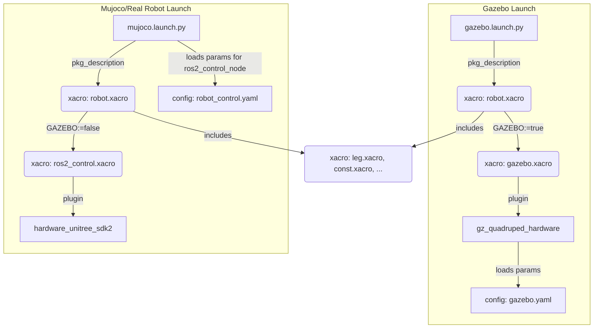

# `ocs2_quadruped_controller` 启动文件分析

这两个启动文件是 `ocs2_quadruped_controller` 控制器在不同环境（仿真与现实）下运行的入口，它们负责加载机器人模型、启动仿真环境（如果需要）、配置并启动 `ros2_control` 框架以及相关控制器。

## 1. 配置文件加载流程

两个启动文件都遵循一个相似但针对不同环境有所区别的配置加载流程。核心思想是利用 `xacro` 的条件包含机制，根据启动参数来生成适用于特定环境的机器人描述文件 (URDF)。

### 嵌套关系图

### 详细流程

1.  **启动入口 (`.launch.py`)**:
    -   `gazebo.launch.py`: 接收一个关键参数 `pkg_description` (默认为 `go2_description`)。它在调用 `xacro` 解析器时，会传入一个映射 `mappings={'GAZEBO': 'true'}`。
    -   `mujoco.launch.py`: 同样接收 `pkg_description` 参数，但在调用 `xacro` 解析器时**不**传入 `GAZEBO` 映射，使其默认为 `false`。

2.  **主模型文件 (`robot.xacro`)**:
    -   这是机器人模型的顶层 `xacro` 文件。它使用 `<xacro:if value="$(arg GAZEBO)">` 和 `<xacro:unless value="$(arg GAZEBO)">` 条件块来决定包含哪个 `ros2_control` 配置文件。
    -   当 `GAZEBO` 为 `true` 时（由 `gazebo.launch.py` 触发），它会包含 `gazebo.xacro`。
    -   当 `GAZEBO` 为 `false` 时（由 `mujoco.launch.py` 触发），它会包含 `ros2_control.xacro`。

3.  **环境特定的 `ros2_control` 配置 (`gazebo.xacro` vs `ros2_control.xacro`)**:
    -   `gazebo.xacro`: 定义了一个名为 `GazeboSystem` 的 `<ros2_control>` 系统。其 `<hardware>` 标签指定使用 `gz_quadruped_hardware/GazeboSimSystem` 插件。这个插件是专门用于 Gazebo 仿真的硬件接口。此外，该文件还包含了一个 Gazebo 插件 `gz_quadruped_hardware::GazeboSimQuadrupedPlugin`，并指定它从 `go2_description/config/gazebo.yaml` 文件加载参数。
    -   `ros2_control.xacro`: 定义了一个名为 `UnitreeSystem` 的 `<ros2_control>` 系统。其 `<hardware>` 标签指定使用 `hardware_unitree_sdk2/HardwareUnitree` 插件。这个插件是用于和 Unitree 真实机器人硬件或其官方 SDK 支持的仿真（如 MuJoCo）进行通信的硬件接口。

4.  **控制器参数文件 (`gazebo.yaml` vs `robot_control.yaml`)**:
    -   `gazebo.yaml`: 由 Gazebo 插件加载，包含了 `controller_manager` 的配置以及 `joint_state_broadcaster`、`imu_sensor_broadcaster` 和 `ocs2_quadruped_controller` 等控制器的具体参数。
    -   `robot_control.yaml`: 在 `mujoco.launch.py` 中，这个文件被直接传递给 `ros2_control_node` 节点。它同样定义了 `controller_manager` 和各个控制器的参数，但其内部的参数值（如 `update_rate`, `feet_force_threshold`）可能与 `gazebo.yaml` 不同，以适应真实硬件或 MuJoCo 的特性。

## 2. `ros2_control` 配置分析

`ros2_control` 的配置被巧妙地分成了两个部分：

1.  **硬件抽象层定义 (在 XACRO/URDF 中)**:
    -   `<ros2_control>` 标签定义了整个控制系统的类型（`system`）。
    -   `<hardware>` 部分通过 `<plugin>` 标签指定了与物理硬件或仿真器交互的后端插件。这是实现仿真和现实切换的核心。
    -   `<joint>` 和 `<sensor>` 标签声明了机器人可用的所有接口（`command_interface` 和 `state_interface`）。控制器（如 `ocs2_quadruped_controller`）将从这些声明的接口中请求它所需要的资源。

2.  **控制器层配置 (在 YAML 中)**:
    -   `controller_manager` 的 `ros__parameters` 部分配置了 `ros2_control` 节点的核心参数，如 `update_rate`。
    -   YAML 文件中列出了所有需要加载的控制器及其类型（例如 `ocs2_quadruped_controller` 的类型是 `ocs2_quadruped_controller/Ocs2QuadrupedController`）。
    -   每个控制器下面都有各自的 `ros__parameters`，用于配置该控制器的特定行为，例如关节名称、接口类型、IMU 名称等。

这种分离使得机器人模型（URDF）和控制器配置（YAML）可以独立修改，提高了模块化程度。

## 3. `mujoco.launch.py` 与真实硬件

`mujoco.launch.py` **是**可以用于真实硬件的。原因如下：

-   它加载的 `ros2_control.xacro` 文件中指定的硬件接口插件是 `hardware_unitree_sdk2/HardwareUnitree`，这个插件被设计为既可以连接到 Unitree 的 SDK（用于 MuJoCo 仿真），也可以直接连接到真实机器人的网络接口。

### 用于真实硬件的注意事项

根据 `go2_description/README.md` 和 `ros2_control.xacro` 文件的内容，将此启动文件用于真实硬件时需要注意：

1.  **修改硬件接口参数**: 在 `go2_description/xacro/ros2_control.xacro` 文件中，`<hardware>` 标签下的参数（如 `network_interface`）被注释掉了。需要取消注释并正确设置参数，以匹配机器人连接的本地网络接口。
2.  **禁用官方控制器**: 在启动 `ros2_control` 之前，必须先禁用机器人自带的底层运动控制器，以避免指令冲突。
3.  **安全第一**: 强烈建议在部署到真实机器人之前，在 MuJoCo 仿真环境中进行充分的测试。
4.  **手柄适配**: 如果希望使用 Unitree 的遥控器，需要启动 `unitree_joystick_input` 包，而不是通用的 `joystick_input`。

## 4. 其他说明

-   **启动顺序**: 两个启动文件都使用了 `RegisterEventHandler` 和 `OnProcessExit` 来确保节点的启动顺序。例如，在 `gazebo.launch.py` 中，`ocs2_quadruped_controller` 会在 `joint_state_broadcaster` 成功启动并退出后才会被加载。这对于 `ros2_control` 来说至关重要，因为控制器依赖于广播器提供的状态信息。
-   **模块化与可重用性**: 通过将 `pkg_description` 作为启动参数，这两个 launch 文件变得非常灵活。用户可以轻松地将它们用于不同的机器人模型（例如 `go1_description`），只要该模型遵循相同的目录结构和配置文件命名约定即可。
-   **仿真环境差异**: `gazebo.launch.py` 负责启动 Gazebo 仿真器 (`gz_sim.launch.py`) 和 `ros_gz_bridge`（用于 ROS 与 Gazebo 的话题桥接）。而 `mujoco.launch.py` 则直接启动 `ros2_control_node`，它假定仿真环境（或真实硬件）会由 `HardwareUnitree` 插件在内部进行处理和连接。
