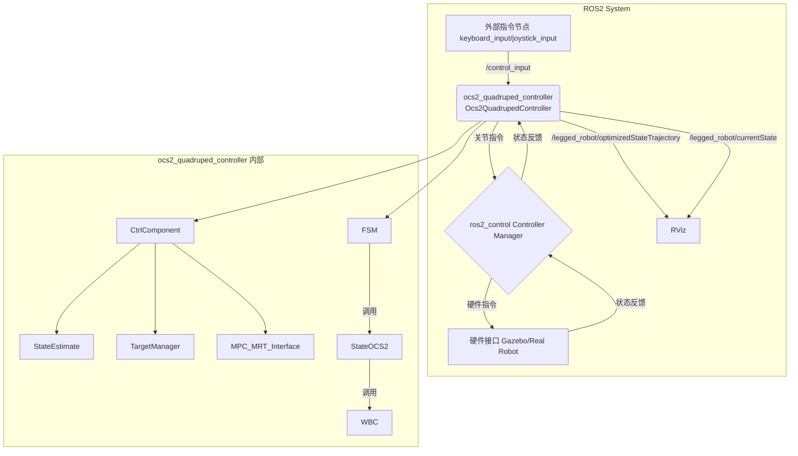

# ocs2_quadruped_controller 代码分析

## 1. 功能与节点关系

`ocs2_quadruped_controller` 是一个基于 `ros2_control` 框架的控制器，它利用 OCS2 (Optimal Control for Switched Systems) 库来实现对四足机器人的模型预测控制 (MPC)。

其核心功能是接收高层指令（例如，来自键盘或手柄的目标速度），通过MPC计算出最优的足端力矩和关节状态，然后通过全身控制器(WBC)将这些力矩应用到机器人上，从而实现复杂的动态运动。

### 节点关系 (Mermaid)

### 节点关系文字表述

1.  **外部指令节点**: 例如 `keyboard_input` 或 `joystick_input` 节点，它们会发布用户的控制指令到 `/control_input` 话题 (类型为 `control_input_msgs/msg/Inputs`)。
2.  **ocs2_quadruped_controller**: 这是核心控制器节点。
    *   它订阅 `/control_input` 话题来接收用户指令。
    *   它通过 `ros2_control` 的 `ControllerInterface` 与 `Controller Manager` 交互，获取机器人当前的状态（关节角度、速度、IMU数据等）并发送计算出的指令（关节力矩、位置、速度、KP/KD增益）。
    *   它会发布一些可视化信息到 RViz，例如优化后的轨迹 (`/legged_robot/optimizedStateTrajectory`) 和当前状态 (`/legged_robot/currentState`)。
3.  **ros2_control Controller Manager**: 这是 `ros2_control` 框架的核心，负责加载、启动、停止和管理控制器，并将控制器与硬件接口连接起来。
4.  **硬件接口**: 这是 `ros2_control` 的一部分，负责与仿真环境（如Gazebo）或真实机器人硬件进行通信。它从硬件读取状态并写入指令。
5.  **RViz**: 用于可视化机器人的状态、轨迹等调试信息。

## 2. 核心类与方法功能

`ocs2_quadruped_controller` 的内部逻辑可以分解为几个关键的类和组件：

### `Ocs2QuadrupedController` (主控制器类)

这个类继承自 `controller_interface::ControllerInterface`，是 `ros2_control` 框架的入口点。

*   `on_init()`: 初始化控制器，读取关节名称、IMU名称等参数，并创建核心组件 `CtrlComponent` 和状态机。
*   `command_interface_configuration()` / `state_interface_configuration()`: 声明控制器需要从 `ros2_control` 获取的指令接口和状态接口。
*   `on_activate()` / `on_deactivate()`: 在控制器启动和停止时被调用，负责获取和释放硬件接口。
*   `update(time, period)`: 这是控制循环的核心，每个控制周期都会被调用。它会：
    1.  调用 `ctrl_comp_->updateState()` 来更新机器人状态估计。
    2.  运行当前的状态机状态 (`current_state_->run()`)。
    3.  检查是否需要切换状态 (`current_state_->checkChange()`)。

### `CtrlComponent` (控制核心组件)

这个类封装了 OCS2 控制器的主要部分，包括状态估计、MPC接口、参考轨迹管理器等。

*   `CtrlComponent(...)` (构造函数): 初始化MPC、状态估计器、可视化工具等。它会加载URDF和OCS2的配置文件。
*   `setupStateEstimate(estimator_type)`: 根据配置选择并设置状态估计器（例如，`GroundTruth`, `KalmanFilterEstimate`）。
*   `updateState(time, period)`:
    1.  调用状态估计器的 `update()` 方法来获取最新的机器人状态 (`measured_rbd_state_`)。
    2.  将物理状态转换为中心化模型状态 (`observation_`)。
    3.  更新可视化。
    4.  调用 `target_manager_->update()` 来计算目标轨迹。
    5.  将最新的观测值设置到MPC接口 (`mpc_mrt_interface_`)。
*   `init()`: 在控制器首次进入OCS2控制状态时被调用，用于初始化MPC并等待第一个策略的生成。
*   `setupLeggedInterface()`: 设置 `LeggedInterface`，这是OCS2与机器人模型之间的桥梁，定义了动力学、约束和代价函数。
*   `setupMpc()`: 设置MPC求解器 (`SqpMpc`)、步态管理器 (`GaitManager`) 和目标管理器 (`TargetManager`)。
*   `setupMrt()`: 设置MPC-MRT（Model Predictive Control-Model Reference Tracking）接口，并启动一个独立的线程来异步运行MPC优化。

### `StateOCS2` (OCS2控制状态)

这是一个有限状态机（FSM）的状态，代表机器人正在由OCS2控制器主动控制。

*   `enter()`: 进入该状态时，调用 `ctrl_component_->init()` 来启动MPC。
*   `run(time, period)`: 在该状态下，每个控制周期执行：
    1.  从MPC-MRT接口获取最新的优化策略 (`mpc_mrt_interface_->updatePolicy()`)。
    2.  评估当前策略，得到优化的状态和输入 (`optimized_state_`, `optimized_input_`)。
    3.  将优化的结果传递给全身控制器 (`wbc_->update()`)，计算出最终的关节力矩。
    4.  将计算出的力矩、位置、速度和增益发送到硬件接口。
*   `checkChange()`: 检查是否需要切换到其他状态（例如，`PASSIVE`状态）。

### `StateEstimateBase` (状态估计基类) 和其子类

*   `update(time, period)`: 纯虚函数，由子类实现，用于更新并返回机器人的完整状态（位置、速度、姿态等）。
*   `GroundTruth`: 直接从仿真或外部定位系统（如Vicon）获取真实状态。
*   `KalmanFilterEstimate`: 使用卡尔曼滤波器，融合IMU数据和足端运动学来估计机器人的状态。

### `TargetManager` (目标管理器)

*   `update(observation)`:
    1.  从 `/control_input` 或 `/cmd_vel` 话题读取用户指令。
    2.  将用户指令（通常是线速度和角速度）转换为未来的目标位姿。
    3.  生成一个从当前状态到目标位姿的平滑轨迹 (`TargetTrajectories`)。
    4.  将这个轨迹设置到OCS2的 `ReferenceManager` 中，供MPC使用。

### `WbcBase` (全身控制器基类) 和其子类

*   `update(...)`: 接收来自MPC的优化状态和输入，以及测量的机器人状态，计算出最终的关节力矩。
*   `formulate...Task()`: 将全身控制问题分解为一系列任务，例如：
    *   `formulateFloatingBaseEomTask`: 浮动基座的动力学方程。
    *   `formulateTorqueLimitsTask`: 关节力矩限制。
    *   `formulateFrictionConeTask`: 摩擦锥约束。
    *   `formulateSwingLegTask`: 摆动腿的轨迹跟踪。
*   `WeightedWbc`: 一种WBC实现，它将不同的任务加权后组合成一个二次规划（QP）问题来求解。
*   `HierarchicalWbc`: 另一种WBC实现，它将任务按优先级分层，构成一个分层的QP问题来求解。

## 3. 步态 (Gait) 的实现与切换

步态是四足机器人运动的核心概念，它定义了在运动过程中足端的接触模式和时序。在 `ocs2_quadruped_controller` 中，步态的管理和切换是一个动态且与MPC紧密结合的过程。

### 步态的定义与表示

1.  **定义**: 一个步态在代码中被定义为一个 `ModeSequenceTemplate`。这个结构体包含两个关键部分：
    *   `switchingTimes`: 一个时间点序列，定义了每个运动阶段（Phase）的持续时间。
    *   `modeSequence`: 一个模式ID序列，每个ID对应 `switchingTimes` 的一个阶段，定义了在该阶段哪些足是处于支撑相（Stance）还是摆动相（Swing）。模式ID是一个整数，通过 `modeNumber2StanceLeg` 函数可以解码为每个腿的布尔接触标志。

2.  **配置文件**: 具体的步态参数（如trot, pace, standing_trot等）并不是硬编码在代码中的，而是在机器人描述包（例如 `go2_description`）的 `config/ocs2/gait.info` 文件中定义的。控制器在初始化时会从这个文件加载所有可用的步态模板。

### 步态的切换流程

步态的切换是由外部指令触发，并在MPC的规划周期中动态完成的，具体流程如下：

1.  **外部指令输入**: 用户通过键盘、手柄或其他节点发布一个 `control_input_msgs::msg::Inputs` 类型的消息到 `/control_input` 话题。消息中的 `command` 字段用于指定期望的步态（例如，3代表trot，4代表standing_trot）。

2.  **指令接收**: `Ocs2QuadrupedController` 类订阅了 `/control_input` 话题。当接收到新消息时，它会更新内部共享数据结构 `ctrl_interfaces_.control_inputs_` 中的 `command` 值。

3.  **GaitManager 的角色**: `GaitManager` 类是步态管理的核心。
    *   在初始化时 (`GaitManager::init`)，它会加载 `gait.info` 文件中定义的所有步态模板，并存储在一个列表 `gait_list_` 中。
    *   `GaitManager` 被注册为MPC求解器的一个 **同步模块 (Synchronized Module)**。这意味着它的 `preSolverRun` 方法会在 **每次MPC求解之前** 被自动调用。

4.  **检测与更新**:
    *   在 `preSolverRun` 方法中，会调用 `getTargetGait`。
    *   `getTargetGait` 方法会检查 `ctrl_interfaces_.control_inputs_.command` 的值是否与上一次记录的 `last_command_` 不同。
    *   如果指令发生了变化，它会根据新的 `command` 值从 `gait_list_` 中选择一个新的步态模板 (`target_gait_`)，并设置一个标志位 `gait_updated_ = true`。

5.  **注入新步态**:
    *   回到 `preSolverRun` 方法，如果 `gait_updated_` 标志位为 `true`，控制器会调用 `gait_schedule_ptr_->insertModeSequenceTemplate()`。
    *   这个函数的作用是将新的步态模板 (`target_gait_`) 插入到MPC的 `GaitSchedule` (步态时间表) 中。`GaitSchedule` 负责维护未来一段时间内的模式序列。这个插入操作是平滑的，它会规划从当前步态到新步态的过渡。

6.  **MPC重新规划**: 当MPC求解器开始本次迭代时，它会使用更新后的 `GaitSchedule` 来进行运动规划。因此，新生成的优化轨迹将自然地体现出新步态的接触模式和时序。

通过这种方式，步态的切换不是一个瞬时的、硬性的改变，而是被无缝地集成到了MPC的优化框架中，使得机器人能够平滑、动态地在不同步态之间进行过渡。

## 步态对MPC的影响

为了具象化说明，我们首先要理解MPC的目标是求解一个在未来一段时间内的最优控制问题（Optimal Control Problem, OCP），这个问题的通用形式可以写成：

### 最优控制问题的形式

- **最小化**: J(x, u) (一个代价函数，比如跟踪误差、能量消耗等)
- **受限于** (subject to):
  1. x_dot = f(x, u) (系统动力学)
  2. g(x, u) <= 0 (不等式约束)
  3. h(x, u) = 0 (等式约束)

### 步态 (Gait) 的作用

步态在这个框架中，扮演了“模式调度器 (Mode Scheduler)”的角色。它提供了一个随时间变化的模式 m(t)。这个模式 m(t) 是一个离散的变量（比如一个整数），它唯一地定义了当前的接触状态。

例如：
- m(t) = 0 可能代表所有腿都处于摆动相（飞行）。
- m(t) = 5 可能代表左前（LF）和右后（RH）腿处于支撑相，而另外两条腿处于摆动相（典型的Trot步态）。

这个模式 m(t) 不会改变动力学方程 f(x, u) 的形式，但它会动态地改变约束 g(x, u) 和 h(x, u) 的集合。我们可以把约束看作是模式的函数，即 g_m(x, u) 和 h_m(x, u)。

### 具体约束示例

#### 1. 零速约束 (Zero Velocity Constraint) - 用于支撑腿

- **目的**: 保证与地面接触的足端速度为零，防止打滑。
- **公式 (概念性)**: v_foot_i(x) = 0，其中 v_foot_i 是第 i 个足端的速度，它是机器人状态 x (包含关节角度和速度) 的函数。
- **步态如何影响**: 这个约束仅在第 i 条腿处于支撑相 (Stance Phase) 时才被激活。
  - **具体体现**: 在代码中，`ZeroVelocityConstraintCppAd::isActive(time)` 方法会查询 ReferenceManager 当前时间 time 的接触标志 `contact_flag_i(m(t))`。
    - IF `contact_flag_i(m(t)) == true` THEN MPC求解器必须满足 `v_foot_i(x) = 0` 这个等式约束。
    - ELSE (腿在摆动相), 这个约束被忽略。

#### 2. 零力约束 (Zero Force Constraint) - 用于摆动腿

- **目的**: 保证在空中摆动的腿与地面之间没有接触力。
- **公式 (概念性)**: F_foot_i(u) = 0，其中 F_foot_i 是施加在第 i 个足端的地面反作用力，它是控制输入 u 的一部分。
- **步态如何影响**: 这个约束与零速约束正好相反，它仅在第 i 条腿处于摆动相 (Swing Phase) 时才被激活。
  - **具体体现**: `ZeroForceConstraint::isActive(time)` 方法会进行查询。
    - IF `contact_flag_i(m(t)) == false` THEN MPC求解器必须满足 `F_foot_i(u) = 0` 这个等式约束。
    - ELSE (腿在支撑相), 这个约束被忽略，允许足端产生力。

#### 3. 摩擦锥约束 (Friction Cone Constraint) - 用于支撑腿

- **目的**: 保证地面反作用力在摩擦锥内，以防止足端打滑。
- **公式 (概念性)**: sqrt(F_x^2 + F_y^2) <= mu * F_z，其中 F_x, F_y 是水平切向力，F_z 是法向力，mu 是摩擦系数。
- **步态如何影响**: 这个约束同样仅在腿处于支撑相时才有意义。
  - **具体体现**: `FrictionConeConstraint::isActive(time)` 方法进行查询。
    - IF `contact_flag_i(m(t)) == true` THEN MPC求解器必须满足 `sqrt(F_x^2 + F_y^2) - mu * F_z <= 0` 这个不等式约束。
    - ELSE (腿在摆动相), 这个约束被忽略。

#### 4. 摆动腿轨迹约束 (Swing Trajectory Constraint)

- **目的**: 引导摆动腿按照预定的轨迹（例如，一个半椭圆或三次样条曲线）运动，以越过障碍并到达下一个落足点。
- **公式 (概念性)**: z_foot_i(x) >= z_swing_desired(t)，其中 z_foot_i 是足端的实际高度，z_swing_desired(t) 是由 SwingTrajectoryPlanner 生成的期望最低高度。
- **步态如何影响**: 这个约束仅在腿处于摆动相时才被激活。
  - **具体体现**: `NormalVelocityConstraintCppAd::isActive(time)` (以及其他相关约束) 会进行查询。
    - IF `contact_flag_i(m(t)) == false` THEN MPC求解器会激活一系列与摆动腿轨迹相关的约束，确保脚能抬起并向前摆动。
    - ELSE (腿在支撑相), 这些约束被忽略。

### 总结流程

所以，当用户切换步态时：

1. **GaitManager** 将新的步态模板（包含新的模式序列 `modeSequence` 和切换时间 `switchingTimes`）插入到MPC的 `GaitSchedule` 中。
2. **MPC求解器** 在进行优化时，对于其规划时域中的每一个时间点 t：
   - 它会从 `GaitSchedule` 中查询该时间点的模式 m(t)。
   - 根据 m(t) 解码出每条腿的接触状态 `contact_flag(m(t))`。
   - 动态地构建该时间点的约束集：为支撑腿激活零速和摩擦锥约束，为摆动腿激活零力和摆动轨迹约束。
3. **求解器** 在这个动态变化的约束集下，找到最优的状态和控制序列。

最终，机器人的运动就自然地体现出了新步态的特征。

## 4. 值得说明的内容

*   **MPC与WBC的解耦**: 该控制器采用了MPC+WBC的经典分层控制思想。MPC在高层负责在较长的时间尺度上进行优化，生成一个动态可行的全身运动轨迹（以中心化模型表示）。WBC在底层负责在每个控制瞬间，将MPC生成的期望运动转换为具体的关节力矩，同时处理如摩擦锥、关节限制等更具体的约束。这种分层结构使得问题更易于求解，并能实时运行。
*   **实时多线程 (MRT)**: MPC的计算量通常很大，难以在每个控制周期内完成。该控制器通过 `MPC_MRT_Interface` 将MPC的优化过程放在一个独立的、较低优先级的线程中运行。主控制线程（高优先级）则在每个周期从MRT接口获取最新计算出的最优策略，并用它来计算控制指令。这保证了控制回路的实时性。
*   **感知能力 (Perceptive Locomotion)**: 当 `enable_perceptive` 参数为 `true` 时，控制器会启用感知能力。它会订阅一个地形图话题 (`/convex_plane_decomposition_ros/planar_terrain`)，并利用 `ConvexRegionSelector` 来规划足底落点和摆动腿轨迹，使其能够适应不平坦的地形。这是该控制器的一个高级功能。
*   **状态机 (FSM)**: 使用了一个简单的状态机来管理控制器的状态（例如，`PASSIVE` 和 `OCS2`）。这使得控制器的启动、停止和模式切换更加安全和鲁棒。

这个分析文档应该涵盖了 `ocs2_quadruped_controller` 包的主要方面。