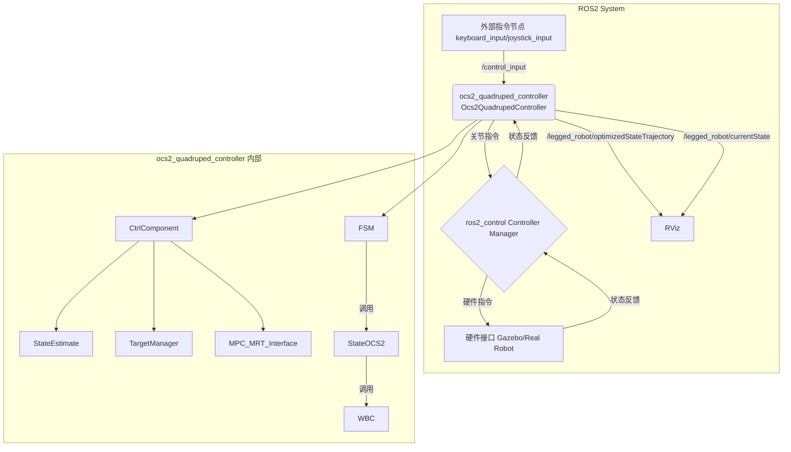

# ocs2_quadruped_controller 代码分析

## 1. 功能与节点关系

`ocs2_quadruped_controller` 是一个基于 `ros2_control` 框架的控制器，它利用 OCS2 (Optimal Control for Switched Systems) 库来实现对四足机器人的模型预测控制 (MPC)。

其核心功能是接收高层指令（例如，来自键盘或手柄的目标速度），通过MPC计算出最优的足端力矩和关节状态，然后通过全身控制器(WBC)将这些力矩应用到机器人上，从而实现复杂的动态运动。

### 节点关系 (Mermaid)

### 节点关系文字表述

1.  **外部指令节点**: 例如 `keyboard_input` 或 `joystick_input` 节点，它们会发布用户的控制指令到 `/control_input` 话题 (类型为 `control_input_msgs/msg/Inputs`)。
2.  **ocs2_quadruped_controller**: 这是核心控制器节点。
    *   它订阅 `/control_input` 话题来接收用户指令。
    *   它通过 `ros2_control` 的 `ControllerInterface` 与 `Controller Manager` 交互，获取机器人当前的状态（关节角度、速度、IMU数据等）并发送计算出的指令（关节力矩、位置、速度、KP/KD增益）。
    *   它会发布一些可视化信息到 RViz，例如优化后的轨迹 (`/legged_robot/optimizedStateTrajectory`) 和当前状态 (`/legged_robot/currentState`)。
3.  **ros2_control Controller Manager**: 这是 `ros2_control` 框架的核心，负责加载、启动、停止和管理控制器，并将控制器与硬件接口连接起来。
4.  **硬件接口**: 这是 `ros2_control` 的一部分，负责与仿真环境（如Gazebo）或真实机器人硬件进行通信。它从硬件读取状态并写入指令。
5.  **RViz**: 用于可视化机器人的状态、轨迹等调试信息。

## 2. 核心类与方法功能

`ocs2_quadruped_controller` 的内部逻辑可以分解为几个关键的类和组件：

### `Ocs2QuadrupedController` (主控制器类)

这个类继承自 `controller_interface::ControllerInterface`，是 `ros2_control` 框架的入口点。

*   `on_init()`: 初始化控制器，读取关节名称、IMU名称等参数，并创建核心组件 `CtrlComponent` 和状态机。
*   `command_interface_configuration()` / `state_interface_configuration()`: 声明控制器需要从 `ros2_control` 获取的指令接口和状态接口。
*   `on_activate()` / `on_deactivate()`: 在控制器启动和停止时被调用，负责获取和释放硬件接口。
*   `update(time, period)`: 这是控制循环的核心，每个控制周期都会被调用。它会：
    1.  调用 `ctrl_comp_->updateState()` 来更新机器人状态估计。
    2.  运行当前的状态机状态 (`current_state_->run()`)。
    3.  检查是否需要切换状态 (`current_state_->checkChange()`)。

### `CtrlComponent` (控制核心组件)

这个类封装了 OCS2 控制器的主要部分，包括状态估计、MPC接口、参考轨迹管理器等。

*   `CtrlComponent(...)` (构造函数): 初始化MPC、状态估计器、可视化工具等。它会加载URDF和OCS2的配置文件。
*   `setupStateEstimate(estimator_type)`: 根据配置选择并设置状态估计器（例如，`GroundTruth`, `KalmanFilterEstimate`）。
*   `updateState(time, period)`:
    1.  调用状态估计器的 `update()` 方法来获取最新的机器人状态 (`measured_rbd_state_`)。
    2.  将物理状态转换为中心化模型状态 (`observation_`)。
    3.  更新可视化。
    4.  调用 `target_manager_->update()` 来计算目标轨迹。
    5.  将最新的观测值设置到MPC接口 (`mpc_mrt_interface_`)。
*   `init()`: 在控制器首次进入OCS2控制状态时被调用，用于初始化MPC并等待第一个策略的生成。
*   `setupLeggedInterface()`: 设置 `LeggedInterface`，这是OCS2与机器人模型之间的桥梁，定义了动力学、约束和代价函数。
*   `setupMpc()`: 设置MPC求解器 (`SqpMpc`)、步态管理器 (`GaitManager`) 和目标管理器 (`TargetManager`)。
*   `setupMrt()`: 设置MPC-MRT（Model Predictive Control-Model Reference Tracking）接口，并启动一个独立的线程来异步运行MPC优化。

### `StateOCS2` (OCS2控制状态)

这是一个有限状态机（FSM）的状态，代表机器人正在由OCS2控制器主动控制。

*   `enter()`: 进入该状态时，调用 `ctrl_component_->init()` 来启动MPC。
*   `run(time, period)`: 在该状态下，每个控制周期执行：
    1.  从MPC-MRT接口获取最新的优化策略 (`mpc_mrt_interface_->updatePolicy()`)。
    2.  评估当前策略，得到优化的状态和输入 (`optimized_state_`, `optimized_input_`)。
    3.  将优化的结果传递给全身控制器 (`wbc_->update()`)，计算出最终的关节力矩。
    4.  将计算出的力矩、位置、速度和增益发送到硬件接口。
*   `checkChange()`: 检查是否需要切换到其他状态（例如，`PASSIVE`状态）。

### `StateEstimateBase` (状态估计基类) 和其子类

*   `update(time, period)`: 纯虚函数，由子类实现，用于更新并返回机器人的完整状态（位置、速度、姿态等）。
*   `GroundTruth`: 直接从仿真或外部定位系统（如Vicon）获取真实状态。
*   `KalmanFilterEstimate`: 使用卡尔曼滤波器，融合IMU数据和足端运动学来估计机器人的状态。

### `TargetManager` (目标管理器)

*   `update(observation)`:
    1.  从 `/control_input` 或 `/cmd_vel` 话题读取用户指令。
    2.  将用户指令（通常是线速度和角速度）转换为未来的目标位姿。
    3.  生成一个从当前状态到目标位姿的平滑轨迹 (`TargetTrajectories`)。
    4.  将这个轨迹设置到OCS2的 `ReferenceManager` 中，供MPC使用。

### `WbcBase` (全身控制器基类) 和其子类

*   `update(...)`: 接收来自MPC的优化状态和输入，以及测量的机器人状态，计算出最终的关节力矩。
*   `formulate...Task()`: 将全身控制问题分解为一系列任务，例如：
    *   `formulateFloatingBaseEomTask`: 浮动基座的动力学方程。
    *   `formulateTorqueLimitsTask`: 关节力矩限制。
    *   `formulateFrictionConeTask`: 摩擦锥约束。
    *   `formulateSwingLegTask`: 摆动腿的轨迹跟踪。
*   `WeightedWbc`: 一种WBC实现，它将不同的任务加权后组合成一个二次规划（QP）问题来求解。
*   `HierarchicalWbc`: 另一种WBC实现，它将任务按优先级分层，构成一个分层的QP问题来求解。

## 4. 值得说明的内容

*   **MPC与WBC的解耦**: 该控制器采用了MPC+WBC的经典分层控制思想。MPC在高层负责在较长的时间尺度上进行优化，生成一个动态可行的全身运动轨迹（以中心化模型表示）。WBC在底层负责在每个控制瞬间，将MPC生成的期望运动转换为具体的关节力矩，同时处理如摩擦锥、关节限制等更具体的约束。这种分层结构使得问题更易于求解，并能实时运行。
*   **实时多线程 (MRT)**: MPC的计算量通常很大，难以在每个控制周期内完成。该控制器通过 `MPC_MRT_Interface` 将MPC的优化过程放在一个独立的、较低优先级的线程中运行。主控制线程（高优先级）则在每个周期从MRT接口获取最新计算出的最优策略，并用它来计算控制指令。这保证了控制回路的实时性。
*   **感知能力 (Perceptive Locomotion)**: 当 `enable_perceptive` 参数为 `true` 时，控制器会启用感知能力。它会订阅一个地形图话题 (`/convex_plane_decomposition_ros/planar_terrain`)，并利用 `ConvexRegionSelector` 来规划足底落点和摆动腿轨迹，使其能够适应不平坦的地形。这是该控制器的一个高级功能。
*   **状态机 (FSM)**: 使用了一个简单的状态机来管理控制器的状态（例如，`PASSIVE` 和 `OCS2`）。这使得控制器的启动、停止和模式切换更加安全和鲁棒。

这个分析文档应该涵盖了 `ocs2_quadruped_controller` 包的主要方面。

## KeyboardInput

### 物理量定义

| 变量 | 含义 | 控制功能 | 取值范围 |
|------|------|----------|----------|
| `lx` | 左摇杆 X 轴值 (Left X-axis) | 控制左右移动或横向位移 | -1.0 到 1.0 |
| `ly` | 左摇杆 Y 轴值 (Left Y-axis) | 控制前后移动或纵向位移 | -1.0 到 1.0 |
| `rx` | 右摇杆 X 轴值 (Right X-axis) | 控制左右旋转或偏航角 | -1.0 到 1.0 |
| `ry` | 右摇杆 Y 轴值 (Right Y-axis) | 控制上下移动或俯仰角 | -1.0 到 1.0 |

### 键盘控制映射

| 按键 | 控制变量 | 功能描述 |
|------|----------|----------|
| `W`/`S` | `ly` | 前后移动控制 |
| `A`/`D` | `lx` | 左右移动控制 |
| `I`/`K` | `ry` | 上下移动控制 |
| `J`/`L` | `rx` | 左右旋转控制 |

### 说明

- **灵敏度控制**：通过 `sensitivity_left_` 和 `sensitivity_right_` 参数调整控制灵敏度
- **消息发布**：控制值通过 `control_input` 话题发布，用于机器人运动控制
- **应用场景**：适用于四足机器人等需要多自由度控制的移动机器人平台