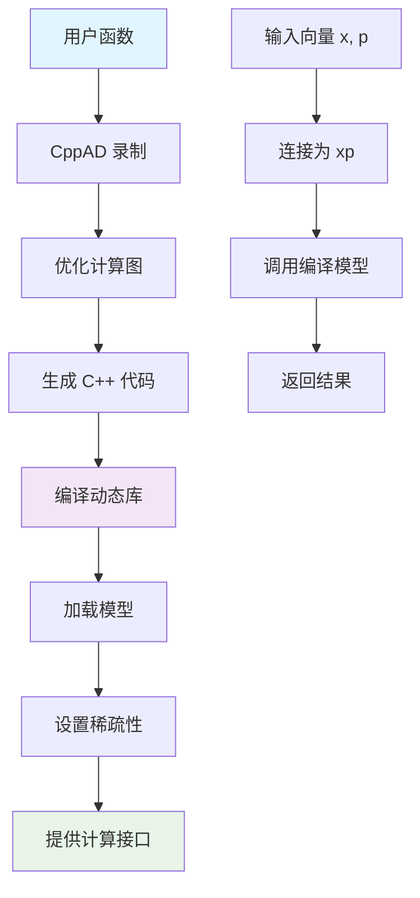

# CppAdInterface 类分析

## 1. 功能概述

`CppAdInterface` 类是 OCS2 库中用于自动微分的核心接口类，基于 CppAD 库实现。该类的主要功能是将用户定义的数学函数转换为高效的编译代码，并提供函数值、雅可比矩阵和海塞矩阵的计算功能。

### 主要特性：
- **自动微分**：将符号函数转换为可求导的数值函数
- **代码生成**：生成高度优化的 C++ 代码并编译为动态库
- **稀疏性利用**：利用函数的稀疏结构提高计算效率
- **缓存机制**：支持模型的保存和加载，避免重复编译
- **多阶导数**：支持零阶、一阶和二阶导数计算

## 2. 类结构与接口

### 2.1 核心类型定义
```cpp
enum class ApproximationOrder { Zero, First, Second };
using ad_function_t = std::function<void(const ad_vector_t&, ad_vector_t&)>;
using ad_parameterized_function_t = std::function<void(const ad_vector_t&, const ad_vector_t&, ad_vector_t&)>;
```

### 2.2 构造函数
- **参数化函数构造**：`y = f(x, p)` 形式的函数
- **非参数化函数构造**：`y = f(x)` 形式的函数
- **拷贝构造**：支持模型重用和加载

## 3. 主要方法功能分析

### 3.1 模型管理方法

#### `createModels(ApproximationOrder approximationOrder, bool verbose)`
**功能**：创建、编译和保存自动微分模型
**核心流程**：
1. **建立文件夹结构**：创建库文件存储目录
2. **设置独立变量**：使用 `CppAD::Independent(xp)` 开始记录计算图
3. **执行函数录制**：调用用户定义的函数 `adFunction_(x, p, y)`
4. **创建 AD 函数**：构建 `ad_fun_t` 对象并优化计算序列
5. **生成源代码**：使用 `ModelCSourceGen` 生成 C++ 代码
6. **编译动态库**：配置编译选项并生成共享库文件
7. **加载模型**：将编译好的库加载到内存
8. **设置稀疏性**：计算并存储雅可比和海塞矩阵的非零元素数量

#### `loadModels(bool verbose)`
**功能**：从磁盘加载已编译的模型  
**优势**：避免重复编译，显著提高启动速度

#### `loadModelsIfAvailable(ApproximationOrder approximationOrder, bool verbose)`
**功能**：智能模型加载  
**逻辑**：首先尝试加载现有模型，如果不存在则创建新模型

### 3.2 函数计算方法

#### `getFunctionValue(const vector_t& x, const vector_t& p)`
**功能**：计算函数值 `y = f(x, p)`
**实现**：
- 连接输入向量：`xp << x, p`
- 调用模型的 `ForwardZero` 方法
- 返回函数值向量

#### `getJacobian(const vector_t& x, const vector_t& p)`
**功能**：计算雅可比矩阵 `∂f/∂x`
**技术特点**：
- 使用稀疏矩阵计算提高效率
- 只计算对变量 x 的导数，不包括参数 p
- 利用预计算的稀疏模式避免零元素计算

#### `getGaussNewtonApproximation(const vector_t& x, const vector_t& p)`
**功能**：计算 Gauss-Newton 近似
**数学公式**：
- **函数值**：`f = 0.5 * |y|²`
- **一阶导数**：`∇f = J^T * y`
- **二阶导数**：`∇²f = J^T * J`（Gauss-Newton 近似）

**实现特点**：
- 稀疏雅可比矩阵的高效计算
- 逐行处理构建 Gauss-Newton 矩阵
- 维护矩阵对称性

#### `getHessian(const vector_t& w, const vector_t& x, const vector_t& p)`
**功能**：计算加权海塞矩阵 `∑ᵢ wᵢ * ∇²fᵢ`
**实现**：
- 使用稀疏海塞矩阵计算
- 只填充上三角矩阵，然后复制到下三角保持对称性

### 3.3 内部工具方法

#### `setApproximationOrder(ApproximationOrder approximationOrder, ...)`
**功能**：配置导数计算阶数
**策略**：
- `Zero`：仅计算函数值
- `First`：计算函数值和雅可比矩阵
- `Second`：计算函数值、雅可比矩阵和海塞矩阵

#### `createJacobianSparsity(ad_fun_t& fun)` 和 `createHessianSparsity(ad_fun_t& fun)`
**功能**：创建稀疏性模式
**作用**：确定哪些矩阵元素为非零，避免计算零元素

## 4. 数据处理和更新流程

### 4.1 整体数据流


### 4.2 模型创建流程
1. **函数录制阶段**：
   - 设置独立变量为全 1 向量（避免除零错误）
   - 开始 CppAD 录制过程
   - 执行用户函数获得输出
   - 创建 AD 函数对象并优化

2. **代码生成阶段**：
   - 配置导数计算阶数
   - 生成稀疏性模式
   - 创建 C++ 源代码
   - 设置编译选项和优化标志

3. **编译和加载阶段**：
   - 使用 GCC 编译器生成共享库
   - 加载动态库到内存
   - 获取模型对象引用
   - 计算稀疏性统计信息

### 4.3 运行时计算流程
1. **输入预处理**：
   - 连接变量向量 x 和参数向量 p
   - 创建 ArrayView 包装器

2. **模型调用**：
   - 根据需要调用 `ForwardZero`、`SparseJacobian` 或 `SparseHessian`
   - 利用预计算的稀疏模式高效计算

3. **结果后处理**：
   - 将稀疏结果填充到密集矩阵
   - 处理矩阵对称性（如海塞矩阵）
   - 验证结果的数值有效性

## 5. 与外部系统的交互

### 5.1 与 CppAD 库的交互
- **依赖关系**：核心计算基于 CppAD 的自动微分引擎
- **数据转换**：在 Eigen 向量和 CppAD 向量之间进行转换
- **模型管理**：利用 CppAD 的模型管理和编译功能

### 5.2 与文件系统的交互
- **库文件管理**：创建和管理编译后的动态库文件
- **临时文件**：使用唯一临时名称避免进程间冲突
- **缓存策略**：检查现有库文件避免重复编译

### 5.3 与编译器的交互
- **编译配置**：设置 GCC 编译选项和优化标志
- **链接选项**：配置动态库链接参数
- **源码保存**：可选择保存生成的 C++ 源码用于调试

## 6. 性能优化特性

### 6.1 稀疏性利用
- **稀疏模式检测**：自动识别函数的稀疏结构
- **高效存储**：只存储和计算非零元素
- **内存优化**：减少内存使用和缓存未命中

### 6.2 编译优化
- **高级优化**：使用 `-O3` 等编译器优化选项
- **架构特化**：使用 `-march=native` 针对特定 CPU 优化
- **数学优化**：使用 `-ffast-math` 进行数学运算优化

### 6.3 多线程兼容
- **线程安全**：选择线程安全的 CppAD 函数接口
- **避免分配**：使用 ArrayView 避免内部向量分配
- **独立实例**：支持多个线程同时使用不同实例

## 7. 错误处理和调试

### 7.1 数值验证
- **有限性检查**：所有计算结果都经过 `allFinite()` 验证
- **断言保护**：关键路径使用断言确保正确性

### 7.2 编译错误处理
- **文件系统检查**：验证库文件存在性
- **编译状态**：提供详细的编译过程信息
- **异常处理**：适当的异常传播机制

### 7.3 调试支持
- **详细日志**：可选的详细输出信息
- **源码保存**：保存生成的 C++ 源码用于分析
- **库文件命名**：清晰的文件命名约定便于识别

## 8. 使用场景和应用

### 8.1 典型应用场景
- **优化问题**：提供目标函数和约束的高效导数计算
- **控制系统**：计算系统动力学的线性化
- **参数估计**：提供代价函数的梯度和海塞矩阵
- **敏感性分析**：计算函数对参数变化的敏感性

### 8.2 性能优势
- **编译时优化**：比解释型计算快数倍
- **稀疏性利用**：大幅减少大规模问题的计算量
- **缓存友好**：生成的代码具有良好的内存访问模式
- **可重用性**：一次编译多次使用

## 9. 配置和参数

### 9.1 编译选项
- **默认标志**：`-O3 -g -march=native -mtune=native -ffast-math`
- **可定制性**：支持用户自定义编译选项
- **动态库选项**：自动添加 `-shared -rdynamic`

### 9.2 文件组织
- **基础路径**：默认使用 `/tmp/ocs2`
- **模型命名**：基于用户提供的模型名称
- **版本管理**：使用进程 ID 和时间戳避免冲突

该类通过将复杂的自动微分过程封装成简洁的接口，为 OCS2 框架中的各种优化算法提供了高效、可靠的导数计算能力，是整个系统性能的关键支撑组件。