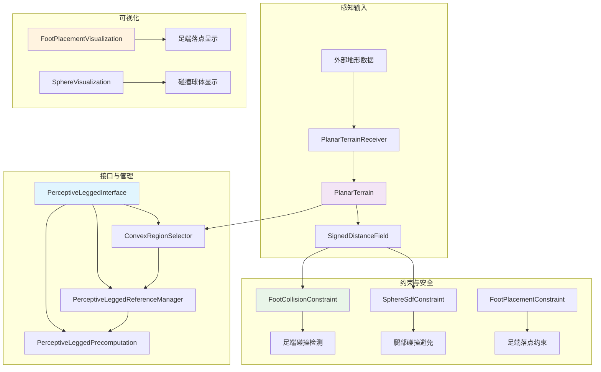

# perceptive 模块分析

## 1. 功能概述

`perceptive` 目录实现了基于感知的四足机器人运动控制功能，主要用于在复杂地形环境下进行路径规划和避障控制。该模块在标准的 `LeggedInterface` 基础上，增加了地形感知、碰撞检测、足端落点规划等高级功能。

### 主要功能模块：
- **地形感知与建模**：处理和管理平面地形数据
- **碰撞约束**：足端和腿部的碰撞检测与避免
- **凸区域选择**：为足端落点选择安全的凸区域
- **可视化支持**：提供足端落点和碰撞球体的可视化
- **数据同步**：接收和处理外部地形信息

## 2. 模块架构与数据流

## 3. 数据处理和更新流程

### 3.1 地形数据处理流程
1. **数据接收**：`PlanarTerrainReceiver` 订阅外部地形消息
2. **数据转换**：将 ROS 消息转换为内部 `PlanarTerrain` 格式
3. **SDF 计算**：基于高程数据计算符号距离场
4. **数据同步**：通过互斥锁保证数据一致性
5. **约束更新**：更新各类碰撞和约束计算

### 3.2 足端落点规划流程
1. **凸区域提取**：从地形数据中提取可行的凸区域
2. **轨迹投影**：将足端轨迹投影到地形表面
3. **安全评估**：评估每个候选区域的安全性
4. **最优选择**：根据成本函数选择最优落点
5. **约束生成**：为选定落点生成相应的约束

### 3.3 碰撞检测与避免流程
1. **几何建模**：将腿部建模为球体序列
2. **距离查询**：查询球体与地形的最短距离
3. **梯度计算**：计算距离场的梯度信息
4. **约束应用**：将碰撞约束集成到优化问题中
5. **轨迹调整**：根据约束结果调整运动轨迹

## 4. 各类详细功能分析

### 4.1 PerceptiveLeggedInterface 类

**主要功能**：扩展标准腿式机器人接口，集成感知能力

**核心方法**：
- **`setupOptimalControlProblem()`**：
  - 初始化平面地形和符号距离场
  - 创建默认的 5m×5m 平坦地形区域
  - 设置足端碰撞约束（间隙距离 0.02m）
  - 配置腿部球体碰撞检测（大腿余量 0.025m，小腿余量 0.02m）
  
- **`setupReferenceManager()`**：
  - 创建摆动轨迹规划器
  - 初始化凸区域选择器
  - 设置感知参考管理器
  
- **`setupPreComputation()`**：
  - 配置感知预计算模块
  - 集成摆动轨迹和凸区域选择功能

**数据成员**：
- `planarTerrainPtr_`：平面地形数据指针
- `signedDistanceFieldPtr_`：符号距离场指针
- `pinocchioSphereInterfacePtr_`：球体碰撞接口指针
- `numVertices_`：凸区域顶点数量（默认16个）

### 4.2 ConvexRegionSelector 类

**主要功能**：为足端选择安全的凸形落点区域

**核心方法**：
- **`update()`**：
  - 根据步态模式和目标轨迹更新凸区域
  - 处理摆动相和支撑相的区域选择
  - 计算名义足点位置

- **`getProjection()`**：
  - 获取指定腿在特定时间的地形投影
  - 返回 `PlanarTerrainProjection` 结构

- **`getConvexPolygon()`**：
  - 获取凸多边形区域描述
  - 用于约束足端落点范围

- **`getNominalFootholds()`**：
  - 计算名义足点位置
  - 作为足端规划的参考点

**数据结构**：
- `timeEvents_[leg]`：每条腿的时间事件序列
- `feetProjections_[leg]`：足端地形投影数据
- `convexPolygons_[leg]`：凸多边形区域描述
- `nominalFootholds_[leg]`：名义足点位置序列

### 4.3 FootCollisionConstraint 类

**主要功能**：防止摆动足与地形碰撞

**核心方法**：
- **`isActive()`**：
  - 判断约束是否激活
  - 仅在摆动相激活（非接触状态）
  - 使用时间偏移（±0.05s）避免切换时的不连续

- **`getValue()`**：
  - 计算足端到地形表面的距离
  - 公式：`distance = sdf_value - clearance`
  - 正值表示安全，负值表示碰撞

- **`getLinearApproximation()`**：
  - 计算约束的线性化近似
  - 包含雅可比矩阵信息
  - 用于基于梯度的优化

**参数设置**：
- `clearance_`：安全间隙距离（默认 0.02m）
- `contactPointIndex_`：对应的足端索引
- `endEffectorKinematicsPtr_`：足端运动学指针

### 4.4 SphereSdfConstraint 类

**主要功能**：防止腿部球体与地形碰撞

**核心方法**：
- **`getValue()`**：
  - 计算所有球体的碰撞约束值
  - 对每个球体：`constraint = sdf_distance - sphere_radius`
  - 返回约束向量（维度等于球体总数）

- **`getLinearApproximation()`**：
  - 计算多球体约束的线性化
  - 使用 SDF 梯度和球体位置雅可比
  - 公式：`dfdx[i] = sdf_gradient^T * sphere_jacobian[i]`

**技术特点**：
- 支持多球体同时约束
- 使用预计算的 Pinocchio 接口
- 高效的梯度计算

### 4.5 PlanarTerrainReceiver 类

**主要功能**：接收和处理外部地形数据

**核心方法**：
- **构造函数**：
  - 创建地形消息订阅者
  - 设置回调函数处理地形更新
  - 配置 SDF 高程层参数

- **消息回调**：
  - 将 ROS 消息转换为内部格式
  - 处理 NaN 值（使用最小值填充）
  - 计算符号距离场
  - 设置高度边界（最大值+3倍边界）

- **`preSolverRun()`**：
  - 在求解器运行前同步地形数据
  - 确保约束使用最新的地形信息

**数据同步**：
- 使用 `std::mutex` 保证线程安全
- `updated_` 标志指示数据更新状态
- 原子操作避免数据竞争

### 4.6 可视化模块

#### FootPlacementVisualization 类
**功能**：可视化足端落点规划结果

**核心方法**：
- **`update()`**：
  - 基于更新频率控制发布
  - 为每条腿生成可视化标记
  - 显示凸区域和名义足点

**可视化内容**：
- 凸多边形区域边界
- 名义足点位置
- 时间序列信息
- 不同腿部的颜色区分

#### SphereVisualization 类
**功能**：可视化碰撞检测球体

**特点**：
- 实时显示腿部球体位置
- 根据碰撞状态调整颜色
- 支持多球体同时显示

## 5. 关键技术实现

### 5.1 符号距离场（SDF）
- **用途**：快速计算点到地形表面的距离
- **优势**：支持梯度查询，便于优化
- **实现**：基于 `grid_map` 库的高效计算

### 5.2 凸区域分解
- **算法**：基于 CGAL 的凸多边形分解
- **应用**：将复杂地形分解为凸区域
- **优势**：简化约束表示，提高求解效率

### 5.3 球体近似
- **建模**：将腿部几何体近似为球体序列
- **参数**：大腿余量 0.025m，小腿余量 0.02m
- **精度**：在计算效率和精度之间取得平衡

### 5.4 时间同步
- **策略**：使用时间偏移避免约束切换的不连续
- **实现**：在状态转换前后的时间窗口内保持约束
- **效果**：提高优化求解的数值稳定性

## 6. 性能优化

### 6.1 计算效率
- **预计算**：使用 `PerceptiveLeggedPrecomputation` 缓存中间结果
- **稀疏计算**：仅在约束激活时进行计算
- **并行处理**：支持多足并行处理

### 6.2 内存管理
- **智能指针**：使用 `std::shared_ptr` 管理共享资源
- **拷贝优化**：避免不必要的数据拷贝
- **缓存策略**：合理使用缓存减少重复计算

## 7. 应用场景与扩展

### 7.1 典型应用
- **不平整地形行走**：自动适应地形变化
- **障碍物避让**：实时规避静态障碍
- **精确落点控制**：在特定区域内精确着地
- **安全性保证**：防止意外碰撞和摔倒

### 7.2 扩展可能性
- **动态障碍物**：支持移动障碍物检测
- **多层地形**：处理桥梁、台阶等复杂结构
- **不确定性处理**：考虑感知误差和模型不确定性
- **学习优化**：结合机器学习改进规划策略

## 8. 配置与参数

### 8.1 关键参数
- **地形尺寸**：默认 5m×5m，分辨率 0.03m
- **安全间隙**：足端 0.02m，腿部球体半径+余量
- **凸区域顶点**：默认 16 个顶点
- **时间偏移**：约束切换缓冲 0.05s

### 8.2 可调参数
- **碰撞检测精度**：球体数量和半径
- **地形更新频率**：根据计算资源调整
- **可视化频率**：平衡显示效果和性能
- **约束权重**：调整不同约束的相对重要性

该模块通过集成多种感知和规划技术，为四足机器人提供了在复杂地形中安全高效行走的能力，是实现真实环境自主导航的重要组成部分。
