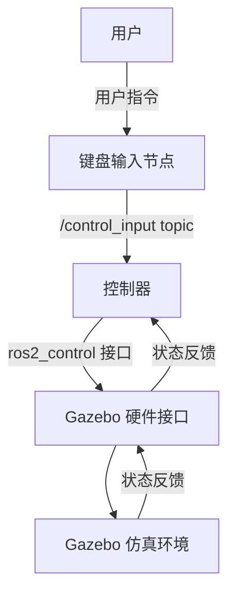
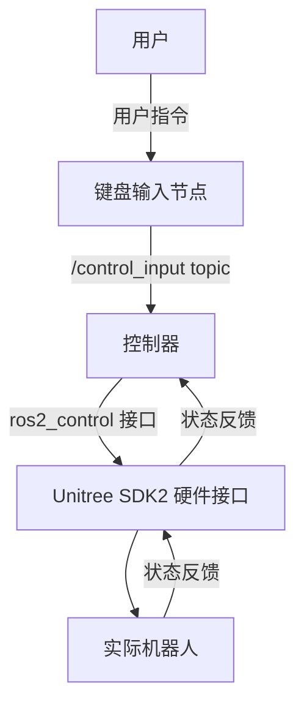
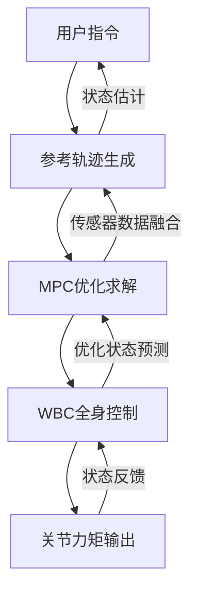
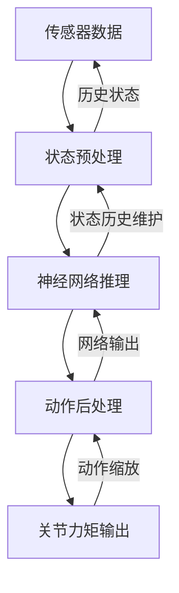
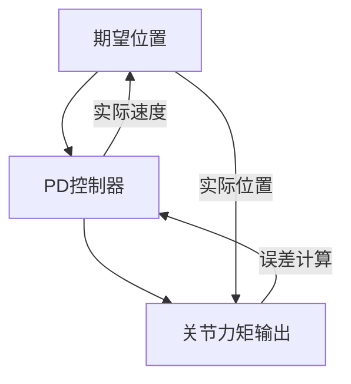

# Quadruped ROS2 Control 项目分析文档

## 项目概述

Quadruped ROS2 Control 是一个基于 ROS2 控制框架的四足机器人控制系统。项目支持多种控制算法（MPC、RL、PD），并且能够在 Gazebo 仿真环境和实际硬件上运行。

## 1. Gazebo 仿真环境下的数据流分析

### 1.1 系统架构图



### 1.2 关键节点和接口

#### 1.2.1 输入节点
- **keyboard_input_node**: 处理键盘输入，发布控制指令
  - 发布话题: `/control_input` (control_input_msgs::msg::Inputs)
  - 消息内容:
    ```cpp
    int32 command    // 控制模式 (1-10)
    float32 lx       // 左摇杆 X 轴
    float32 ly       // 左摇杆 Y 轴  
    float32 rx       // 右摇杆 X 轴
    float32 ry       // 右摇杆 Y 轴
    ```

#### 1.2.2 控制器节点
- **unitree_guide_controller**: Unitree Guide 算法控制器
- **ocs2_quadruped_controller**: OCS2 MPC 控制器
- **rl_quadruped_controller**: 强化学习控制器
- **leg_pd_controller**: PD 控制器

#### 1.2.3 Gazebo 硬件接口
- **gz_quadruped_hardware/GazeboSimSystem**: Gazebo 仿真硬件接口插件
- 提供的命令接口:
  - `joint_name/position` - 关节位置命令
  - `joint_name/velocity` - 关节速度命令
  - `joint_name/effort` - 关节力矩命令
  - `joint_name/kp` - PD 控制器 Kp 增益
  - `joint_name/kd` - PD 控制器 Kd 增益

- 提供的状态接口:
  - `joint_name/position` - 关节位置状态
  - `joint_name/velocity` - 关节速度状态
  - `joint_name/effort` - 关节力矩状态
  - `imu_sensor/linear_acceleration.x/y/z` - IMU 线性加速度
  - `imu_sensor/angular_velocity.x/y/z` - IMU 角速度
  - `imu_sensor/orientation.x/y/z/w` - IMU 姿态
  - `foot_force_sensor/force.x/y/z` - 足端力传感器

### 1.3 数据流详细描述

1. **用户输入**: 用户通过键盘输入控制指令
2. **指令发布**: keyboard_input_node 将输入转换为 control_input_msgs::msg::Inputs 消息
3. **控制器接收**: 各控制器订阅 `/control_input` 话题获取用户指令
4. **状态获取**: 控制器通过 ros2_control 接口获取关节状态、IMU 数据、足端力等
5. **控制计算**: 控制器根据当前状态和用户指令计算控制输出
6. **命令下发**: 控制器通过 ros2_control 接口设置关节位置/速度/力矩命令
7. **仿真执行**: Gazebo 硬件接口将命令传递给仿真环境执行
8. **状态更新**: 仿真环境更新机器人状态，传感器数据回传

## 2. 实际硬件环境下的数据流分析

### 2.1 系统架构图



### 2.2 关键组件

#### 2.2.1 硬件接口
- **hardware_unitree_sdk2/HardwareUnitree**: 基于 Unitree SDK2 的硬件接口
- 网络配置:
  ```xml
  <param name="domain">1</param>
  <param name="network_interface">lo</param>
  ```

#### 2.2.2 通信协议
- 使用 Unitree SDK2 通过 DDS 协议与机器人通信
- 支持 Mujoco 仿真和实际 Unitree 机器人
- 需要配置网络域和接口

### 2.3 数据流特点

1. **低延迟通信**: 通过 DDS 协议实现高频率低延迟的数据传输
2. **实时控制**: 支持 1kHz 的控制频率
3. **传感器融合**: 集成 IMU、编码器、足端力传感器数据
4. **安全机制**: 包含急停和模式切换保护

## 3. 控制器数据交互流程分析

### 3.1 MPC 控制器 (OCS2) 数据流

#### 3.1.1 控制架构



#### 3.1.2 核心公式

**MPC 优化问题**:
```
min  ∫[t,t+T] L(x(τ), u(τ)) dτ + Φ(x(t+T))
s.t. ẋ = f(x, u)
     g(x, u) ≤ 0
     h(x, u) = 0
```

其中:
- `x`: 状态向量 (位置、速度、姿态等)
- `u`: 控制输入 (关节力矩)
- `L`: 阶段代价函数
- `Φ`: 终端代价函数
- `f`: 系统动力学
- `g, h`: 不等式和等式约束

**全身控制 (WBC)**:
```
min ||Jẍ_desired - J̇q̇ - Jq̈||²
s.t. Mq̈ + h = Sᵀτ + Jᶜᵀλ
     Jᶜq̈ + J̇ᶜq̇ = 0
```

其中:
- `J`: 雅可比矩阵
- `M`: 惯性矩阵
- `h`: 科里奥利力和重力项
- `S`: 选择矩阵
- `τ`: 关节力矩
- `λ`: 接触力

#### 3.1.3 实现流程

1. **状态估计**: 融合 IMU、编码器、足端接触信息
   ```cpp
   void updateState(const rclcpp::Time& time, const rclcpp::Duration& period);
   ```

2. **参考轨迹**: 根据用户指令生成期望轨迹
   ```cpp
   TargetTrajectories targetTrajectories;
   targetTrajectories.stateTrajectory = desiredStateTrajectory;
   targetTrajectories.inputTrajectory = desiredInputTrajectory;
   ```

3. **MPC 求解**: 使用 SQP 算法求解优化问题
   ```cpp
   mpcSolverPtr_->run(time, currentObservation, targetTrajectories);
   primalSolution = mpcSolverPtr_->primalSolution(time);
   ```

4. **WBC 执行**: 将 MPC 输出转换为关节力矩
   ```cpp
   wbcPtr_->update(stateObservation, primalSolution, contactFlags);
   torqueCommand = wbcPtr_->getJointTorques();
   ```

### 3.2 强化学习控制器数据流

#### 3.2.1 控制架构



#### 3.2.2 核心组件

**神经网络策略**:
```
π(a|s) = NN(s; θ)
```

其中:
- `s`: 状态向量 (关节位置、速度、IMU、历史信息)
- `a`: 动作向量 (关节位置增量或力矩)
- `θ`: 网络参数
- `NN`: 深度神经网络

**状态空间**:
```cpp
observations = [
    joint_positions,      // 12维关节位置
    joint_velocities,     // 12维关节速度  
    base_orientation,     // 3维基座姿态
    base_angular_velocity,// 3维基座角速度
    command_velocity,     // 3维指令速度
    foot_contacts,        // 4维足端接触状态
    action_history        // 历史动作
];
```

#### 3.2.3 实现流程

1. **状态预处理**: 
   ```cpp
   processObservations(joint_states, imu_data, command);
   ```

2. **网络推理**: 使用 LibTorch 执行前向传播
   ```cpp
   torch::Tensor input = torch::from_blob(observations.data(), {1, obs_dim});
   torch::Tensor output = module_->forward({input}).toTensor();
   ```

3. **动作后处理**: 缩放和限制输出
   ```cpp
   for (int i = 0; i < num_actions; i++) {
       actions[i] = std::clamp(output[0][i].item<float>() * action_scale[i], 
                              -action_limit, action_limit);
   }
   ```

### 3.3 PD 控制器数据流

#### 3.3.1 控制架构



#### 3.3.2 核心公式

**PD 控制律**:
```
τ = Kp(qd - q) + Kd(q̇d - q̇)
```

其中:
- `τ`: 关节力矩输出
- `Kp`: 比例增益矩阵
- `Kd`: 微分增益矩阵
- `qd, q̇d`: 期望关节位置和速度
- `q, q̇`: 实际关节位置和速度

#### 3.3.3 实现流程

1. **误差计算**:
   ```cpp
   position_error = desired_position - current_position;
   velocity_error = desired_velocity - current_velocity;
   ```

2. **力矩计算**:
   ```cpp
   torque = kp * position_error + kd * velocity_error;
   ```

3. **输出限制**:
   ```cpp
   torque = std::clamp(torque, -max_torque, max_torque);
   ```

## 4. 接口统一性分析

### 4.1 ROS2 Control 接口层

所有控制器都通过统一的 ros2_control 接口与硬件交互:

**命令接口**:
- `position`: 位置命令
- `velocity`: 速度命令  
- `effort`: 力矩命令
- `kp/kd`: PD 增益

**状态接口**:
- `position`: 关节位置反馈
- `velocity`: 关节速度反馈
- `effort`: 关节力矩反馈
- `imu/*`: IMU 传感器数据
- `force_torque/*`: 力/力矩传感器数据

### 4.2 硬件抽象层

通过硬件抽象层实现：
1. **仿真环境**: gz_quadruped_hardware
2. **实际硬件**: hardware_unitree_sdk2

这种设计使得控制器可以无缝在仿真和实际硬件间切换。

## 5. 总结

Quadruped ROS2 Control 项目通过以下设计实现了高效的四足机器人控制：

1. **统一接口**: 使用 ros2_control 框架提供统一的硬件抽象
2. **模块化设计**: 控制器、硬件接口、传感器处理模块化
3. **多算法支持**: 同时支持经典控制、最优控制和强化学习方法
4. **实时性能**: 支持高频率控制循环（1kHz）
5. **仿真验证**: 提供完整的 Gazebo 仿真环境用于算法验证

该架构为四足机器人控制算法的研究和开发提供了一个完整、灵活的平台。
