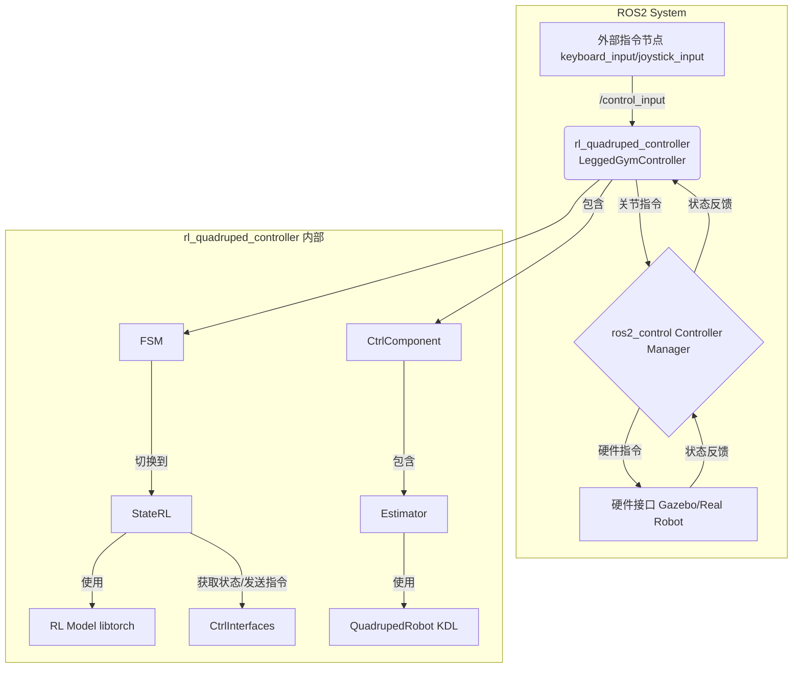

# rl_quadruped_controller 代码分析

## 1. 功能与节点关系

`rl_quadruped_controller` 是一个基于 `ros2_control` 框架的控制器，它利用一个通过强化学习（RL）训练好的神经网络模型来控制四足机器人。

其核心功能是：收集机器人的当前状态（如IMU数据、关节角度和速度）作为观测值（Observation），输入到预先加载的PyTorch神经网络模型中，模型输出期望的动作（Action），控制器将这个动作转换为对机器人关节的直接指令（通常是目标关节角度），从而实现动态行走。

### 节点关系 (Mermaid)

### 节点关系文字表述

1.  **外部指令节点**: 与OCS2控制器类似，`keyboard_input` 或 `joystick_input` 节点发布用户的控制指令到 `/control_input` 话题。
2.  **rl_quadruped_controller**: 这是核心的RL控制器节点。
    *   它订阅 `/control_input` 话题以接收用户指令（目标线速度和角速度）。
    *   它通过 `ros2_control` 的 `ControllerInterface` 与 `Controller Manager` 交互，获取机器人状态并发送关节指令。
    *   内部包含一个状态机（FSM），主要在 `StateRL` 状态下运行。
3.  **ros2_control Controller Manager**: `ros2_control` 的核心，管理控制器和硬件接口之间的通信。
4.  **硬件接口**: 负责与仿真（Gazebo/Mujoco）或真实硬件通信。

## 2. 核心类与方法功能

`rl_quadruped_controller` 的实现围绕着一个状态机，其中核心的控制逻辑在 `StateRL` 类中。

### `LeggedGymController` (主控制器类)

继承自 `controller_interface::ControllerInterface`，作为 `ros2_control` 的插件。

*   `on_init()`: 初始化控制器，读取配置参数，如关节名、IMU名、足端力传感器名、默认站立/趴下姿态、PD增益等。如果配置了足端力传感器，则会启用状态估计器。
*   `on_configure()`: 创建ROS订阅者，订阅 `/control_input` 话题和 `/robot_description` 话题。
*   `on_activate()`: 激活控制器时被调用。
    1.  获取硬件接口。
    2.  创建状态机（FSM）的各个状态实例，包括 `StatePassive`（被动）、`StateFixedDown`（趴下）、`StateFixedStand`（站立）和 `StateRL`（RL控制）。
    3.  初始化FSM，并将初始状态设置为 `StatePassive`。
*   `update(time, period)`: 控制循环的核心。
    1.  如果启用了状态估计器，则更新估计器 (`estimator_->update()`)。
    2.  运行当前状态机的 `run()` 方法。
    3.  调用 `checkChange()` 检查是否需要切换状态。

### `StateRL` (RL控制状态)

这是实现强化学习控制的核心。

*   `StateRL(...)` (构造函数):
    1.  加载RL模型的配置文件 (`config.yaml`)，该文件定义了模型的输入（观测空间）、输出（动作空间）、网络结构、各种缩放因子等超参数。
    2.  使用 `torch::jit::load()` 加载预训练的PyTorch模型（`.pt` 文件）。
    3.  如果配置了 `use_rl_thread`，则会创建一个独立的线程来运行神经网络的前向传播，以避免阻塞主控制循环。
*   `enter()`: 进入此状态时，重置所有观测值、动作和历史观测缓冲区。
*   `run(time, period)`:
    1.  调用 `getState()` 从硬件接口获取最新的机器人状态。
    2.  如果未使用独立线程，则直接调用 `runModel()`。
    3.  调用 `setCommand()` 将最新的计算结果发送给硬件。
*   `runModel()`:
    1.  **准备观测数据**: 将从 `getState()` 获取的原始数据（如IMU、关节编码器）填充到 `obs_` 结构体中。如果启用了状态估计器，线速度会从估计器获取。
    2.  **计算观测向量**: 调用 `computeObservation()`，根据配置文件中的 `observations` 列表，将各个观测项（如 `lin_vel`, `ang_vel`, `dof_pos` 等）进行缩放和拼接，形成一个最终的观测张量（Tensor）。
    3.  **前向传播**: 调用 `forward()`，将观测张量输入到加载的PyTorch模型中，得到模型的输出，即动作（actions）。
    4.  **动作处理**: 对模型的输出动作进行处理，包括乘以动作缩放因子 (`action_scale`)，并应用臀部关节的缩减因子 (`hip_scale_reduction`)。
    5.  **计算目标关节位置**: 最终的动作被解释为与默认站姿的偏差，计算出目标关节位置：`output_dof_pos_ = actions_scaled + params_.default_dof_pos`。
    6.  将目标关节位置和配置文件中定义的PD增益 (`rl_kp`, `rl_kd`) 填充到 `robot_command_` 结构体中。
*   `getState()`: 从 `ctrl_interfaces_` 中读取IMU、关节位置、关节速度等数据，并填充到 `robot_state_` 结构体中。同时，也从 `ctrl_interfaces_` 读取用户输入指令。
*   `setCommand()`: 将 `robot_command_` 中的目标关节位置、速度（通常为0）、KP和KD增益通过硬件接口发送出去。

### `Estimator` (状态估计器)

当控制器配置了足端力传感器时启用。它实现了一个卡尔曼滤波器来估计机器人的质心位置和速度。

*   `Estimator(...)` (构造函数): 初始化卡尔曼滤波器的状态转移矩阵 `A`、输入矩阵 `B`、观测矩阵 `C` 以及各种协方差矩阵 `P`, `Q`, `R`。
*   `update()`: 在每个控制周期被调用。
    1.  **预测 (Prediction)**: 使用IMU的加速度作为输入，根据运动学方程 `x_hat_ = A * x_hat_ + B * u_` 预测当前的状态。
    2.  **更新 (Update)**:
        *   根据足端是否接触地面（通过足底力传感器判断）来调整协方差矩阵 `Q` 和 `R`。对于未接触的足，会增大其不确定性。
        *   将运动学计算出的足端位置/速度和实际的足高（通常为0）作为观测值 `y_`。
        *   计算预测的观测值 `y_hat_ = C * x_hat_`。
        *   根据观测误差 `y_ - y_hat_` 和卡尔曼增益，更新状态估计 `x_hat_` 和协方差矩阵 `P`。

### `QuadrupedRobot` 和 `RobotLeg`

这两个类使用KDL (Kinematics and Dynamics Library) 来处理机器人的运动学计算。

*   `RobotLeg`: 代表单条腿，封装了该腿的正向运动学（FK）、逆向运动学（IK）和雅可比矩阵的计算。
*   `QuadrupedRobot`: 代表整个机器人，包含了四条腿的实例。它提供了一些方便的接口，例如根据所有关节的角度计算所有足端的位姿 (`getFeet2BPositions()`)。

## 3. 值得说明的内容

*   **端到端控制**: 与MPC+WBC的分层方法不同，RL控制器通常是一种端到端的策略。它直接将传感器信息映射到低级的执行器指令（在这里是关节PD目标）。这种方法的优点是反应速度快，并且可以学习到一些在传统方法中难以建模的复杂行为。
*   **Sim-to-Real**: 这种控制器通常在仿真环境（如Isaac Gym）中进行大规模的并行训练，然后将训练好的模型部署到真实机器人上。`config.yaml` 文件中的许多参数（如缩放因子、观测空间定义）都与训练环境的设置密切相关，这对于成功的Sim-to-Real迁移至关重要。
*   **观测和动作空间**: 强化学习的性能高度依赖于观测空间和动作空间的设计。
    *   **观测空间**: `config.yaml` 中的 `observations` 字段定义了哪些信息被用作模型的输入。常见的输入包括：机身线速度、角速度、重力向量（在机身坐标系下）、用户指令、关节位置、关节速度和上一时刻的动作。这些信息共同构成了机器人对自身和环境的“感知”。
    *   **动作空间**: 模型的输出（动作）被解释为对默认站姿 `default_dof_pos` 的一个增量。这种设计（残差控制）通常比直接输出绝对关节角度更容易学习。最终的PD控制指令是 `torque = kp * (action + default_pos - current_pos) - kd * current_vel`。
*   **历史观测**: 配置文件中的 `observations_history` 允许将过去几步的观测数据也作为当前时刻的输入。这为模型提供了一个时间序列信息，有助于它推断出状态的时间导数（如加速度）或理解当前的动态趋势，对于学习动态步态至关重要。`ObservationBuffer` 类就是为此目的而设计的。