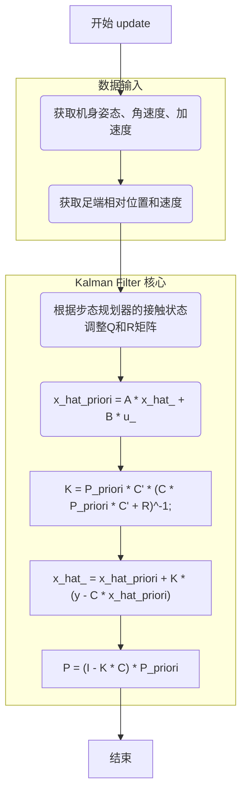

# Estimator 类深度分析

## 1. 功能概述

`Estimator` 类是 `unitree_guide_controller` 控制框架中的核心状态估计器。它实现了一个**线性卡尔曼滤波器 (Linear Kalman Filter)**，用于估计机器人的**质心状态**（位置和速度）以及**足端位置**。

与传统的基于IMU和腿部运动学的状态估计方法不同，该估计器**不直接使用足端接触力传感器**的数据，而是依赖于**步态规划器 (`WaveGenerator`)** 提供的期望接触状态来调整卡尔曼滤波器的噪声协方差矩阵。这种方法使得估计器对于没有足端力传感器的机器人平台也具有很好的适用性。

## 2. 数据处理与更新流程

`Estimator` 的核心逻辑在 `update()` 方法中实现，遵循标准的卡尔曼滤波器预测与校正两大步骤。

### 2.1 状态与测量模型

#### 状态向量 `x_hat_` (18x1)
状态向量 `x_hat_` 包含了机器人的核心运动学状态：
- **`x_hat_[0:2]`**: 质心位置 `p` (3D)
- **`x_hat_[3:5]`**: 质心速度 `v` (3D)
- **`x_hat_[6:17]`**: 四个足端的绝对位置 `p_foot` (12D, 3D x 4)

#### 系统输入 `u_` (3x1)
- **`u_[0:2]`**: 经过旋转到世界坐标系下的机身加速度计读数。

#### 测量向量 `y_` (28x1)
测量向量 `y_` 融合了来自IMU和腿部运动学的多源信息：
- **`y_[0:11]`**: 四个足端相对于机身的位置（通过腿部运动学正解计算得到）。
- **`y_[12:23]`**: 四个足端相对于机身的线速度（通过腿部运动学雅可比计算得到）。
- **`y_[24:27]`**: 四个足端的高度（直接从运动学计算的Z值）。

### 2.2 `update()` 方法流程

**流程文字说明:**
1.  **数据更新**: 从 `CtrlInterfaces` 获取最新的IMU数据（姿态、加速度、角速度）和关节编码器数据。
2.  **运动学计算**: 调用 `robot_model_` (即 `QuadrupedRobot` 类) 计算足端相对于机身的位置 `foot_poses_` 和速度 `foot_vels_`，并填充测量向量 `y_`。
3.  **噪声协方差调整**: 这是该估计器的关键特色。遍历四条腿，查询 `wave_generator_->getContactState()` 获取期望的接触状态。
    - 如果腿处于**支撑相**，则认为其足端位置相对固定，减小对应的过程噪声 `Q` 和测量噪声 `R`，表示信任运动学模型和测量。
    - 如果腿处于**摆动相**，则认为其足端位置在变化，增大对应的噪声，表示不确定性更高。
4.  **状态预测 (Prediction)**: 根据线性系统模型 `x_k = A*x_{k-1} + B*u_k`，预测当前时刻的先验状态 `x_hat_priori` 和先验协方差 `P_priori`。
5.  **状态校正 (Correction)**:
    - 计算卡尔曼增益 `K`。
    - 使用测量值 `y` 和预测的测量值 `y_hat = C * x_hat_priori` 之间的残差，对先验状态进行校正，得到后验状态（最终估计值）`x_hat_`。
    - 更新后验协方差矩阵 `P`。

## 3. 主要方法功能

- **`Estimator(ctrl_interfaces, ctrl_component)` (构造函数)**:
  - 初始化系统矩阵 `A`, `B`, `C`。
  - 设置初始的过程噪声协方差 `QInit_` 和测量噪声协方差 `RInit_`。这些初始矩阵通常是离线标定或经验调优的结果。
  - 初始化状态向量 `x_hat_` 和协方差矩阵 `P`。

- **`update()`**:
  - 执行完整的卡尔曼滤波迭代，是类的核心。处理流程如上所述。

- **`getPosition()`, `getVelocity()`, `getRotation()`**:
  - 提供获取机器人质心位置、速度和机身姿态的接口，供上层控制器（如WBC）使用。

- **`getFootPos()`, `getFeetVel()`, `getFeetPos2Body()`**:
  - 提供获取世界坐标系或机身坐标系下足端位置和速度的接口。

- **`getYaw()`, `getDYaw()`**:
  - 提供获取偏航角和偏航角速度的便捷接口。

## 4. 与 `LinearKalmanFilter` 的对比分析

`unitree_guide_controller/Estimator` 和 `ocs2_quadruped_controller/LinearKalmanFilter` 都是针对四足机器人的线性卡尔曼状态估计器，但它们在实现细节和设计哲学上存在显著差异。

| 特性 | `unitree_guide_controller/Estimator` | `ocs2_quadruped_controller/LinearKalmanFilter` |
| :--- | :--- | :--- |
| **核心依赖** | `WaveGenerator` (步态规划器) | `contact_flag_` (来自力传感器或步态) |
| **接触判断** | **预测性**：使用期望接触状态 | **反应性**：使用实际测量或判定的接触状态 |
| **传感器依赖** | **不依赖**足端力传感器 | **强依赖**足端力传感器或可靠的接触标志 |
| **状态向量** | 18维 (base_pos, base_vel, 4*foot_pos) | 18维 (base_pos, base_vel, 4*foot_pos) |
| **测量向量** | 28维 (4*foot_pos_body, 4*foot_vel_body, 4*foot_height) | 28维 (4*foot_pos_kin, 4*foot_vel_kin, 4*foot_height) |
| **代码耦合** | 与 `unitree_guide` 框架紧密耦合 | 与 OCS2 框架紧密耦合 |
| **适用场景** | 适用于无力传感器的机器人，或希望估计与规划更一致的场景 | 适用于有力传感器的机器人，估计结果更贴近物理实际 |

### 4.1 `LinearKalmanFilter` 是否可被 `Estimator` 替换？

**可以，但需要进行接口适配。**

由于两者都实现了相似的状态估计功能，并且状态向量定义一致，替换是可行的。主要挑战在于处理两者不同的依赖和框架耦合。

**对接流程:**

1.  **创建适配器类**: 创建一个 `EstimatorAdapter` 类，继承自 OCS2 的 `StateEstimateBase`。
2.  **实例化 `Estimator`**: 在 `EstimatorAdapter` 内部实例化一个 `unitree_guide_controller::Estimator` 对象。
3.  **提供依赖**:
    - **`CtrlInterfaces`**: `Estimator` 需要 `CtrlInterfaces` 来获取IMU和关节数据。`StateEstimateBase` 的构造函数中已经包含了 `CtrlInterfaces`，可以直接传递。
    - **`CtrlComponent`**: `Estimator` 需要 `CtrlComponent` 来访问 `robot_model_` 和 `wave_generator_`。
        - `robot_model_`: `ocs2_quadruped_controller` 使用 `PinocchioInterface`。需要创建一个 `QuadrupedRobot` 的包装类，使其内部使用 `PinocchioInterface` 来提供运动学计算。
        - `wave_generator_`: OCS2 使用 `GaitSchedule` 来管理步态。需要创建一个 `WaveGenerator` 的包装类，使其能够从 `GaitSchedule` 中查询期望的接触状态。
4.  **实现 `update()` 方法**: 在 `EstimatorAdapter::update()` 方法中，调用 `Estimator::update()`，然后将 `Estimator` 的输出（如 `xHat_`）转换并填充到 OCS2 所需的 `rbd_state_` 向量中。
5.  **修改 `CtrlComponent`**: 在 `CtrlComponent` 中，将原有的 `KalmanFilterEstimate` 替换为新创建的 `EstimatorAdapter`。

### 4.2 `LinearKalmanFilter` 如何替代足端接触力？

`LinearKalmanFilter` 依赖 `contact_flag_` 来调整噪声矩阵。这个标志通常来自对足端力传感器的阈值判断。如果机器人没有力传感器，可以通过以下方式替代：

**使用期望接触状态 (与 `Estimator` 类似的方法)**

1.  **获取步态信息**: 在 `StateEstimateBase::update()` 或其子类 `KalmanFilterEstimate::update()` 中，访问 `reference_manager_` (可通过 `ctrl_component_` 获取)。
2.  **查询接触状态**: 通过 `reference_manager_->getContactFlags(time)` 获取当前时刻由步态规划器（如 `GaitSchedule`）决定的期望接触状态。
3.  **更新 `contact_flag_`**: 将查询到的期望接触状态赋值给 `contact_flag_` 成员变量。

这样，`LinearKalmanFilter` 就可以在没有力传感器的情况下，利用与 `Estimator` 相同的思想，根据**期望步态**而非**实际接触**来调整其滤波器的行为。这使得它能够在更广泛的硬件平台上运行。

## 5. 总结与补充说明

- **设计哲学差异**: `Estimator` 的设计更偏向于**模型与规划的一致性**，它相信步态规划器的决策，并以此为依据进行状态估计。而 `LinearKalmanFilter` 更偏向于**物理现实的反馈**，它利用真实的接触力数据来修正估计，使得结果更贴近物理世界的实际情况。
- **鲁棒性**: 在崎岖不平或意外接触的场景下，`LinearKalmanFilter` 由于能感知非预期的接触，可能表现出更好的鲁棒性。而 `Estimator` 在这些情况下可能会因为模型与现实不符而产生漂移，直到新的运动学测量修正它。
- **可移植性**: `Estimator` 的实现不依赖特定硬件（力传感器），因此在不同机器人平台间的可移植性更好。

总的来说，`Estimator` 是一个设计精良、高效且不依赖特定传感器的状态估计器，非常适合作为通用四足机器人控制框架的基础。通过简单的适配，它可以被集成到 OCS2 等其他框架中，为没有力传感器的机器人提供可靠的状态估计。
