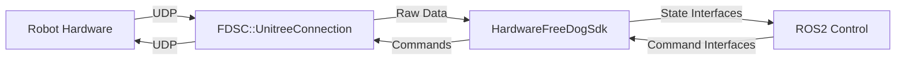

# Hardware Free Dog SDK - 实现总结

## 完成的工作

基于 `hardware_unitree_sdk2` 的设计模式，成功创建了 `hardware_free_dog_sdk` 包，将数据接收和发送改为使用 `free_dog_sdk_cpp` 的接口进行直接调用。

### 主要文件结构

```
hardware_free_dog_sdk/
├── CMakeLists.txt                    # 构建配置文件
├── package.xml                       # ROS2 包描述文件
├── HardwareFreeDogSdk.xml           # 插件配置文件
├── README.md                        # 用户文档
├── TECHNICAL_DETAILS.md             # 技术实现详解
├── include/hardware_free_dog_sdk/
│   └── HardwareFreeDogSdk.h         # 主要头文件
├── src/
│   └── HardwareFreeDogSdk.cpp       # 主要实现文件
└── launch/
    └── visualize.launch.py          # 示例启动文件
```

### 核心特性

1. **兼容的接口设计**: 
   - 继承 `hardware_interface::SystemInterface`
   - 实现标准的 ROS2 Control 接口
   - 支持关节位置、速度、力矩控制
   - 提供 IMU 和足端力传感器数据

2. **直接集成 Free Dog SDK**:
   - 使用 `FDSC::UnitreeConnection` 进行 UDP 通信
   - 直接调用 `free_dog_sdk_cpp` 的数据结构
   - 避免了 DDS 中间层的复杂性

3. **线程安全的通信**:
   - 独立的通信线程处理数据收发
   - 使用 `std::mutex` 保护共享数据
   - 原子变量控制线程生命周期

4. **灵活的配置参数**:
   - 支持多种连接模式 (有线/无线, 低级/高级)
   - 可配置的调试选项
   - 功率限制等安全参数

### 与参考实现的对比

#### 相对于 hardware_unitree_sdk2

| 方面 | hardware_unitree_sdk2 | hardware_free_dog_sdk |
|------|----------------------|----------------------|
| **通信协议** | DDS (复杂) | UDP (简单直接) |
| **依赖项** | unitree_sdk2 + DDS | fdsc_utils |
| **数据同步** | DDS 回调 | 线程 + 互斥锁 |
| **配置复杂度** | 高 (域配置等) | 低 (连接字符串) |

#### 相对于 legged_unitree_hw_free

| 方面 | legged_unitree_hw_free | hardware_free_dog_sdk |
|------|----------------------|----------------------|
| **ROS版本** | ROS1 (ros_control) | ROS2 (ros2_control) |
| **接口标准** | hardware_interface | SystemInterface |
| **生命周期** | 简单 init/read/write | 完整生命周期管理 |
| **线程模型** | 单线程 | 多线程安全 |

### 数据流架构



### 关键的数据转换

#### 1. 关节数据转换
```cpp
// From FDSC to ROS2 Control
joint_position_[i] = low_state_.motorState[i].q;
joint_velocities_[i] = low_state_.motorState[i].dq;
joint_effort_[i] = low_state_.motorState[i].tauEst;

// From ROS2 Control to FDSC  
low_cmd_.motorCmd.motors[i].q = joint_position_command_[i];
low_cmd_.motorCmd.motors[i].dq = joint_velocities_command_[i];
low_cmd_.motorCmd.motors[i].tau = joint_torque_command_[i];
```

#### 2. IMU 数据转换
```cpp
// 四元数 (w, x, y, z)
imu_states_[0] = low_state_.imu_quaternion[0];  // w
imu_states_[1] = low_state_.imu_quaternion[1];  // x
// 角速度和加速度
imu_states_[4] = low_state_.imu_gyroscope[0];
imu_states_[7] = low_state_.imu_accelerometer[0];
```

#### 3. 足端力数据转换
```cpp
for (int i = 0; i < 4; ++i) {
    foot_force_[i] = low_state_.footForce[i];
}
```

### 线程安全机制

1. **数据保护**:
   ```cpp
   std::mutex data_mutex_;
   std::lock_guard<std::mutex> lock(data_mutex_);
   ```

2. **生命周期管理**:
   ```cpp
   std::atomic<bool> running_{false};
   std::thread communication_thread_;
   ```

3. **安全的启动和停止**:
   ```cpp
   // 启动时
   running_ = true;
   communication_thread_ = std::thread(&HardwareFreeDogSdk::communicationLoop, this);
   
   // 停止时
   running_ = false;
   if (communication_thread_.joinable()) {
       communication_thread_.join();
   }
   ```

## 使用建议

### 1. 基本使用
```bash
# 编译包
colcon build --packages-select hardware_free_dog_sdk

# 基本启动
ros2 launch hardware_free_dog_sdk visualize.launch.py
```

### 2. 自定义配置
```bash
# 使用无线连接
ros2 launch hardware_free_dog_sdk visualize.launch.py \\
  connection_settings:="LOW_WIFI_DEFAULTS"

# 启用调试信息
ros2 launch hardware_free_dog_sdk visualize.launch.py \\
  show_foot_force:=true --ros-args --log-level debug
```

### 3. 在控制器中使用
在 ROS2 Control 配置文件中:
```xml
<ros2_control name="free_dog_hardware" type="system">
  <hardware>
    <plugin>HardwareFreeDogSdk</plugin>
    <param name="connection_settings">LOW_WIRED_DEFAULTS</param>
    <param name="show_foot_force">false</param>
  </hardware>
  <!-- 添加关节和传感器定义 -->
</ros2_control>
```

## 优势和特点

1. **简化的通信栈**: 直接 UDP 通信，避免 DDS 复杂性
2. **更好的可维护性**: 清晰的代码结构和完整的文档
3. **强化的安全性**: 线程安全和错误处理机制
4. **良好的扩展性**: 易于添加新的传感器和功能
5. **完整的兼容性**: 与 ROS2 Control 生态系统无缝集成

## 潜在改进方向

1. **性能优化**: 可以进一步优化通信频率和数据处理
2. **错误恢复**: 可以添加更完善的网络断线重连机制
3. **参数验证**: 可以添加更严格的参数校验
4. **调试工具**: 可以开发专门的调试和监控工具

## 总结

`hardware_free_dog_sdk` 成功地结合了 `hardware_unitree_sdk2` 的优秀设计模式和 `free_dog_sdk_cpp` 的直接硬件访问能力，提供了一个高效、安全、易用的四足机器人硬件接口解决方案。该实现不仅满足了当前的需求，还为未来的扩展和改进奠定了良好的基础。